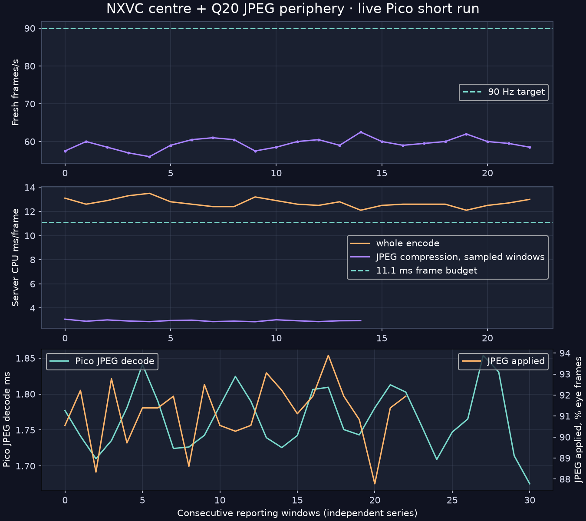
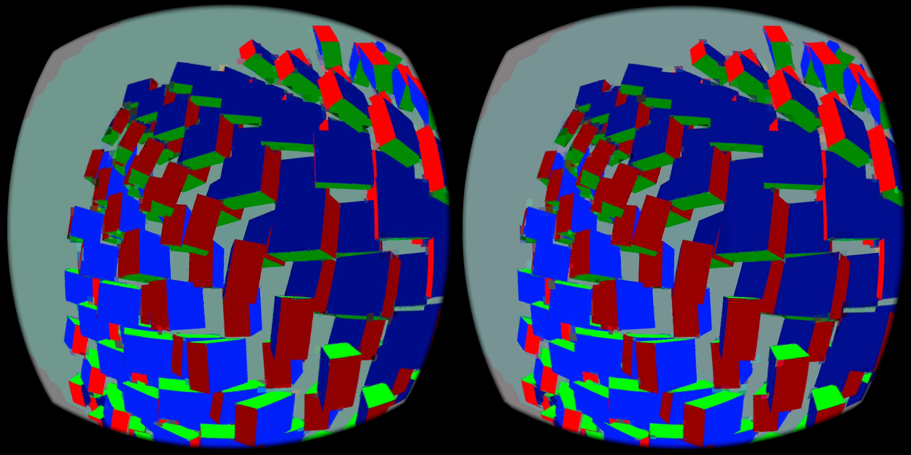

# Live Pico check: NXVC centre + Q20 JPEG periphery

The hybrid is installed in the custom WiVRn NX APK and was exercised end to end on a Pico. The server encodes a 544×544 Q20 JPEG for each eye beside the direct NXVC stream. The Pico decodes it on a worker and samples it in the existing reprojection pass: NXVC remains unchanged through radius 128, with a smooth radial blend to JPEG by radius 384. Missing or late JPEG falls back to NXVC. The server switch is `NX_WARP_JPEG_PERIPHERY=1`; it is opt-in.

This is an ADB compositor capture, not a through-lens photo. It shows that a
stereo image reached the headset, but cannot establish how the transition
looks to a wearer in a real scene.

| Short-run observation | Result |
|---|---:|
| Fresh stream frames, 23 two-second windows | **59.4/s mean** |
| Whole server encode | **12.71 ms/frame mean** |
| Stereo JPEG compression | **2.94 ms/frame mean** |
| JPEG payload | **40.0 kB/stereo frame mean** |
| Pico software JPEG decode | **1.77 ms/frame mean** |
| JPEG used by presentation | **91.2% of reported eye frames** |
| JPEG staging upload | **~0.15 ms per reported upload** |
| Source-to-target-display-time offset | **78.9 ms mean** |

This proves transport, decode and presentation-path use. It **does not meet 90 fresh FPS** in this synthetic scene. The Pico was off-head. Presentation was requested at 90 Hz, but repeated presentations are not fresh frames. The source-to-target offset is an instrumented scheduling quantity, **not measured photon latency**. No visual judgment from a worn headset was made here.

## Method and limits

The short check used a headless Vulkan `hello_xr` scene with 195 animated cubes, synthetic predicted-time motion, 2176×2176 pixels per eye and a 90 Hz target. The JPEG input was read back from the compositor's *already foveated NV12* image; the earlier offline quality study instead encoded source-derived RGB. Its quality and bitrate results therefore cannot be transplanted onto this live path. The live client uses `stb_image` for JPEG decode, not the standalone libjpeg-turbo benchmark binary. The producer performs a full-resolution NV12 staging copy before downsampling; its memory traffic and the ~2.94 ms CPU compression are immediate optimization targets.

The log excerpts include all reporting windows used by [the extraction/plot script](plot.py), and [the machine-readable summary](summary.json) contains the derived means. Consecutive reporting windows are not independent thermal trials or p95/p99 evidence. JPEG applied below 100% reflects same-frame matching and arrival timing; the shader's NXVC fallback remains available. The separate safety stream remains NXVC-only after a follow-up server fix.

[Server log excerpt](server-telemetry.log) · [Pico log excerpt](pico-telemetry.log) · [Offline quality study](../README.md) · [Pico isolated costs](../pico-check/README.md)
