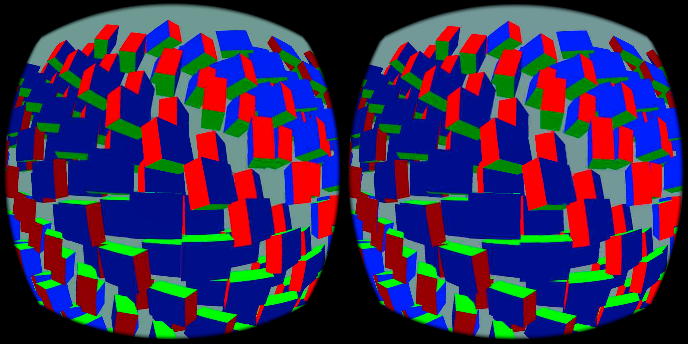

# Native-source JPEG with foveation disabled

This is an **opt-in live experiment**, not the default NXVC profile. The server samples each eye from the renderer image *before* foveation, writes a uniform 1088 × 1088 RGB capture in the existing compositor compute pass, and encodes it as Q20 JPEG. The main 2176 × 2176-per-eye NXVC stream also uses a uniform source mapping. No foveation map is needed for either image in this test. The JPEG still supplies the outer image; NXVC supplies the central reconstruction.

## Short Pico check

| Observation | Result |
| --- | ---: |
| Pico refresh request | 90 Hz |
| Fresh server frames during the animated scene | about 53–60/s in successive two-second windows |
| Server full encode | about 12–13 ms/frame |
| Stereo JPEG compression | about 3.9–4.1 ms/frame |
| Pico JPEG decode | about 5.5–6.0 ms/eye image |
| Pico JPEG upload | about 0.66–0.69 ms/upload |
| JPEG used by presentation after two-frame retention | 360/360 sampled eye frames |

The transport received and decoded 180/180 JPEG eye images with zero invalid images in repeated log windows. The presentation count measures **use of a current or up-to-two-frame-old JPEG**, not fresh JPEGs. Before retention, only about half the eye frames used JPEG because the larger decode finished after exact-frame selection. Retention avoids a sharp/soft alternation but may make peripheral motion lag by one or two source frames. This is a synthetic scene with headset off-head; it does not prove worn-headset comfort, VRChat quality, physical photon latency, or 90 fresh FPS.

Enable with `NX_WARP_JPEG_PERIPHERY=1 NX_WARP_JPEG_NO_FOVEATION=1` on the matched WiVRn NX server/client build. The compositor capture and main no-foveation path share one compute dispatch; JPEG compression remains on the PC CPU, and JPEG decode remains on the Pico CPU. The screenshot is a Pico `screencap`, not a source render.
