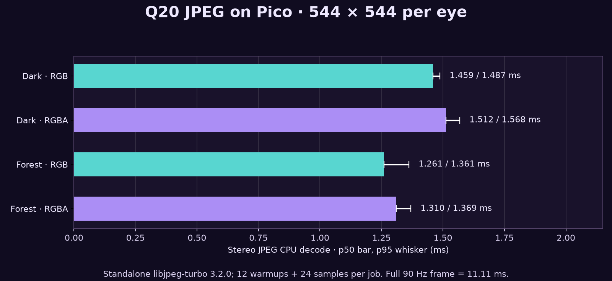
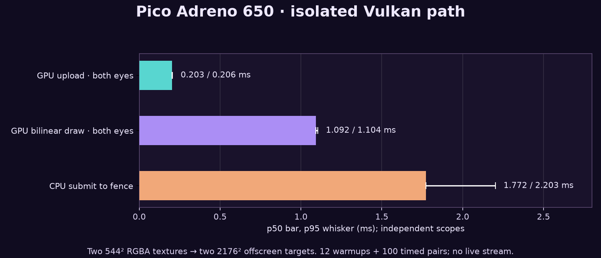

# Pico check: low-quality JPEG outer image

**29 September 2026 — isolated device measurement.** The Pico A8110 was
connected over ADB. We decoded the chosen **Q20, 4:2:0, 544×544-per-eye**
peripheral JPEGs on its own ARM CPU. Each saved stereo JPEG is 1088×544.
The existing WiVRn NX stream and headset app were not running.

| Scene | JPEG bytes / stereo frame | RGB p50 / p95 | RGBA p50 / p95 |
|---|---:|---:|---:|
| Forest | 12,070 | 1.261 / 1.361 ms | **1.310 / 1.369 ms** |
| Dark | 25,247 | 1.459 / 1.487 ms | **1.512 / 1.568 ms** |

RGBA is the relevant first implementation candidate: it supplies bytes for a
544×544-per-eye texture without a separate RGB-to-RGBA conversion.
The two-eye decoded output is **2,367,488 bytes per frame**. At 90 frames/s,
that is **213 MB/s** of raw texture input before staging overhead. The stereo
JPEG is encoded once and decoded once per frame. Vulkan upload, shader
sampling, NXDF reconstruction, frame transport and display were **not included**
in the CPU numbers.

## Method

We used libjpeg-turbo **3.2.0**, tag commit
`c85e6b905bf237038faa936dab160ebfc5da0344`, built for Android API 29,
arm64-v8a with the local NDK r29, static TurboJPEG and ARM SIMD. The linked
standalone benchmark calls `tj3Decompress8()` to RGB888 or RGBA8888; it does
not use a hardware decoder. The RGB harness is the same source used in the
[host JPEG comparison](../../mjpeg-vs-nxvc/harness/jpeg_decode_bench.cpp); the RGBA variant is
included [here](harness/jpeg_decode_bench_rgba.cpp). Inputs have the same SHA-256
hashes as the earlier [source-derived comparison](../fixtures.json).

Each image was timed in a separate serial process: 12 warmups, then 24 measured
decode calls. Decoder handles and output buffers were allocated before timing;
output hashing and CSV writes were outside the timer. All 144 repeated outputs
were byte-stable within their respective run. That check does not mean JPEG is
lossless. The source images, JPEG inputs and executable remain private; hashes
and numeric samples are public.

The Pico reported an `aoss0-usr` thermal reading of **44.2–44.9 °C** during
these short runs. CPU0 frequency varied, then reached **1.8048 GHz** after each
run. We did not lock clocks or run a thermal soak. The Pico model/build and
compiler provenance are recorded in [method details](METHOD.md). The app and
server stayed stopped, and the device's temporary JPEG files were removed.

## Pico Vulkan path, separately measured

An offscreen Adreno 650 Vulkan helper uploaded **two 544×544 RGBA images** and
bilinearly sampled them into two 2176×2176 render targets. It ran 12 warmups
and 100 timed frame pairs; GPU timestamps split the two operations. A final
readback compared every pixel against a CPU bilinear reference: **zero channel
errors above 2/255**, maximum difference 2, checksum `4404f5f4fe9f26bd`.

| Isolated operation | p50 | p95 | p99 |
|---|---:|---:|---:|
| GPU image upload, both eyes | 0.203 ms | 0.206 ms | 0.207 ms |
| GPU bilinear draw, both eyes | 1.092 ms | 1.104 ms | 1.118 ms |
| CPU submit-to-fence wall interval | 1.772 ms | 2.203 ms | 2.682 ms |

The fence interval contains the submitted GPU work and scheduling; it is not
an additional stage to add to the two GPU intervals. The draw is a separate
offscreen pass for measurement. The intended implementation would sample the
JPEG texture inside the **existing direct presentation pass**, so this draw
time is not a measured incremental cost. Synthetic pixels were used; JPEG
decode and network transport were excluded from this Vulkan run. The separate
CPU and GPU percentiles cannot be summed into a verified frame latency.

**Decision:** Q20 is cheap enough to justify a bounded live integration test,
but neither 90 fresh frames/s nor motion-to-photon latency is proven. The next
gate is to transport JPEG alongside the NXVC centre and sample it in the
existing direct presentation pass, then profile the combined frame under VR
load. Avoid a full-resolution intermediate image.

[Summary CSV](pico-summary.csv) · [All samples](pico-samples.csv) ·
[Checks and input hashes](checks.json) · [Plot source](plot.py) ·
[Numeric extraction script](harness/summarize.py) ·
[GPU log](gpu-run.log) · [GPU method and build](harness/GPU.md)
