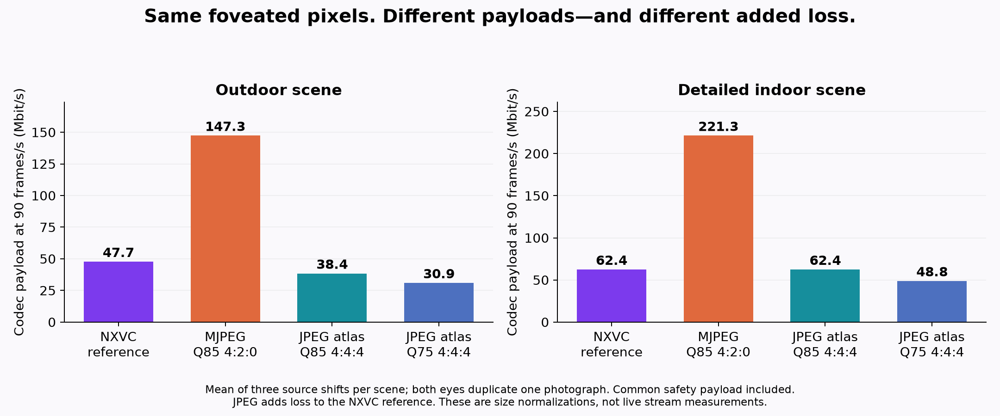
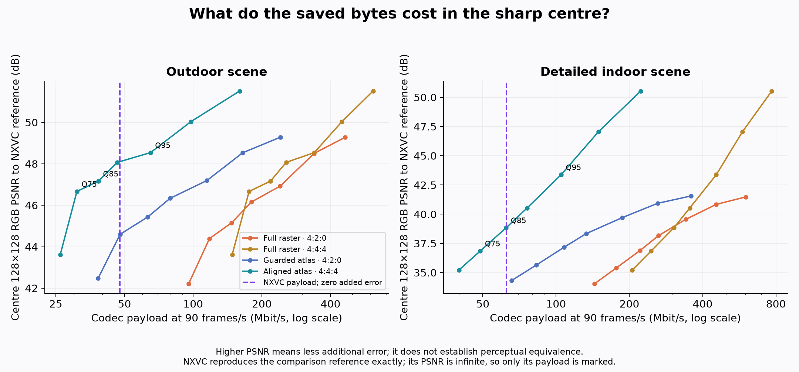
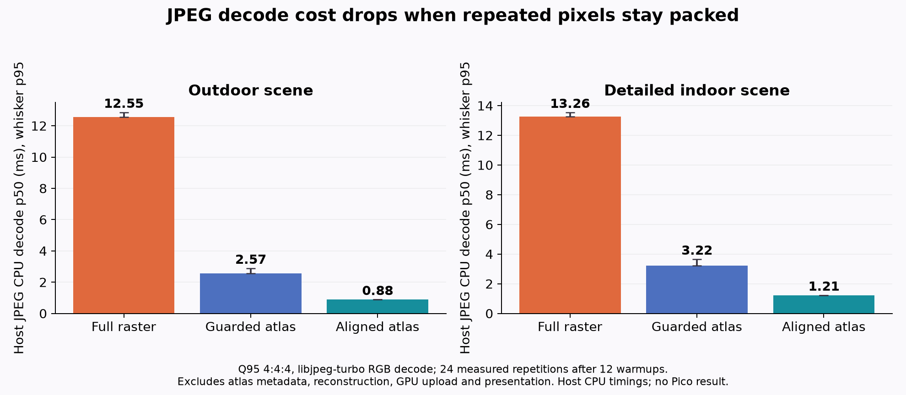

# Motion JPEG versus NXVC on identical foveated pixels

**Plain MJPEG is a poor bandwidth replacement in this experiment. A compact JPEG atlas is more interesting: at Q75 it saves 22–35% of payload, with additional image loss. No runtime or codec setting was changed.**

This is a local test on two saved VRChat photographs, each shifted by 0, 8 and 16 pixels before the existing NXVC encoder. It compares independent frames; no static-frame cache or motion-reference saving is credited to NXVC. It is not a live VR sequence, headset benchmark or claim of sustained 90 FPS.

## Result

Mean payload across the three shifts of each scene, converted to Mbit/s by multiplying bytes by 8 × 90:

| Representation | Outdoor scene | Detailed indoor scene | Additional loss relative to NXVC output |
|---|---:|---:|---|
| Current NXVC independent frame | **47.7 Mbit/s** | **62.4 Mbit/s** | None |
| Full-raster MJPEG, Q85, 4:2:0 | 147.3 Mbit/s | 221.3 Mbit/s | Yes |
| Aligned JPEG atlas, Q85, 4:4:4 | 38.4 Mbit/s | 62.4 Mbit/s | Yes |
| Aligned JPEG atlas, Q75, 4:4:4 | **30.9 Mbit/s** | **48.8 Mbit/s** | More |

These are **measured file sizes normalized to 90 frames/s**, not observed Wi-Fi rates. Both eyes contain the same photograph. The same LZ4-compressed safety companion is included for every arm. Network packetization, FEC, retransmission, padding and transport framing are excluded. The saved profile's **500 Mbit/s quality budget is not its compressed payload rate**.

Full-raster Q85 MJPEG needs about 3.1–3.5 times the payload of NXVC. The compact Q85 atlas saves about 19.5% outdoors and essentially nothing indoors. At Q75, the compact atlas saves 35.2% and 21.8%, respectively. Those savings are lossy, and the detailed scene is the harder quality case. Q100 JPEG is also not lossless.

## What “same foveation” means here

The source is the existing [full-photo 500 Mbit/s NXDF corpus](../../90fps-2026-09-25/row-compression/fixtures.json), not the separate synthetic-periphery encoder microbenchmark. Every file has 2176×2176 storage per eye, arranged as a 4352×2176 stereo raster. The exporter reuses the production peripheral pixel decoder and reads native RGB888 pixels directly. It checks native tile positions and duplicated-eye equality. No extra smoothing, sharpening, rescaling or generated content is applied.

The baseline selector runs the actual LZ4 / dense Zstd / predicted Zstd gates, followed by the native-row 5% gate. Forest row trials save only 4.82–4.99%, so the current selector correctly retains the incumbent; detailed-image row trials save about 14% and are accepted. Every selected envelope and safety payload is decoded and compared byte-for-byte with its original NXDF input.

JPEG then encodes **the decoded NXVC pixels**. Thus this experiment answers “can JPEG carry our existing foveated representation more cheaply?” It does **not** compare two independently tuned encoders against the original uncompressed scene at matched perceptual quality. The NXVC reference already contains its own foveation and palette losses. A JPEG-native representation could make different choices; that remains a separate experiment.

## Two JPEG routes

1. **Full raster:** encode one 4352×2176 JPEG. This is ordinary MJPEG framing at the image level, but decoding expands all 9,469,952 output pixels, including repeated peripheral samples.
2. **Sample atlas:** keep each tile's actual sample pitch. Pack 32×32 samples from native/full-detail tiles and 8×8 samples from quarter-resolution tiles into separate JPEG images. Retain uniform-tile RGB colours and the tile map losslessly with Zstd. Before JPEG is introduced, atlas reconstruction must reproduce the full NXVC raster exactly.

The atlas is a **JPEG/Zstd hybrid prototype**, not standard MJPEG and not integrated into WiVRn. The guarded version has four replicated border pixels and 16-pixel slot alignment for 4:2:0. A second 4:4:4 variant removes guards and aligns every patch to JPEG's independent 8×8 transform blocks. That aligned variant is the better compact result shown in the table.

For this corpus, the aligned atlas decodes **308,224 RGB pixels**, versus 1,032,192 for the guarded atlas and 9,469,952 for the full raster. This is a reduction in intermediate JPEG output work, not a measured reduction in total headset GPU work. A real client would still need metadata parsing, atlas sampling/reconstruction and GPU upload.

The prototype container includes its dimensions, guard-layout version, compressed tile map, exact flat colours, JPEG lengths and JPEG data. All 126 generated hybrid containers were decoded from serialized bytes. Eight representative decodes were additionally matched against the exact quality metrics reported by the encoder-side test.

## Quality and compression

The sweep covers JPEG Q60, Q75, Q85, Q90, Q95, Q98 and Q100, both 4:2:0 and 4:4:4, plus the aligned 4:4:4 atlas. All 210 results are available in [quality.csv](quality.csv) and [aligned444/quality.csv](aligned444/quality.csv).

Metrics report RGB PSNR over the full raster, the central 128×128 pixels of each eye, and the region outside each 256×256 centre. Higher PSNR means less *additional* error, not proven perceptual equivalence. The NXVC comparison reference has zero additional error by definition. Whole-image scores alone are misleading because repeated low-detail peripheral pixels dominate the raster. Private centre-crop comparisons are saved locally; the original photos and their derivatives are not published.

## CPU timing, not headset latency

JPEG timing uses libjpeg-turbo 3.2.0, a decoder handle and preallocated RGB output for each JPEG. Multi-image atlas decodes are timed together as one logical frame. File access, initial setup, output checks and CSV writing are outside the timed interval. Each job uses 12 warmups and 24 measured repetitions; job ordering is seeded and shuffled. Reported p95 is a coarse estimate from a small sample.

At Q75 4:4:4, the aligned atlas takes **0.552–0.726 ms p50** of host CPU decode across the two unshifted scenes. At Q95 4:4:4 it takes **0.884–1.212 ms**, versus **12.548–13.256 ms** for the expanded JPEG raster. These intervals exclude tile-map decompression and atlas reconstruction; they do not establish a complete client speedup. All **1,152 warm/measured outputs** remain stable across repetitions.

NXVC CPU helper timings are recorded separately. They produce decoder-ready NXDF buffers, **not a full RGB raster**, so dividing JPEG time by that helper time would not be an end-to-end decoder comparison. The GPU presentation pass, upload, networking, safety fallback display, app workload and motion-to-photon latency are unmeasured here.

The host is an AMD Ryzen 9 9950X3D. Clocks were not pinned and thermal history was not captured. The Pico was unavailable over ADB; the user explicitly chose local results. No Pico decode-speed or hardware-JPEG support claim is made.

## Decision

Keep NXVC as the current high-quality path. Plain expanded-frame MJPEG adds substantial bandwidth and output work in these fixtures. An aligned JPEG atlas merits a future **optional lower-bandwidth mode**, but its extra quality loss must be judged in moving scenes, and its full decode/presentation cost must be tested on the Pico before integration. These results do not justify replacing the live codec today.

## Reproduce and audit

- [Harness and commands](harness/README.md)
- [NXVC sizes and helper timings](nx-summary.json) · [Raw NXVC samples](nx-decode-samples.csv)
- [JPEG timing summary](jpeg-decode-summary.csv) · [Raw JPEG samples](jpeg-decode-samples.csv)
- [Input hashes and atlas dimensions](fixtures.json) · [Host and production source identities](host-method.json)
- [Serialized-container checks](container-checks.json)
- [Build, malformed-container and artifact validation](validation.json)

Run `python3 plot.py` to regenerate the numerical graphs. Re-encoding requires the caller-supplied private fixtures. All changes in this experiment are measurement tools and documentation; the server remains stopped.
