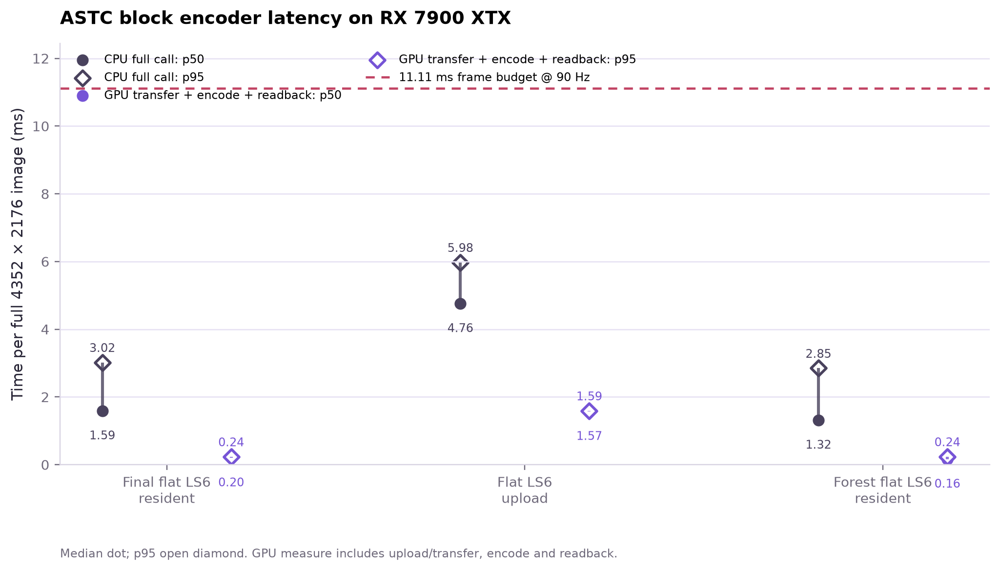
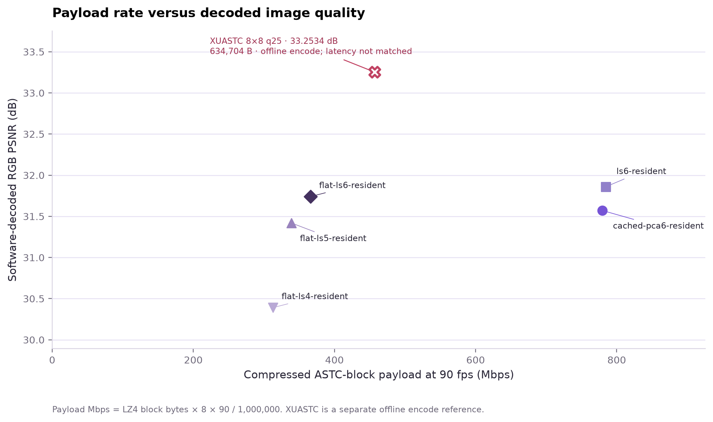
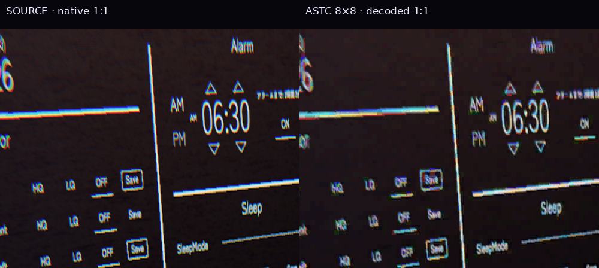
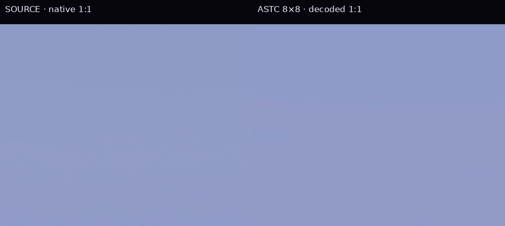
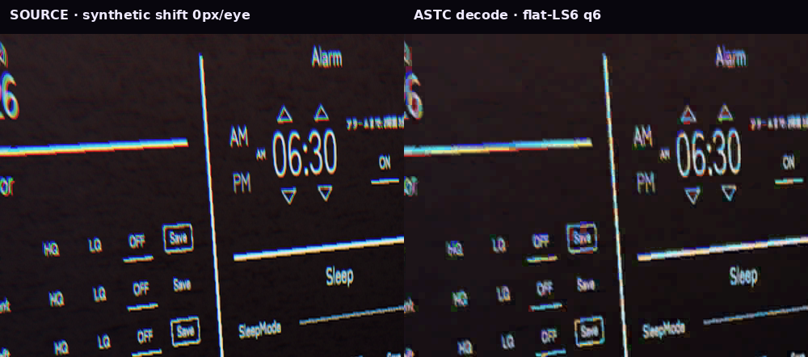

# Native ASTC: a PC encoder that removes the mode search

**3 October 2026 · standalone offscreen experiment · RX 7900 XTX + Ryzen 9 9950X3D**

The PC now emits legal full-image ASTC 8×8 blocks directly from a Vulkan compute shader, followed by CPU LZ4. The final dark-scene **GPU-resident source call takes 1.590 / 3.023 ms p50/p95**, including output transfer, the fence wait, cached readback, and LZ4. Uploading the entire source from CPU memory each time costs **4.759 / 5.977 ms**. This removes the previous hundreds-of-milliseconds CPU encoder obstacle, with a deliberate quality tradeoff.

This is **encoder proof**, not live WiVRn integration, fresh displayed FPS, sustained thermal performance, or physical photon latency. The existing production path and launch profile are unchanged. Do not add GPU timestamp time to the synchronous CPU time: CPU time already includes waiting for GPU work.

## What was cut

One invocation encodes an 8×8 block. Every block uses the same standard ASTC representation: one partition, direct RGB endpoint pair, a 5×5 grid of three-bit weights, and six-bit endpoint fields. There is no partition search, mode search, entropy codec, transform pyramid, motion search, or inter-frame dependency. The shader writes 16 bytes per block in one dispatch. This is native raster coverage, **not native-lossless quality**.

RGB endpoints use a short PCA fit. A precomputed least-squares inverse fits weights to ASTC's actual interpolation grid, preserving more edge contrast than sampling 25 isolated points. Only low-variance blocks take the flat shortcut: maximum per-channel standard deviation below four byte levels becomes a mean colour and zero weights. All high-variance blocks keep the fitted weights. This is spatial variance selection; it does not rely on repeated tiles.

The raw native block payload is 2,367,488 bytes/frame. LZ4 makes its regular structure cheaper to transport. Coarser endpoint precision was measured but is not selected: six-bit endpoints keep more colour detail.

## Measured complete PC call

4352×2176 RGBA input; 12 warmup iterations, 30 timed calls per case. Short static-input tests use separately uploaded input; no renderer executes alongside this harness.

| Final case | GPU encode + transfers p50 / p95, ms | CPU full call p50 / p95, ms | LZ4 payload bytes | Payload Mbit/s at 90 updates/s |
|---|---:|---:|---:|---:|
| final-flat-ls6-resident | 0.203 / 0.237 | 1.590 / 3.023 | 508605 | 366.2 |
| flat-ls6-upload | 1.573 / 1.594 | 4.759 / 5.977 | 508605 | 366.2 |
| forest-flat-ls6-resident | 0.165 / 0.239 | 1.315 / 2.850 | 318924 | 229.6 |

The **1 Gbit/s slider or 500 Mbit/s quality setting is not a measured link capacity**. These rates are byte counts normalized to 90 updates/s, without frame headers, packets, safety image, FEC, retransmission, or Wi-Fi overhead. Both photographic inputs duplicate one square view for stereo; they are not a native stereoscopic capture. The dark source is the same RGB image reconstructed from the earlier 4:2:0 fixture; the forest image was resized from the user's photograph. Neither input replaces a demanding native renderer capture.

## Quality and byte cost

Same dark-scene source and software decoder, no blur or post-filter:

| Dark scene variant | RGB PSNR, dB | RGB MAE, byte levels | LZ4 bytes | Payload Mbit/s at 90 |
|---|---:|---:|---:|---:|
| Point-sampled PCA, six-bit endpoints | 31.572 | 2.384 | 1,082,687 | 779.5 |
| Least-squares weights, six-bit endpoints | 31.860 | 2.283 | 1,089,642 | 784.5 |
| Flat shortcut + least-squares, six-bit endpoints | **31.741** | 2.599 | **508,605** | **366.2** |
| Flat shortcut, endpoint step two | 31.420 | 3.266 | 470,826 | 339.0 |
| Flat shortcut, endpoint step four | 30.391 | 4.708 | 434,726 | 313.0 |
| Earlier offline XUASTC 8×8 q25 | 33.253 | See earlier report | 634,704 | 457.0 |

The flat shortcut saves **53.3%** against the fitted non-flat encoder on dark, at 0.119 dB less PSNR. Forest saves **66.4%**, at 41.248 → 40.042 dB. These gains depend on scene variance. The fast dark result remains **1.51 dB below offline XUASTC q25**; text and fine coloured edges visibly soften. Global PSNR cannot establish headset acceptability or temporal stability.

## Checks and rejected approaches

- `glslangValidator` and `spirv-val` accept Vulkan 1.1 SPIR-V. A 17×9 run with Khronos validation enabled exits successfully with empty stderr; software decode validates its six partial-edge blocks. This high-frequency tiny fixture has poor reconstruction quality (15.76 dB), so it is a bounds/format check, not quality proof.
- The independent packing oracle matches pinned Basis Universal output for flat, ramp and random fixed-mode blocks. The 64×25 interpolation matrix has rank 25; inverse checks preserve constants and ramps within numerical tolerance. Legal quantization and integer ASTC rounding still add error.
- LZ4 safe decompression exactly matches emitted block payloads for the final dark, forest and synthetic-pan cases. Software ASTC decode succeeds on all published quality cases.
- Six synthetic per-eye edge-clamped shifts test changing packets. They are independent full-image encodes, not motion estimation, frame generation, object motion, or headset presentation. See retained per-frame samples and the animation below.
- Uncached readback made complete PC calls take roughly 18–24 ms despite a tiny compute timestamp. Host-cached memory fixes that bottleneck. Earlier uncached records are retained; they are not the final encoder result.
- The original point-sampled grid blurred thin edges. Least-squares fitting gives +0.288 dB on the dark scene, but saves no bytes by itself.
- Stock CPU direct ASTC without statistics took 582 ms for the CLI call, at 36.45 dB and 846.8 Mbit/s normalized payload. The CLI includes file operations and has different quality; **no matched-quality GPU speedup ratio is claimed**. XUASTC was also rejected for its much larger CPU encode cost.

## Synthetic pan illustration

This 1:1 UI crop compares the source with the actual software-decoded fast ASTC output for six global per-eye shifts. No blur or invented frames are added. The animated PNG preserves full RGB (the retained GIF has palette loss). It is slowed down for inspection, and the 4→8-pixel jump is intentional. It reveals fine-text softening and grid-dependent edge changes; it does not prove a jitter-free headset view.

[Per-frame quality and input hashes](quality/pan-shift-sweep/quality-results.json) · [Per-frame encoder samples](timing/dark-pan-summary.csv) · [Lossless packet round-trip checks](timing/dark-pan-manifest.json)

## Next integration gate

Use the renderer's GPU image directly, then transfer only the encoded blocks. Keep packets independently decodable and feed their ASTC payload into the already demonstrated Pico texture path. The renderer image layout, colour space and alpha rules must be handled explicitly. A production encoder should retain a quality fallback for complex multi-colour blocks.

The Pico hardware decoder result in the [parent experiment](../report.md) used **offline XUASTC-produced blocks**. These new fast GPU-produced blocks have only been checked with the independent desktop decoder. Actual Pico sampling, live transport, competing render work, thermal behaviour and fresh presentation still need one matched test. Do not sum separately measured PC and Pico medians into photon latency.

## Reproduce and inspect

- [Encoder build/run instructions](encoder/README.md), [compute shader](encoder/shaders/encode.comp), [runtime](encoder/src/main.cpp).
- [Per-call CSV and JSON](timing/final-flat-ls6-resident.astc.csv), [CPU-upload samples](timing/flat-ls6-upload.astc.csv), [forest samples](timing/forest-flat-ls6-resident.astc.csv).
- [Dark quality measurements](quality/least-squares-flat-comparison/astc-quality.json), [forest quality measurements](quality/forest-scene-comparison/astc-quality.json), [packing oracle](oracle/oracle.cpp), [matrix generator](oracle/weights/generate.py).
- [Source/device/build manifest](manifest.json), [artifact hashes](SHA256SUMS), [LZ4 provenance and license](../evidence/pico-astc/third_party/lz4/PROVENANCE.md).

From `encoder/`, run `./build.sh`, then `build/astc-gpu input.rgba output.astc 4352 2176 3 6 resident`. Use `upload` to include CPU-to-GPU source staging. Input must be exact tightly packed RGBA8; allocate and validate the source outside timing. The published script uses the adjacent pinned LZ4 source, or accepts `LZ4_DIR`.

The quality helper accepts `--source SOURCE.png --decoder DECODE_ASTC --output-dir DIR OUTPUT.astc`. Its software decoder source includes pinned Basis Universal's Android ASTC decoder: clone commit `99f52d63aa6799cbdaecfe977111dc5ec3b31d47` into a sibling directory named `basis_universal`, then compile `quality/decode_astc.cpp` with that parent directory on the include path. Basis license/notice are retained under `oracle/`. Full personal screenshots and binary frame buffers are not copied into this report; input hashes and bounded crops identify the tested fixtures.

Regenerate figures with `python regenerate_figures.py --gpu-runs timing --quality-json quality/least-squares-flat-comparison/astc-quality.json --output-dir .`.

The [pan generator](quality/pan-shift-sweep/generate_pan_artifacts.py) accepts `--source --decoder --runs --inputs --output-dir` and preserves full RGB in its animated PNG. Inputs use per-eye clamp-to-edge shifts; match the hashes in the pan manifest.
