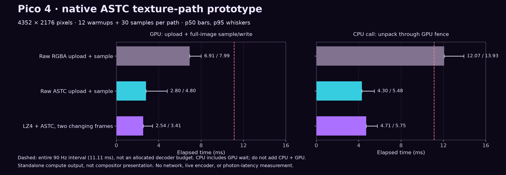
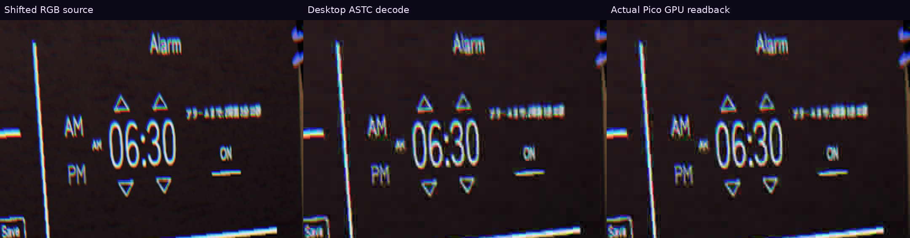
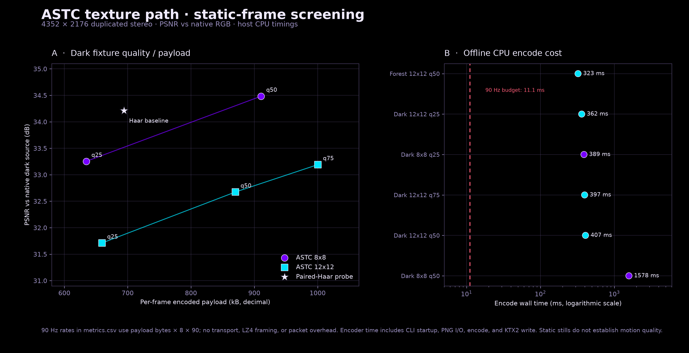

# ASTC texture path: remove reconstruction, measure what remains

**Measured native Pico candidate:** two alternating 4352×2176 ASTC 8×8 images, carried as LZ4 block payloads, take **2.54 / 3.41 ms GPU p50/p95** for upload plus full-image sample/write. The synchronous CPU call, including unpack, staging, flush, recording, submission and GPU fence wait, takes **4.71 / 5.75 ms**. Their 634,704 / 634,248-byte payloads imply **457.0 / 456.7 Mbit/s at 90 updates/s**, before transport overhead.



The architectural cut is to upload compressed texture blocks and let the GPU texture unit produce pixels during sampling. [HAP's GPU texture playback design](https://hap.video/developers.html) suggests this direction; [Arm's ASTC format overview](https://github.com/ARM-software/astc-encoder/blob/main/Docs/FormatOverview.md) explains the fixed-size blocks. The Pico capability check confirmed ASTC LDR sampling support. This removes software coefficient reconstruction; sampling and memory traffic still cost time.

**The stock PC encoder remains far too slow.** The 16-thread check spends 331 ms inside `basis_compressor::process()`, before the host transcode. Fast headset sampling does not solve that. No live integration, installed APK, sustained 90/240 Hz, or photon-latency win is claimed. WiVRn NX production code and configuration remain unchanged.

## Pico proof and rejected route

| Final native 8×8 run | GPU upload + sample/write p50 / p95 | CPU call through fence p50 / p95 |
|---|---:|---:|
| Raw RGBA comparator | 6.91 / 7.99 ms | 12.07 / 13.93 ms |
| Raw ASTC block payload | 2.80 / 4.80 ms | 4.30 / 5.48 ms |
| LZ4 + ASTC, two changing images | **2.54 / 3.41 ms** | **4.71 / 5.75 ms** |

All three paths upload and write the same full-size RGBA8 output. Each runs sequentially with 12 warmups and 30 timed iterations; clocks/thermals are uncontrolled. The smaller GPU time in the LZ4 run is not evidence that CPU decompression accelerates the shader. CPU call time contains GPU wait: never add the columns. The final trace uses sorted index `floor((n−1)q)` for p50/p95. Its [90 retained samples](evidence/pico-astc/logs/q25-alternating-samples.csv) regenerate the [vector figure](pico-texture-path.svg) through `generate_runtime.py`.

The second input is a synthetic two-pixel horizontal shift, alternated every iteration. Final Pico readback matches its desktop ASTC decode with maximum channel error **1/255**, MAE **0.01047/255**, and no channel exceeding tolerance 2. Both LZ4 outputs match their ASTC payloads byte-for-byte. This verifies changing inputs and correctness; it does not establish real VR motion quality. [Harness source, build procedure, input hashes and logs](evidence/pico-astc/RESULTS.md). The earlier 12×12 q50 check also matched within one level, but its payload exceeds 500 Mbit/s and lacks a per-sample trace.

**Rejected:** transmit XUASTC and transcode on Pico. A repeated native 12×12 q50 check takes **29.88 / 30.46 ms** for the full CPU transcode call, before upload or sampling, despite byte-exact outputs. Move that work to the PC and transmit LZ4-compressed ASTC blocks instead. Standalone Pico LZ4 on the actual 8×8 payload takes **0.458 / 0.603 ms**, with byte-exact output. That cost is already included in the combined call above. [Retained host/Pico logs and helper](evidence/transcoder/rerun/results.md).

For context, the earlier paired-Haar probe takes **12.16 ms GPU p50** at these dimensions and approximately 500 Mbit/s payload. Haar produces planar YUV; this ASTC test samples/writes RGBA. These are different paths and separate runs, not a controlled speedup ratio against live NXVC. [Haar methods and trace](../pyrowave-full-image/dequant-batching/report.md).



This nearest-2× crop comes from the actual final device readback. Its [full-image comparison and hashes](pico-readback.json) are retained; it is not a headset photograph.

## Before live use

1. Build a restricted-mode GPU ASTC encoder on the PC, avoiding the stock offline search and XUASTC-to-ASTC detour. Keep full image dimensions; quality is the permitted approximation.
2. Sample ASTC inside the existing presentation pass, avoiding an extra full-frame RGBA intermediate. This fusion is proposed, not measured here.
3. Integrate bounded LZ4 payloads with deadline/recovery handling, then test representative stereo motion, transport overhead and sustained presentation. At 500 Mbit/s the tested payload takes about 10.15 ms just to serialize.

The [four host thread-cap checks](evidence/thread-check/results.md) produce identical packets. More threads help through 16 (CLI 1.761 → 0.397 seconds); startup/init adds about 66–76 ms, so removing CLI startup alone cannot close the gap. These are single-run checks.

## Offline packet and quality screening

This bounded experiment tested Basis Universal XUASTC output, CPU-transcoded to ASTC blocks, then LZ4-compressed as a candidate texture payload for 90 Hz delivery. It is a static-frame feasibility screen, not a live encoder, stream, motion-quality, or end-to-end readiness result.

**Current read:** dark-fixture ASTC 8×8 quality 25 is the smallest tested payload at 634,704 bytes (456.99 Mb/s at 90 fps) and reaches 33.25 dB full-frame RGB PSNR. Against the measured paired-Haar probe output (694,260 bytes; 34.21 dB), this saves 8.58% payload for a 0.96 dB PSNR drop. On an ideal 500 Mb/s link, that payload alone takes 10.16 ms of the 11.11 ms frame interval, leaving about 0.96 ms for all transport and scheduling overhead. The stock native encoder still takes 389 ms for this case, including process startup and PNG/KTX2 I/O, so this is an offline coding experiment, not an encoder suitable for a 90 Hz live path.

## Measurements

All dark rows use the same 4352×2176 duplicated-stereo RGB fixture. The forest case is an independent fixture; its PSNR is only comparable to its own source, not the dark or Haar rows. “LZ4 payload” is only the fast-LZ4-compressed raw ASTC block bytes. It excludes framing, packet headers, and transport overhead. The 90 fps rate is the payload bytes multiplied by 8×90.

| Fixture | ASTC block | Quality | LZ4 payload | Rate at 90 fps | PSNR vs matching source | Host encode wall* | Host ASTC transcode** |
|---|---:|---:|---:|---:|---:|---:|---:|
| Dark | 12×12 | 25 | 659,500 B | 474.84 Mb/s | 31.71 dB | 362 ms | 9.55 ms |
| Dark | 12×12 | 50 | 870,184 B | 626.53 Mb/s | 32.67 dB | 407 ms | 14.41 ms |
| Dark | 12×12 | 75 | 1,000,356 B | 720.26 Mb/s | 33.19 dB | 397 ms | 17.20 ms |
| Dark | 8×8 | 25 | 634,704 B | 456.99 Mb/s | 33.25 dB | 389 ms | 15.25 ms |
| Dark | 8×8 | 50 | 910,735 B | 655.73 Mb/s | 34.48 dB | 1,578 ms | 24.25 ms |
| Forest | 12×12 | 50 | 653,851 B | 470.77 Mb/s | 38.96 dB | 323 ms | 9.23 ms |
| Paired-Haar probe reference | — | — | 694,260 B | 499.87 Mb/s | 34.21 dB | — | — |

\* Native host CLI wall time includes CLI startup, PNG input, encode, and KTX2 write; it is not a pure kernel time. The observed 323–1,578 ms range is 29–142× the 11.11 ms interval.

\** Measured on the AMD Ryzen 9 9950X3D host; not Pico timing and not included in the candidate LZ4 packet-rate calculation. The Pico section above must be used for device-path conclusions.

## Visual evidence



[Vector version](astc-texture-path-metrics.svg) · [Six-case contact sheet](astc-quality-contact-sheet.png) · [Nearest-neighbour 2× text-edge crop: native, Haar, ASTC 8×8 q25/q50](dark-text-edge-detail-strip-2x.png) · [Two-static-frame blink comparison](dark-source-vs-astc8-q25-blink.gif)

The q25 detail crop shows visible text/colour blocking: speed and dimensions pass this screen, but visual quality is not solved. The contact sheet is downscaled for overview; the detail strip is a nearest-neighbour enlargement of source pixels. The two-frame GIF alternates still-image reconstructions only and is not evidence of temporal stability or motion quality. The source fixture duplicates one view into both eye regions, so it is not a representative independent-eye stereo workload.

## Method and reproducibility

- Upstream encoder: [BinomialLLC/basis_universal](https://github.com/BinomialLLC/basis_universal), v2.50.0, commit `99f52d63aa6799cbdaecfe977111dc5ec3b31d47`; Apache-2.0 license and upstream notice are included in `licenses/`.
- Native Release build: Linux x86_64, AMD Ryzen 9 9950X3D, SSE and Zstandard enabled; OpenCL and Python bindings disabled. XUASTC LDR, Zstd profile, effort 0. Blur flag omitted.
- One representative exact invocation (other rows substitute their block and quality values):

  ```sh
  basisu -xuastc_ldr_8x8 -quality 25 -effort 0 -xuastc_zstd \
    -no_status_output -output_file dark-xuastc-8x8-q25.ktx2 dark-native.png
  ```

- The dark fixture is the prepared 4352×2176 RGB8 conversion of full-range BT.709 YCbCr420, with the same 2176×2176 view duplicated side-by-side. It is identified by SHA-256 in `manifest.json`; no full source frame or original YUV is redistributed here. A separate forest fixture is likewise hashed in the manifest.
- Quality is full-frame RGB8 PSNR of direct ASTC block decode against the matching RGB source. Raw decoder references use direct block decode without deblocking. The paired-Haar probe reference is the prepared frame-0 host-plane reconstruction, converted to rounded RGB8; the manifest includes its image hash, RGB PSNR/MAE, and reported packet size.
- `metrics.csv` and `manifest.json` contain all measured values, payload and ASTC file hashes, source hashes, and generated-figure hashes. `evidence/logs/` contains the per-case encoder and transcoder logs with private scratch paths replaced by `$XUASTC_SCRATCH`. `generate_artifacts.py` regenerates the plots and image comparisons when `XUASTC_SCRATCH` points at the private experiment directory.

## Limits

The offline quality screen does not test network framing, loss/recovery, representative crowd coverage, or live capture-to-display streaming. The device update check uses only two synthetic images. Payload-rate estimates omit every transport and LZ4 framing cost. Host CPU encode/transcode timings must not be presented as Pico timings. The Pico harness evidence above records headset decoding, upload, sample, and correctness measurements; those are a different stage from this host encoder screen. No 90 fps or live-readiness claim follows from these measurements.
