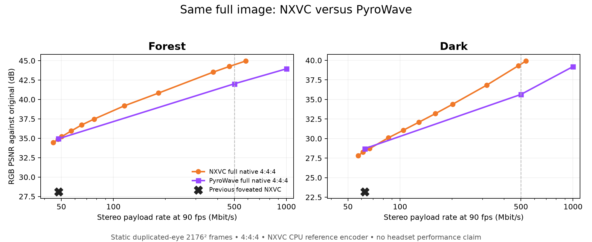
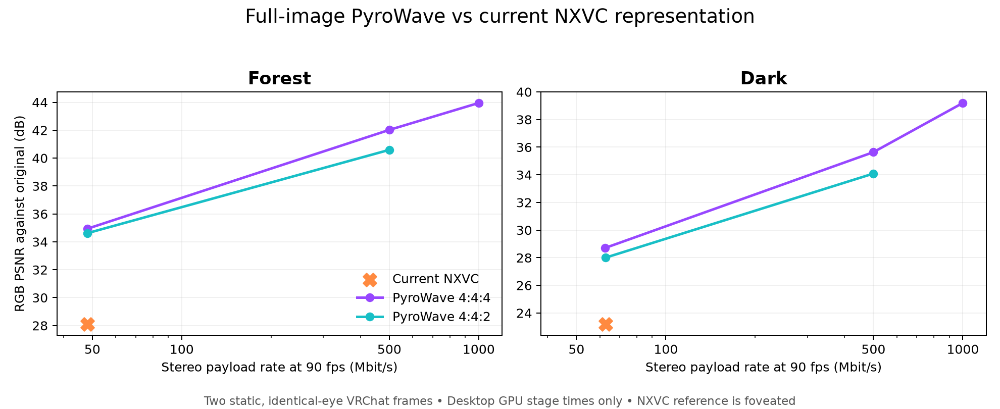

# Full-image PyroWave probe — 3 October 2026

**Updated decision:** PyroWave wins against the *previous foveated NXVC output*, but **does not win this full-image quality comparison**. With both codecs fed the original full-resolution pixels, NXVC is nearly tied around 50–63 Mbit/s and ahead by **2.24–3.67 dB** near 500 Mbit/s while using fewer bytes. The earlier 5.5–6.9 dB gap was largely the cost of NXVC's foveated representation, not evidence that PyroWave's wavelet transform is better. The live Pico performance question remains open.

| Scene | Rate region | NXVC full native 4:4:4 | PyroWave full native 4:4:4 |
|---|---|---:|---:|
| Forest | ~48 Mbit/s | 66,444 B, 34.86 dB | 66,848 B, 34.94 dB |
| Dark | ~62 Mbit/s | 84,896 B, 28.26 dB | 86,828 B, 28.71 dB |
| Forest | ~500 Mbit/s | 650,000 B, **44.26 dB** | 694,380 B, 42.02 dB |
| Dark | ~500 Mbit/s | 671,320 B, **39.31 dB** | 694,328 B, 35.64 dB |

The rates are close, not exactly identical; the NXVC high-rate points spend 3–6% **fewer** bytes. The [full QP sweep](full-image-nxvc.csv) shows the curve. This test uses the NXVC **CPU reference encoder** to establish quality, not its live Vulkan encoder's timing. Its decoded frames are normative, but no PC/Pico throughput claim follows. The PyroWave GPU stage times below are kept for context and are not compared with CPU wall time.

There is a separate **desktop decoder-speed lead** worth testing on Pico. On the RX 7900 XTX, eight launches of PyroWave decoding the 694,380-byte forest frame gave a median **0.173 ms** for its reported iDWT + dequant GPU stages. Eight launches of `nxvc-vkdec --no-out --repeat 12` decoding the 650,000-byte full-native QP12 frame gave a median **6.665 ms** for its reported best Pass A + Pass B GPU time ([samples](desktop-decode-stages.csv)). These are different timing scopes: PyroWave excludes its YUV-to-RGB presentation, and NXVC reports the best of twelve per launch. They cannot be turned into a 38× end-to-end speed claim, yet the gap motivates an isolated headset trial even though NXVC wins the high-rate PSNR comparison.

## Why the first result looked dramatic

The current 500 Mbit/s NXVC *setting* generated only 48–63 Mbit/s on these stills, and its input had already passed through the compositor's foveation/sampling path. PyroWave was fed the native full image. The resulting blocky outer region therefore dominated the first PSNR gap. PyroWave also budgets the requested bytes across the entire image in one GPU pass; NXVC's live byte/QP controller and the compositor's sampling policy are separate. These are the useful design ideas to investigate. This experiment does not isolate a CDF 9/7 wavelet advantage.

The two supplied VRChat screenshots are valuable because one combines a detailed silhouette and dark foliage, while the other has fine bright patterns against dark objects. We used their existing private 2176 × 2176 per-eye source fixtures and duplicated each eye to form a 4352 × 2176 stereo frame. A second dark-scene check shifted the right eye by 8 pixels: its matched-rate 4:4:4 packet was 86,936 bytes with 28.74 dB mean stereo PSNR and 0.389/0.164 ms GPU encode/decode stage sums. This reduces one obvious duplicated-eye concern but is still a static synthetic stereo pair. Original screenshots and decoded crops are intentionally omitted from this public report.

| Scene | Representation | Bytes/stereo frame | 90 Hz payload | RGB PSNR | GPU encode | GPU decode |
|---|---|---:|---:|---:|---:|---:|
| Forest | Current NXVC | 66,851 | 48.1 Mbit/s | 28.09 dB | — | — |
| Forest | PyroWave 4:4:4, matched | 66,848 | 48.1 Mbit/s | **34.94 dB** | 0.382 ms | 0.157 ms |
| Forest | PyroWave 4:2:0, matched | 66,828 | 48.1 Mbit/s | 34.62 dB | 0.190 ms | 0.095 ms |
| Forest | PyroWave 4:4:4, 500 Mbit/s | 694,380 | 500.0 Mbit/s | 42.02 dB | 0.381 ms | 0.136 ms |
| Dark | Current NXVC | 86,944 | 62.6 Mbit/s | 23.18 dB | — | — |
| Dark | PyroWave 4:4:4, matched | 86,828 | 62.5 Mbit/s | **28.71 dB** | 0.371 ms | 0.179 ms |
| Dark | PyroWave 4:2:0, matched | 86,896 | 62.6 Mbit/s | 28.00 dB | 0.213 ms | 0.094 ms |
| Dark | PyroWave 4:4:4, 500 Mbit/s | 694,328 | 499.9 Mbit/s | 35.64 dB | 0.405 ms | 0.226 ms |

The [machine-readable data](results.csv) also contains 1 Gbit/s points. Bitrate is calculated as `frame_bytes × 8 × 90`; it is not a measured wireless throughput. NXVC bytes comprise the selected detail and safety payload from the [prior independent frame test](../../90fps-2026-09-29/mjpeg-vs-nxvc/nx-summary.json). PyroWave bytes exclude its 4-byte frame prefix and one-time 40-byte stream header. Neither side includes Wi-Fi packetization or FEC. NXVC timing in that earlier test is a CPU helper decode and is intentionally **not** compared with PyroWave's GPU timings.

The whole-raster PSNR gain is mostly peripheral at the matched, roughly 50–63 Mbit/s payload. In the central 256 × 256 region, forest is **29.36 dB NXVC versus 28.92 dB PyroWave**; dark is **26.30 versus 26.89 dB**. At 500 Mbit/s PyroWave's centres reach 39.11 and 33.29 dB. So the low-rate result is evidence for eliminating conspicuous peripheral simplification, not a universal centre-detail win. The current NXVC 500 Mbit/s *quality setting* used only 48–63 Mbit/s on these frames; PyroWave's 500 Mbit/s row actually spends approximately the full budget.

The PyroWave figures are one-frame Vulkan timestamp sums from its CLI. Encode includes packing, resolve, analysis, quantization, and DWT; decode includes inverse DWT and dequantization. They omit transfers, CPU submission, shader compilation, transport, compositor work, and headset thermals. Thus 0.1–0.2 ms here cannot be translated into Pico motion-to-photon latency or sustained 90 Hz.

## What to borrow

PyroWave's [own design](https://github.com/Themaister/pyrowave) is intra-only Vulkan compute with a CDF 9/7 wavelet, simple parallel coefficient coding, exact per-frame byte control, 4:2:0 and 4:4:4 modes, and independent 64 × 64 coefficient blocks for local recovery. NXVC already has a Vulkan encoder and decoder; this test does not justify copying the wavelet or replacing those paths. The part worth pursuing is **spending the permitted bits across the full native image** while preserving NXVC's faster/cheaper tile choices when the headset needs them. In a separate offline `nxv-enc --rc --rc-fov off --rc-temporal off` probe, the 500 Mbit/s target spent only 262,510 bytes on forest, versus 650,000 bytes for the full-native QP12 point; its quality was 40.89 versus 44.26 dB. The offline allocator and the live controller are different, so this is a rate-allocation lead, not a diagnosis of the running streamer.

Next experiment: run an **opt-in full-native NXVC profile** on the Pico at 90 Hz with real stereo motion, packet loss and bitrate steps. Record headset GPU p50/p95, received-frame age, thermals and visible recovery, alongside the current profile. It needs `stream_scale=1`, headset `render_scale=1`, sharper centre and adaptive foveation off, and native tile sampling; merely raising the bitrate slider cannot recreate missing source pixels. A PyroWave Pico decode probe remains useful for speed, but its quality numbers no longer justify a port by themselves. Its MIT-licensed code would require retaining the license notice if copied.

## Reproduction and scope

PyroWave was checked out at `89f7e47d4abbf650c91fae766728af866c5e32a0`, with Granite `1b2d1801d2910fb09ebcded2f0bb3a3a781103b5`, and built in an isolated `/tmp/pyrowave-bench` directory. `pyrowave-encode` and `pyrowave-decode` were built in Release mode with `PYROWAVE_DEVEL=ON`. Each source PNG was horizontally duplicated with FFmpeg, converted to full-range `yuv444p` or `yuv420p` Y4M, encoded with the target bytes/frame, decoded back to Y4M, and converted to RGB PNG for PSNR. For the fair control, the same horizontal pair was converted to full-range raw `yuv444p`, encoded with freshly built `build-vk/bin/nxv-enc --w 4352 --h 2176 --eyes 2 --pix yuv444p --qp N`, decoded by `nxv-dec`, and converted to RGB PNG with FFmpeg. No `--rc` or resolution map was used in the plotted NXVC full-native QP sweep. The source fixtures are `scratch/jpeg-periphery/{forest,dark}-s0-source.png`; the current NXVC decoded references are matching `*-s0-nx.png`. Both are private local material and are not required to understand the published summary.

PSNR is RGB against the original screenshot after conversion back from YUV. Identical left/right duplication, still frames, differing container overhead, and slight byte mismatches can all favor one candidate. The full-image control specifically removes foveation as the principal confound, but does not establish motion quality, decoder speed or a universal transform ranking. No live server, WiVRn build, or Pico install was changed for this probe.
