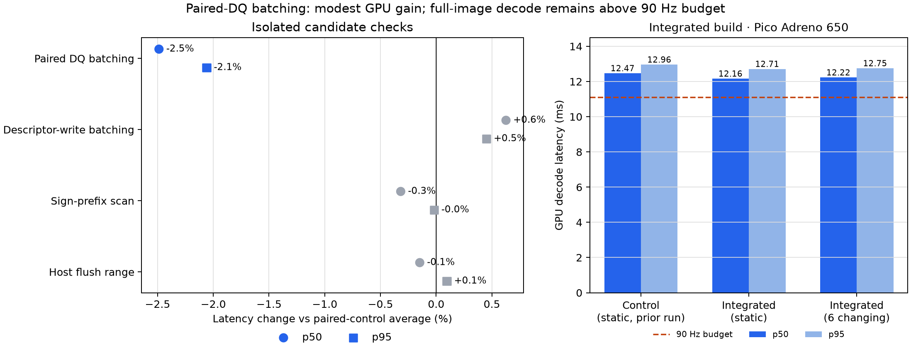
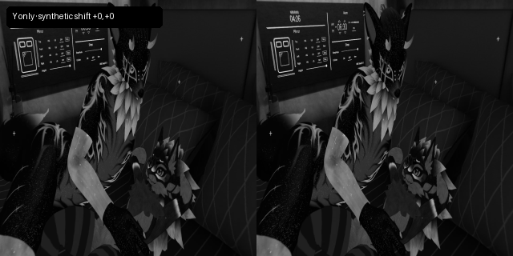

# Paired dequantization batching: measured gain, integrated gate

The paired-DQ change combines per-band compute dispatches along dispatch Z. In the isolated Pico run it reduced dequantization dispatches from **42 to 13 for 4:2:0** and **48 to 15 for 4:4:4**. For the matched 4352×2176 4:2:0 test, GPU p50 moved from a 12.4661 ms average of the bracketing controls to 12.1560 ms (−2.49%); p95 moved from 12.9565 to 12.6895 ms (−2.06%). CPU-total p50 was 15.2434 ms for the mean of the controls and 14.9522 ms for the candidate. These are modest improvements to the isolated decode path.

The final production-integrated build was compiled through the full Android `wivrn` CMake target with the Haar format enabled and disabled. On Pico Adreno 650, the static 4:2:0 run measured GPU p50/p95 **12.1592/12.7095 ms** and CPU-total p50/p95 **14.8236/15.8225 ms**. The six-packet changing-frame run measured GPU **12.2250/12.7484 ms** and CPU-total **14.9268/16.4277 ms**. Both GPU medians exceed the 11.11 ms 90 Hz frame budget; these measurements do not establish 90 Hz full-frame decode.

Before timing, the integrated changing-frame readback compared all **18 Y/Cb/Cr planes byte-for-byte** against the host reference. Run the general verifier with the host-reference directory/prefix and integrated-output directory/prefix; the recorded invocation and output are in `evidence/motion-planes-verify.log`. The copied `verify_planes.py` accepts `reference_dir candidate_dir reference_prefix candidate_prefix`. Separate host gates also passed byte-exact for 4352×2176 4:2:0, 4352×2176 4:4:4, and non-aligned 1920×1080 4:2:0 outputs; plane sizes and hashes are in `evidence/host-gates-equality.log`. The 4:2:0 CDF baseline gate passed on Pico with all three planes byte-exact to the existing Pico CDF baseline; the host comparison differed by at most one code value from expected rounding (`evidence/cdf-equality.log` and `evidence/cdf420-pico-readback.log`).

## Other decode experiments

Descriptor-write batching did not help: its GPU p50 was 0.6% slower than the bracketing controls. The sign-prefix scan changed p50 by −0.3% and p95 by −0.02%, which is neutral. Narrower host flush ranges also remained within run variation: p50 changed −0.15%, p95 +0.10%. These candidates are retained as evidence, not presented as wins.

The GIF below shows the decoded Y-plane previews for six independently encoded translations of the existing dark stereo 4:2:0 source. Translations use `numpy.roll`, so borders wrap synthetically. This is a small offline motion fixture and does not demonstrate temporal prediction, live streaming, visual comfort, or headset jitter.

The preview is downsampled from actual host readback. The original image, full-resolution source frames, readback planes, and binaries stay outside this report directory. Rebuild the figures with `python3 build_chart.py`; comparison, fixture-generation, build, and readback sources and logs are retained under `evidence/`.

Full build details and the source commit are in [BUILD_CHECKS.md](BUILD_CHECKS.md). The standard CDF format remains the default; the Haar option requires matching encoder and decoder builds. No APK was installed and the server remains off.

## Evidence files

- `evidence/paired-dq-control1.log`, `paired-dq-batched.log`, `paired-dq-control2.log`, and `paired-dq-batched.patch` hold the isolated A/B/A run and implementation.
- `evidence/integrated-pico-static-bench.log`, `integrated-pico-motion-bench.log`, `integrated-pico-motion-readback.log`, and `integrated-motion-equality.log` hold the final hardware runs and readback gate.
- `evidence/descriptor-*`, `signscan-*`, and `flush-*` preserve neutral experiments and their patches.
- `evidence/make-motion.py`, `motion-host-readback.cpp`, `integrated-build.sh`, and `integrated-motion-readback.cpp` preserve the fixture and harness sources. `evidence/integrated-artifacts.sha256` records the tested library and harness hashes.
- `latency-deltas.csv` is the plotted relative-latency data. `build_chart.py` regenerates `dq-batching.png`, `dq-batching.svg`, `motion.png`, and `motion.gif`.

The copied motion-generation script preserves the exact source used for this fixture but depends on the private scratch source and encoder binaries; those inputs are intentionally not bundled, so the report directory alone is not a standalone regeneration package.
