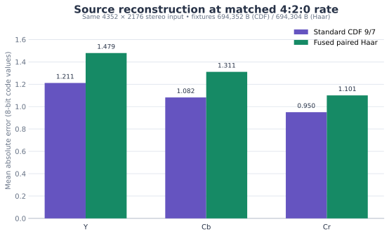
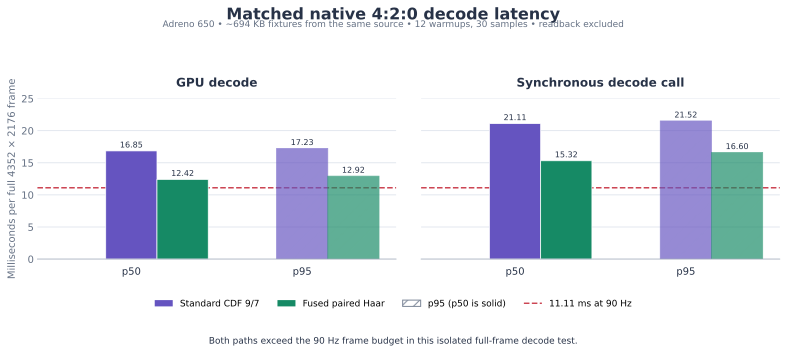
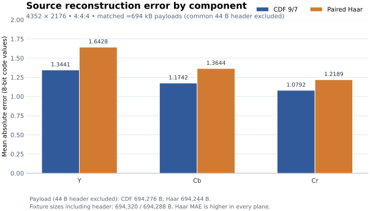
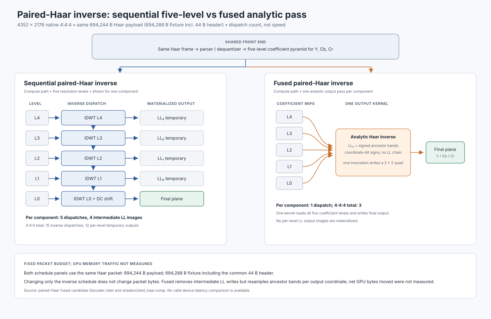

# PyroWave full-image inverse comparison

This report keeps three different measurements separate: matched 4:2:0 CDF-versus-fused-Haar decode, 4:4:4 source-quality reconstruction, and sequential-versus-fused Haar inverse scheduling. All Pico results below are isolated decoder microbenchmarks. They do not demonstrate live streaming, compositor throughput, or 90 fps or motion-to-photon latency.

## Matched native 4:2:0 result

Standard CDF 9/7 and fused paired Haar were tested at 4352 × 2176 on the same native stereo 4:2:0 source. Their fixtures were 694,352 B and 694,304 B respectively, within 48 B of one another. The Cb and Cr source planes use 2 × 2 averaging with round-half-up; Y remains full-resolution.

The CDF reconstruction had lower source MAE in each plane: Y/Cb/Cr were 1.211457 / 1.082256 / 0.950094 code values for CDF and 1.47926 / 1.31090 / 1.10053 for fused Haar. Lower is better. The comparison uses actual decoded planes, not a visual estimate.

The native Adreno 650 timing harness used CDF fragment output and Haar compute output, looped the single fixture for 12 warmups and 30 measured samples, and excluded readback. It measured:

| Path | GPU p50 | GPU p95 | Synchronous call p50 | Synchronous call p95 |
|---|---:|---:|---:|---:|
| Standard CDF 9/7 | 16.8462 ms | 17.2323 ms | 21.1093 ms | 21.5177 ms |
| Fused paired Haar | 12.4169 ms | 12.9234 ms | 15.3183 ms | 16.5999 ms |

Fused Haar reduced median GPU decode time by 26.3% and median Synchronous call by 27.4% in this run. The dashed line in the chart marks 11.11 ms, the full frame budget at 90 Hz. Even fused Haar's GPU p50 and p95 exceed that budget, so these measurements do not support a 90 fps decode claim.

The raw source and full planes remain in private scratch. Encoder, host roundtrip, Pico readback, timing commands, and hashes are documented in [retained methods](evidence/cdf420-methods.md) and [raw timing samples](evidence/cdf420-bench.log); no source photo or raw plane is included here.

## Separate 4:4:4 latency context

A separate native 4:4:4 run provides context, not a matched 4:2:0 comparison. Standard CDF measured 27.6549 ms GPU p50 (28.2897 ms p95); fused Haar measured 23.8222 ms (24.4245 ms p95). A valid sequential-Haar control measured 26.1212 ms (26.3982 ms p95). The sequential and fused Haar measurements decode the same Haar packet; CDF uses its own near-size-matched 4:4:4 fixture. The older 4:4:4 CDF stage profile below came from a separate run, so its phase medians must not be added or substituted for this full-decode distribution.

## 4:4:4 source reconstruction

This original spatial chart uses the sequential Haar reconstruction; fused reconstruction differed by at most one code value. The newer 4:2:0 source-error chart above uses the fused output.

CDF 9/7 has lower mean absolute source error in each plane. Paired Haar increases MAE by 0.2987 in Y, 0.1902 in Cb, and 0.1397 in Cr. CDF payload is 694,276 B and Haar payload is 694,244 B; the fixture files include a common 44-byte header, giving 694,320 B and 694,288 B respectively. The payload budget is closely matched, not byte-identical.

The [CSV](source-quality.csv) records MAE, payload bytes excluding the header, and complete fixture sizes. [plot_source_quality.py](plot_source_quality.py) regenerates the existing 4:4:4 SVG and PNG.

[Actual translated-frame animation and crops](motion-visual/README.md) illustrate spatial detail. These independently encoded translations are not a headset jitter or comfort test.

## Haar inverse scheduling

The pipeline diagram compares two compute inverse schedules for the same paired-Haar packet. Sequential inverse dispatches once at each of five resolution levels per component, materializing four intermediate LL images. Fused inverse dispatches once per component (three dispatches total): each invocation samples the coefficient pyramid, accumulates signed ancestor bands, then writes a final 2 × 2 output quad. Both receive the same parser/dequantized coefficients.

Changing only the inverse schedule leaves the Haar payload unchanged. The fused kernel removes intermediate LL writes but samples ancestor bands at output coordinates; total GPU bytes read and written were not measured. The schedule diagram follows the private fused implementation in `pyrowave-haar-fused-20261003/common/pyrowave/pyrowave_decoder.cpp::Decoder::idwt` and `common/pyrowave/shaders/idwt_haar.comp`.

## Rejected decoder-side experiments

Sparse-clear returned output bit-exact to the reference but measured 30.6606 ms GPU p50, slower than the valid sequential-Haar control at 26.1212 ms, so it is rejected as a speed optimization. Native XY block ordering and typed-R8 experiments were neutral in the tested scope; no speedup is claimed for them. Explicit R16F/R32F coefficient stores were also neutral: [typed-dequant results](typed-dequant/pico-report.md), pooled control 12.4297 ms versus candidate 12.3668 ms GPU p50. Their extra pipeline variants are not integrated.

The [4×4 output variant](quad4/README.md) matched pixels exactly but was about 6% slower than the bracketing 2×2 controls. It is rejected.

## Integrated branch checks

The [root-built integration](integration/README.md) corroborated the speed result at 12.4662 ms GPU p50. Aligned desktop 4:2:0 and 4:4:4 decode passed Vulkan validation and matched prior fused planes exactly. Non-aligned 1920×1080 4:2:0 passed validation; actual Pico output matched desktop exactly. A separately assembled clean sequential host comparator gave inconsistent output and is not accepted as numerical conformance evidence. Source MAE and cross-device equality support the cropped output check, rather than that comparator. Both Android native shared-module variants linked; no new app was installed or live server started.

## Earlier 4:4:4 CDF stage profile

The corrected standard CDF stage profile used the fragment inverse path. On Pico/Adreno 650 at 4352 × 2176, full-decode GPU p50 was 27.8759 ms; dequant was 11.8385 ms and inverse/output was 16.4054 ms. CPU full-decode p50 was 32.4976 ms. These phase medians come from separate distributions, so they do not add exactly to the overall median. Machine-readable data is in [standard-cdf-stage-profile.csv](standard-cdf-stage-profile.csv).

All fixtures here are static standalone frames. The tests do not measure temporal stability, image motion, packet transport, full client load, or headset presentation.
