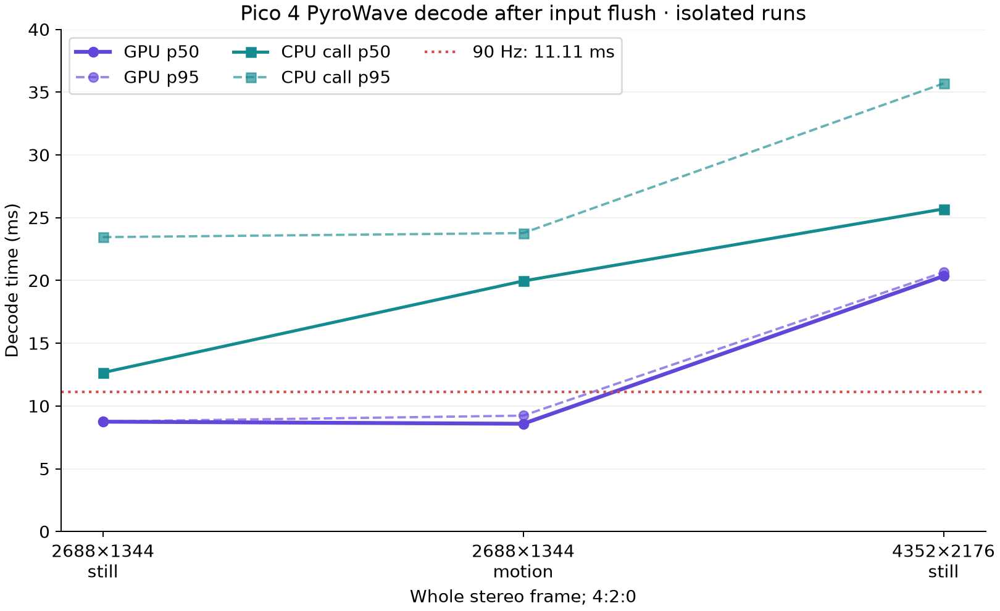
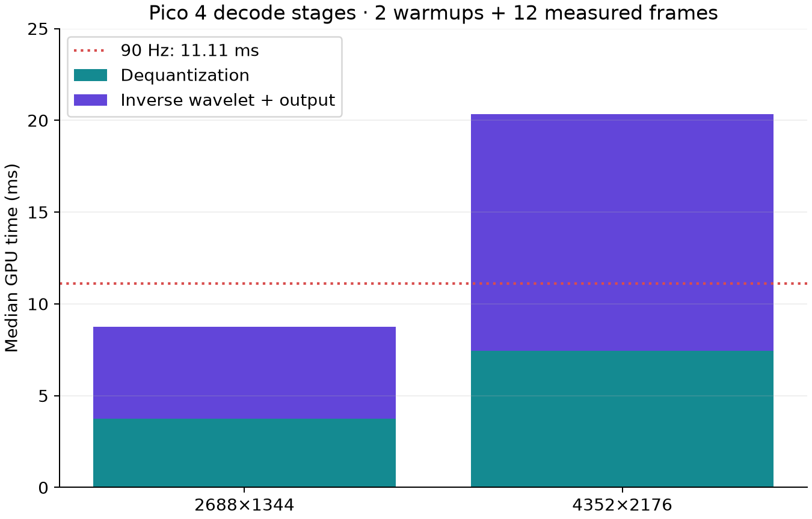
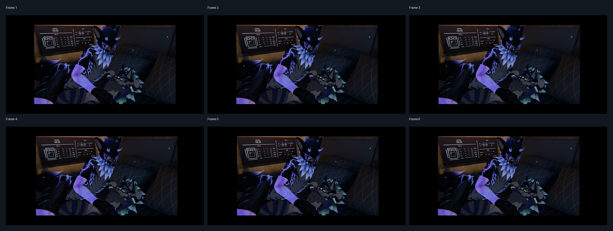
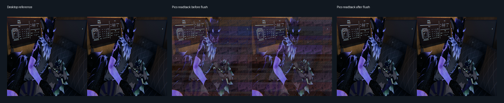

# PyroWave Pico 4 decoder probe

## Abstract

We measured a Vulkan fragment decoder on a PICO 4 (Adreno 650) and compared
full-frame 4:2:0 output with desktop reference captures. An omitted flush of a
cached, noncoherent offset buffer caused visibly corrupt output and invalidated
the earlier speed and shader experiments. After adding the flush, six moving
2688 × 1344 frames matched the desktop reference with mean absolute errors
(MAE) below 0.15 byte levels in luma and 0.027 in either chroma plane. Corrected
GPU decode p50/p95 was 8.75/8.77 ms at 2688 × 1344 and 20.35/20.66 ms at native
4352 × 2176. These are decoder measurements, not evidence of live VR playback
or 90 FPS.

## Methods

The headless harness uses the WiVRn-port decoder with `fragment_path=true` and
runs on Vulkan 1.1.128. Streams are 8-bit 4:2:0 PyroWave packets derived from a
VRChat capture. The 2688 × 1344 stream is a uniformly Lanczos-resampled version
of the native frame. GPU timestamps bracket `Decoder::decode`; CPU wall time
includes packet ingestion, command recording, submission, and fence wait. The
stage runs discard two warmups and then record twelve frames. The correction
flushes CPU-written block offsets before GPU use. The offset allocation is
host-visible, cached, and noncoherent; the payload allocation is host-visible
and coherent.

The motion harness performs separate readback and image-layout work between
timed decodes. Its GPU timestamps and CPU-call timer exclude that work, but
the gaps prevent this run from establishing sustained 90 Hz throughput.

For the moving-image check, six full-frame 2688 × 1344 GPU readbacks were compared
plane by plane against the corresponding desktop captures. MAE is reported in
8-bit byte levels. The retained capture inputs are in `/tmp` and are not copied
into this result folder; `make-proof.py` regenerates both figures and prints the
per-frame errors when those inputs are available.

## Results

| Stereo frame | GPU p50 / p95 | CPU call p50 / p95 | DQ p50 | IDWT/output p50 |
|---|---:|---:|---:|---:|
| 2688 × 1344 | 8.752 / 8.767 ms | 12.658 / 23.451 ms | 3.746 ms | 4.999 ms |
| 2688 × 1344, moving sequence | 8.587 / 9.234 ms | 19.958 / 23.774 ms | — | — |
| 4352 × 2176 | 20.348 / 20.656 ms | 25.695 / 35.693 ms | 7.460 ms | 12.884 ms |

Still values come from `corrected-scaled.raw` and `corrected-native.raw` after
two warmups and twelve measurements. The motion run cycles six different
synthetic-pan frames for 60 decodes, excludes its first six warmups, and uses
the same corrected decoder; see `corrected-motion.raw`. The 90 Hz
frame interval is 11.11 ms. Native decode exceeds it on GPU alone. At
2688 × 1344, GPU decode fits within the interval in this short run, while the
synchronous CPU call p95 does not. Neither result includes encoding, transport,
WiVRn scheduling, presentation, tracking, or sustained thermal behavior.

The decoded output followed the moving desktop capture closely in every frame:

| Plane | Six-frame MAE range (byte levels) |
|---|---:|
| Y | 0.1476–0.1487 |
| Cb | 0.0261–0.0266 |
| Cr | 0.0169–0.0171 |

The still-image comparison illustrates the effect of the missing flush. The
pre-flush readback contains horizontal bands; the corrected output is visually
consistent with the desktop reference. The displayed stills are a visual aid;
the full-resolution moving-frame measurements above are the quantitative
comparison.

The flush reduced native-luma MAE on the still fixture from 24.46 to 0.29 byte
levels. Two corrected native captures were byte-identical. The stage profile
attributes about 3.75 ms to dequantization and 5.00 ms to inverse wavelet/output
at 2688 × 1344; at native resolution the corresponding values are 7.46 and
12.88 ms. Measured mapped-payload GPU upload was below 0.001 ms, and corrected
host packet copy was 0.49 ms p50 at scaled size and 0.58 ms p50 at native size.

## Interpretation and limits

This establishes that the corrected decoder can produce accurate full-frame
output for the measured six-frame sequence and gives isolated timing on one
PICO 4. It does not establish an end-to-end 90 Hz viewer, motion-to-photon
latency, long-run thermal stability, or quality across other content. The
smaller GPU timing is promising for that resolution, but its CPU-call tail and
all unmeasured pipeline stages remain relevant.

## Historical runs excluded from the results

The fragment-speed and shader A/B runs were performed before the offset-buffer
flush. Their readbacks were corrupt, so those timing comparisons cannot support
decoder-speed or shader-quality conclusions. Their logs and patches remain in
this folder only as an audit trail; no pre-flush result is included in the
tables above. The bitrate sweep is also omitted from performance conclusions:
its 14-iteration runs include warmup iterations, and the fixture was one still
frame. A corrected, warmup-separated bitrate-quality sweep remains future
work.

## Reproduction records

- `pyrowave-pico-bench.cpp`: headless Vulkan benchmark harness.
- `corrected-scaled.raw`, `corrected-native.raw`: corrected stage profiles.
- `corrected-motion.raw`, `pyrowave-pico-motion-timing.cpp`: 60-decode
  synthetic-motion timing and its headless harness.
- `motion-mae.csv`: six captured-frame errors against the desktop decode.
- `make-proof.py`: regenerates the comparison and motion figures from the
  available `/tmp` captures; requires Python, NumPy, Pillow, and FFmpeg.
- `readback-comparison.png`, `motion-contact-strip.png`: compact visual proof
  assets included with this report.
