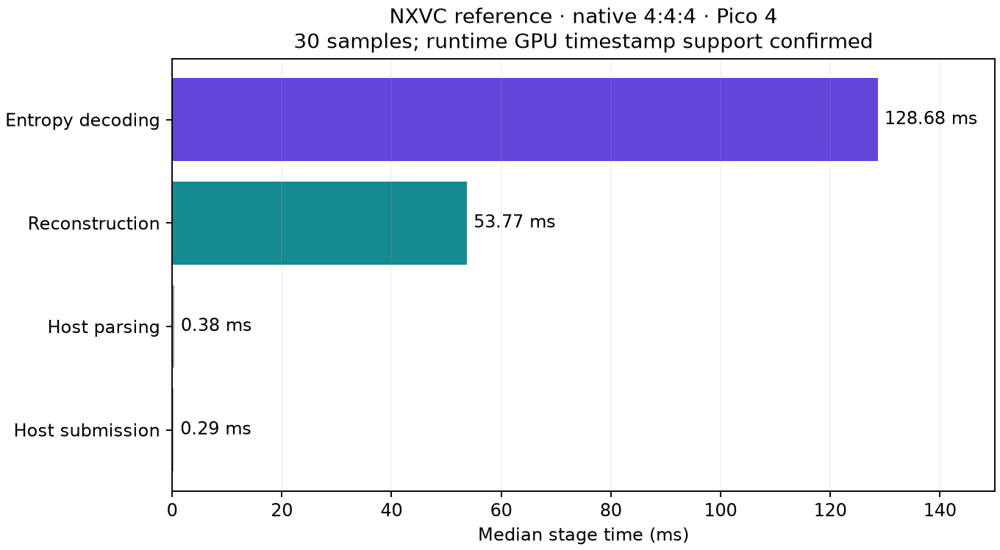
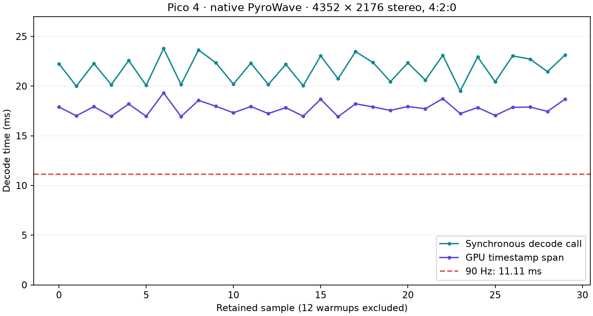
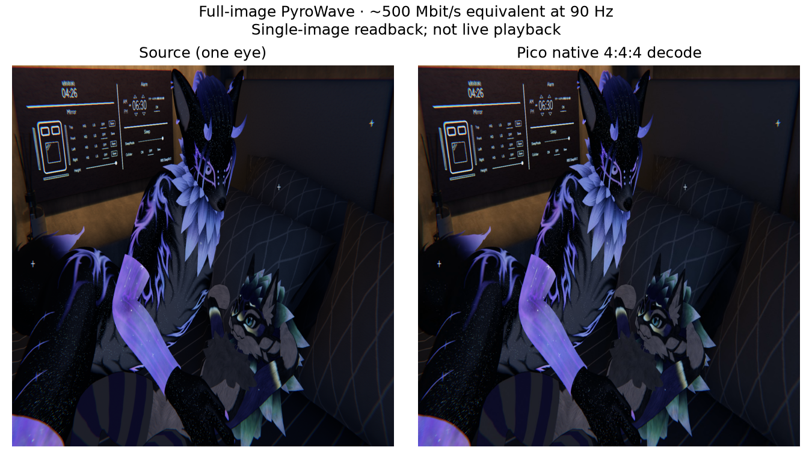

# Native Pico decoder profiles

Pico Adreno 650, full side-by-side 4352×2176 frame. Each timing profile used 12 warmups and 30 retained samples with no readback. Timings are p50/p95 in milliseconds.

| Decoder and fixture | Host wall | GPU |
|---|---:|---:|
| PyroWave baseline, 4:2:0, 694,484-byte `.pyrowave` | 22.254 / 23.478 | 17.847 / 18.682 |
| PyroWave follow-up, 4:4:4, fixture quality unverified | 32.601 / 33.599 | 27.673 / 28.431 |
| PyroWave, fresh feature-correct 4:4:4 fixture | 32.141 / 33.901 | 27.655 / 28.290 |
| NXVC, 4:4:4, 718,376-byte QP22 `.nxv` | 184.837 / 198.983 | metadata incomplete |
| NXVC, same 4:4:4 device fixture, corrected metadata | 184.630 / 193.955 | 181.761 / 190.905 |

The PyroWave harness queried and enabled both `shaderStorageImageWriteWithoutFormat` and `shaderStorageImageExtendedFormats`; the device reported support for both. Its measurements separately report push (0.209 / 0.359), command recording (2.339 / 3.439), submit plus fence (19.045 / 20.774), and total synchronous wall time. The source is `pyrowave-pico-native-feature-enabled.cpp`; raw samples are in `pyrowave-native-feature-enabled.log`.

NXVC's host parse was 0.383 / 1.238 and host submit was 0.300 / 0.456. Synchronous wall time includes decode completion. **Metadata correction:** the isolated harness hardcoded `gpu_timestamps=unavailable`, although all 30 retained rows contain positive GPU spans. That header does not establish driver unavailability. The reported stage medians are 129.024 ms entropy and 53.598 ms reconstruction; capability metadata was omitted, so this split remains provisional pending a repeat with the corrected profiler. The executed source and original samples remain unchanged in `nxvc-vkdec-profile.cpp` and `nxvc-native-q22-444-repeat42.log`; `nxvc-vkdec-profile-timestamps.cpp` adds the missing runtime metadata. See [source audit](audit.md).

The corrected profiler subsequently completed twelve warmups and thirty samples on the existing native QP22 4:4:4 device fixture. Runtime metadata confirmed a **52.083332 ns timestamp period, 48 valid bits, and 30 measured GPU spans**. Entropy p50/p95 was **128.681/137.137 ms**; reconstruction was **53.767/54.555 ms**. This confirms entropy decoding as the dominant measured stage in this reference fixture. The input SHA-256 is `09e9e3433dfd790bd224914a898615ca1b915dffb125992ae3da0020aa2a5ee9`. The repeat used the available standalone Android reference-decoder archive rather than the WiVRn-linked archive; build command and library/binary hashes are retained in `build-nxvc-timestamps.sh` and `nxvc-timestamps-provenance.txt`. Raw samples are `nxvc-native-q22-444-timestamps-run.log`. This remains a standalone reference-decoder result, not live NXVC performance.

The 4:4:4 NXVC readback is bit-identical to the CPU reference: all 28,409,856 bytes match (zero MAE on Y, Cb, and Cr). Evidence: `nxvc-native-q22-444-readback.log`; reference and GPU output hashes were both `9f1943ed44f8ec406803cae785255c74d27874efc12c5cd5c4b8410679f1ff4d`.

An isolated 4:2:0 NXVC repeat fails at repeat 2 with `VK_ERROR_DEVICE_LOST`, even after resetting stream state before each repeat. The 4:4:4 repeat completes all 42 decodes. See `nxvc-native-q16-420-repeat42-reinit.log`. A separate sequential 4:2:0 run also lost the device after two frames (`nxvc-native-q16-420-sequential.log`).

The original PyroWave fixture is 4:2:0 while the passing NXVC fixture is 4:4:4. NXVC therefore reconstructs twice as many total plane samples, including four times as many chroma samples. A subsequent PyroWave 4:4:4 timing run removes this sample-count difference, but its encoder extension-feature state and reference output remain unverified. The fragment readback is nonblank; that alone does not establish valid or equivalent quality. [Follow-up methods and hashes](matched-444-validation.md). Do not interpret either comparison as a controlled quality-matched codec speedup. The fixtures target the same dark image duplicated side by side; payload sizes are close but not identical.

## Fresh feature-correct native fixture

The host harness was rebuilt with the required supported Vulkan 1.1/1.2/1.3 features enabled. A missing 16-bit storage feature had caused a validation failure; the corrected encoder ran with validation enabled and emitted a 694,276-byte frame payload (499.879 Mbit/s at 90 encoded frames/s, before transport overhead). Input is one 2176 × 2176 source image duplicated side by side, converted with the documented full-range BT.709 equations in `make-source-yuv.py`. This remains a single-image decoder test, not a 90 Hz stream or motion benchmark.

The desktop fragment readback exposed an invalid `vk::WholeSize` offset-buffer copy. WiVRn commit `11c1ecd6` bounds this copy to the actual span and enables supported encoder shader capabilities on the server device. The Android PyroWave library and changed server translation unit compiled; a full host application build and live test were not performed. The desktop decoder then completed with Vulkan validation enabled and no reported errors. The Pico fragment readback of the same fresh packet matched desktop with MAE Y/Cb/Cr **0.036336/0.051244/0.042162** and maximum difference **one byte level** in every plane. PSNR against the uncompressed planar source was **39.436/39.916/39.919 dB**. Sources, logs and SHA-256 hashes are retained beside this report; full input/readback arrays remain private in `nx-scratch/pyrowave-matched444-20261003`.

A separate no-readback run of this fresh fixture used twelve warmups and thirty samples: **27.655/28.290 ms GPU**, **32.141/33.901 ms synchronous call**. Raw samples are `feature-correct-444-run.log`. This verifies a native full-colour PyroWave image and its timing on this fixture. NXVC quality has not been matched to this fresh source/conversion, so the timing gap is not an equal-quality codec ratio. Native 90 Hz still requires substantially less GPU work.

`check-native-readback.py` checks every retained plane sample against desktop and regenerates the figure from the private source/readback arrays. The figure downsamples one eye for readability; metrics use the complete native plane arrays.

## Implementation and rejected experiments

WiVRn commit `79c2bf7c` enables the two supported Vulkan storage-image features required by PyroWave. The Android application build passed. This is a capability correction; differing harnesses and device state prevent attributing the change from older 20.35 ms GPU runs to this edit alone.

Descriptor-update batching did not improve command-recording time in the short probe and was reverted. An isolated fragment texture-gather rewrite remained byte-identical on its tested fixture but regressed GPU p50 from 16.891 to 18.422 ms; it was rejected. A corrected-layout compute probe still produced incorrect output and is not a performance candidate. The paired Haar draft only passed compilation; without a paired encoder/decoder round trip it establishes no speed or quality result.

These are isolated decoder runs. Encoding, transport, presentation, physical motion-to-photon latency, and sustained native 90 Hz remain unproven.
