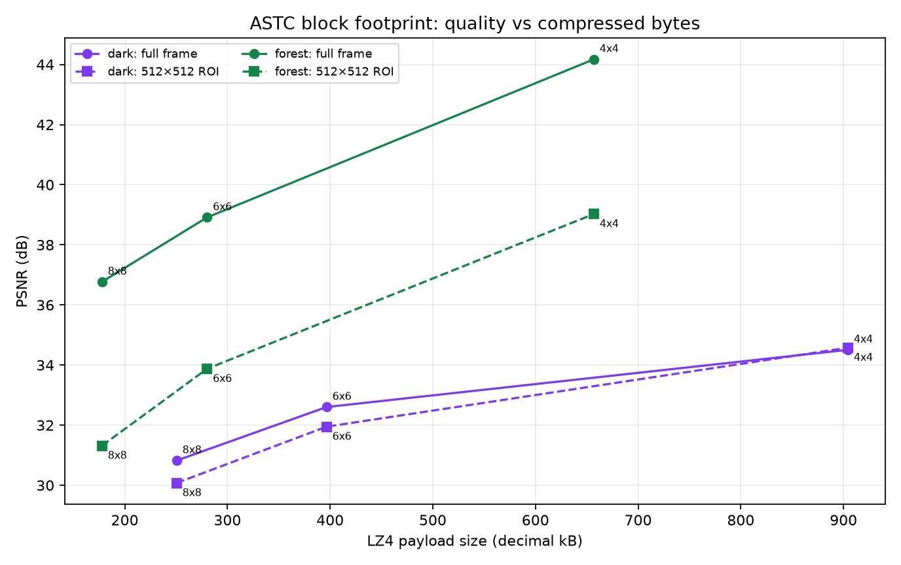

# Adaptive ASTC block sizes: quality and payload

This offline comparison evaluates q6 encoding at 4×4, 6×6, and 8×8 ASTC block footprints on dark-purple-hair and forest-footprint inputs. Every block remains 128 bits; smaller footprints spend more bits per pixel on spatial colour variation. The adaptive controller can choose q7/6×6 and q8/4×4 when measured per-eye packet bytes fit its budget. Its strict packet withholding and 30-other-frame measurement expiry are documented in `docs/NX_ASTC_QUALITY.md` at the source commit.

| Scene | Footprint | LZ4 bytes | Full PSNR | 512² ROI PSNR |
|---|---:|---:|---:|---:|
| dark | 4×4 | 904,373 | 34.5063 dB | 34.5773 dB |
| dark | 6×6 | 396,523 | 32.6022 dB | 31.9480 dB |
| dark | 8×8 | 250,484 | 30.8213 dB | 30.0746 dB |
| forest | 4×4 | 656,824 | 44.1717 dB | 39.0237 dB |
| forest | 6×6 | 280,112 | 38.9115 dB | 33.8734 dB |
| forest | 8×8 | 177,783 | 36.7674 dB | 31.3161 dB |

The 8×8 decoded fixtures match the prior q6 regression fixtures exactly. All tested packets decoded in the external LDR decoder. The graph plots both full-frame and ROI PSNR against independently LZ4-packed payload size.

The harness encodes a direct 1920×1080 RGBA8 SSBO proxy; it does not measure production texture sampling, foveation, headset decode cost, or network behavior. GPU timings used one warmup and three samples per case; this is too little to support a latency claim, so raw timing strings are omitted from the public validation JSON. The original validation evidence hash is recorded in `manifest.json`. Crops are the only image evidence included; no full private photos are copied.

Reproduce the graph with `python3 plot.py` from the metric table in `metrics.csv`. Source commits: blur `bf547738`, adaptive ASTC blocks `af913d4e`, conservative probe prediction `25e008cb`.

## First integration observation and the follow-up fix

The first matched `af913d4e` build was installed without uninstalling or replacing app data. The Pico accepted 8×8 and 6×6 while visible, and later allocated 4×4 while XR was idle. Native dimensions remained 2176×2176 per eye. Two warm startup windows logged 89.8 and 89.7 viewer iterations/s and this app’s own GPU pass at 2.5 and 2.6 ms per iteration. Their fresh-source counts were 148/180 and 143/180. The preceding startup window was 82.6/s. These were uncontrolled, short windows; there is no isolated blur-cost comparison, motion proof, or physical photon measurement.

The first encoder windows also exposed 7–12 withheld 4×4 expansion attempts per 180 encoded frames in the two eye streams. That is too much probing to ignore in a smoothness feature. Follow-up controller commit `25e008cb` now scales the observed packet cost by the candidate’s block-count ratio before probing an unknown footprint. For example, 6×6 at 140,000 bytes with a 282,745-byte target no longer probes 4×4: its estimated 315,000 bytes cannot fit. A 400,000-byte target permits that probe. Recently measured fitting footprints still take priority. The regression checks cover both cases and bitrate recovery.

The later passive eight-second capture occurred after XR had become idle and records 487-byte black 4×4 frames. Those logs establish the format/upload path, **not scene quality or viewer performance at 4×4**. Raw extracts and APK/source identity are included with the `first-live-` prefix. Final follow-up deployment evidence is recorded separately below.

Final matched follow-up build `25e008cb` is installed; the APK digest was verified against the on-device package, app data was preserved, and mode 6 colour smoothing is enabled for the user trial. `final-install.json` records artifact identity. The final controller has not yet been judged in a moving user scene.

The final follow-up startup again warmed to 89.8/89.7 viewer iterations/s, with 150/180 and 145/180 fresh-source selections. 6×6 pools were active before XR went idle; the subsequent 4×4 pools remain an idle-path observation. These final extracts provide a connection/format smoke check, not an isolated performance comparison.

The final encoder startup windows still contain failed expansion attempts: 5/8 per eye in the first 180-frame windows, then 3/5. The budget differed from the first build and the scene/visibility were uncontrolled, so these counts do not establish a causal improvement. Cost prediction reduces unnecessary probes in the regression cases; it does not eliminate all failed probes or guarantee the smallest fitting footprint on every frame. The attempted probe is encoded and measured before it can be rejected.
