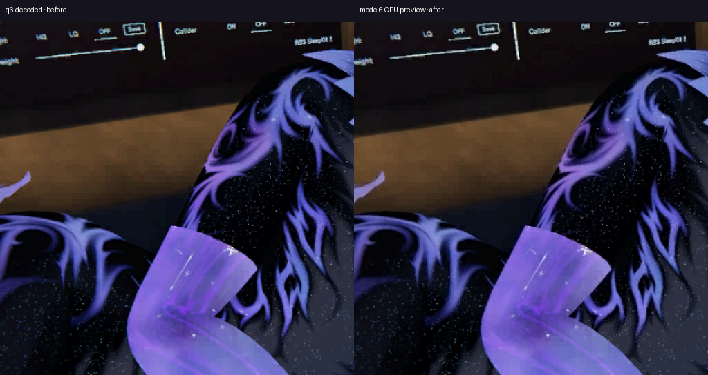
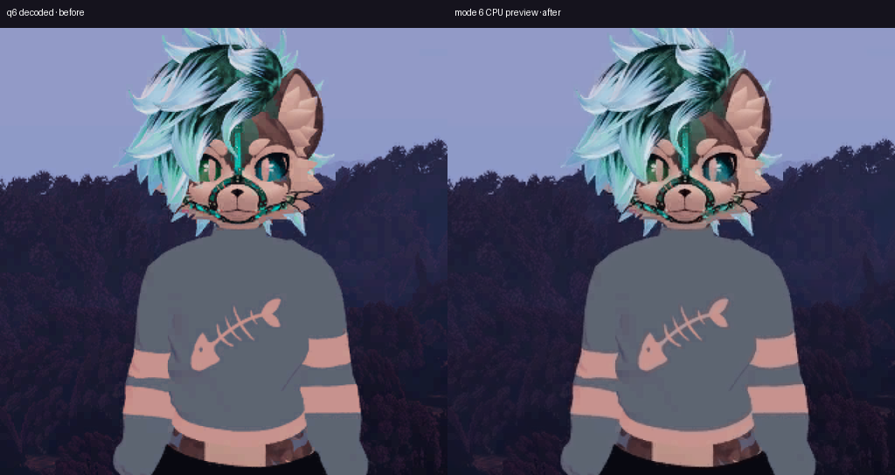

# ASTC q6 chroma-smoothing preview

CPU-only preview of the current `peripheral_smooth == 6` math from `client/shaders/reprojection.glsl`, applied to the exact guarded `.80` q6 decoded RGBA fixtures. It uses two diagonal samples at ±3 texels and weights the result as centre 0.5, each neighbor 0.25. It subtracts the BT.709 encoded-RGB luma component from the chroma delta, then scales the delta to fit the channel gamut. Alpha stays unchanged.

The 512×512 crops come from the `astc-rgb-input-quality` manifest ROIs. Inputs hash-match the guarded q6 rasters in `astc-partition-followup/manifest.json`. Only the crops are saved here; source photos and APKs remain outside this report. `preview.py` regenerates both panels and `metrics.json` with Python, NumPy, and Pillow.

| Scene crop | Before / after |
|---|---|
| Dark, purple hair |  |
| Forest, pale hair and dark edges |  |

Semantic checks in `metrics.json` show near-zero floating-point luma drift, no alpha changes, and in-range UNORM8 output. Float gamut scaling has only sub-1e-6 numerical residue. Quantization can move luma by at most 0.5 code value. These are math and appearance previews, not PSNR wins, GPU readback, device validation, or performance measurements.

ASTC 8×8 always carries 128 bits per block. The quality rung selects how those bits represent the tile; it does not pad output to consume its bitrate target. A later live server snapshot reported about 157 Mbit/s pair payload against about 343 Mbit/s pair encoder budget. Treat those as that snapshot's samples, not a sustained ceiling.
