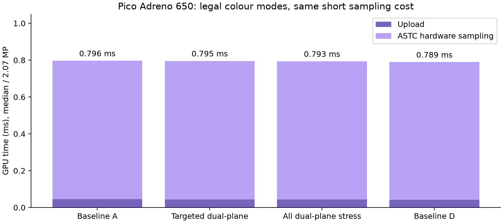

# Pico hardware colour-mode check

The Pico's Adreno 650 accepted the targeted dual-plane ASTC8×8 blocks and a stress image containing only dual-plane blocks. Against the independent desktop ASTC decoder, all four runs had maximum channel difference **1**, and zero channels outside tolerance2. The new legal block mode needs no client reconstruction shader or extra presentation pass.

| Sequential run | Upload + sampling median | p95 |
|---|---:|---:|
| Baseline A, one plane |0.796ms|0.802ms|
| CPU targeted dual-plane fixture |0.795ms|0.798ms|
| All dual-plane stress fixture |0.793ms|0.795ms|
| Baseline D, one plane |0.789ms|0.797ms|

Protocol: standalone offscreen Vulkan1.1, exact1920×1080 ASTC photo geometry, 12warmups then30samples per path, sequential A/B/C/D. The client was stopped to avoid competing XR work. The baseline and targeted fixtures use the exact supplied dark photo; the all-dual fixture stresses legal mode compatibility, and is not a selected quality profile. Fixture hashes, original sample CSV and stdout are retained. ASTC upload and a full-frame storage-image sampling pass are timed. Readback correctness happens outside those GPU timestamps. Device clocks and thermals were not controlled.

**This proves legal-mode hardware compatibility, with no observed sampling penalty in these short runs.** It does not prove native stereo9.47MP cost, live compositor throughput, motion stability, network bitrate or photon latency. CPU timings varied, so they do not support a decoder speed gain. The CPU top5% quality fixture is distinct from the newer fixed-threshold GPU candidate; shared block-mode compatibility does not establish its final quality.

Sources reuse the existing `nx-astc-pico-20261003` benchmark, changing only output geometry to1920×1080 and a dedicated device scratch directory. Sources and exact input SHA values remain in the manifest; no source photos, full decoded images, executable or APK are published here.
