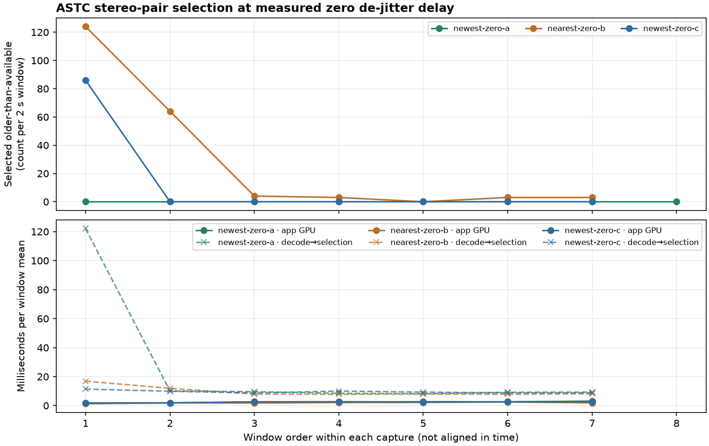

# ASTC zero-delay frame freshness

The measured policy selects the newest **complete stereo pair** only when measured de-jitter playout delay is exactly zero. The de-jitter setting remained ON in the tested app; the measured delay can still be zero on early-arriving frames. At positive delay, the existing nearest-target choice remains. The code compares the common stereo-frame intersection, so the two eyes stay paired. It changes selection among decoded frames and adds no image generation or GPU pass. See the included source diff and `selection-documentation.md`.

The current installed APK SHA-256 was `a6a3f44a538057b91e5489d970bbfaa1a6c6653fcdd9ca6da57e2f9dcbb166a5` for all three captures. `windows.csv` records each 2-second log window; capture metadata, bounded client/server extracts, code/documentation inputs, and result hashes are in `manifest.json`.

| Capture | Windows | Older-than-available counts | FPS | App GPU pass | Decode to selection |
|---|---:|---:|---:|---:|---:|
| Newest A | 8 | 0 in every logged window | 89.2–89.9 | 1.8–3.1 ms | 8.2–10.1 ms after initial resume window; initial 122.1 ms |
| Nearest B | 7 | 124, 64, 4, 3, 0, 3, 3 | 81.6–90.1 | 1.3–2.5 ms | 7.8–8.2 ms in stable windows; 16.9 ms in first slow window |
| Newest C | 7 | 86 in first mixed/resume window; then 0 in six windows | 89.2–90.1 | 1.7–2.8 ms | 11.4 ms first; 8.7–10.0 ms afterward |

The nearest-target capture also has its own transient 81.6 FPS/124 older selections, and the newest capture includes a 122.1 ms initial resume pipeline sample. Stable nearest windows often still report 7–8 ms from decode to selection. These phase-sensitive short runs do **not** support fixed latency savings. The counters show newest selection avoids older-available choices once the zero-delay stream is flowing, not that an old cached image can be replaced before new frames arrive.

The earlier candidate guarded on the de-jitter configuration being OFF failed its activation gate; it is excluded from this A/B. These captures test the corrected measured-delay==0 condition with the setting ON. They are short, stationary, off-head wake/reconnect checks, not motion, sustained complex-scene, perceived-quality, or photon-latency validation. No visual crop is included because these selection captures have no privacy-approved scene artifact.

The plot keeps each capture's windows in local order (the runs were not time-aligned). It shows selected-older counts, app-owned GPU pass, and decode-to-selection timing. These pipeline intervals vary with reconnect/clock phase; the GPU-pass series does not quantify end-to-end latency.

The instrumentation and selection rule preserve the ASTC one-partition CEM8 128-bit block format. This report concerns only frame choice and does not make an encoder quality or throughput claim.
