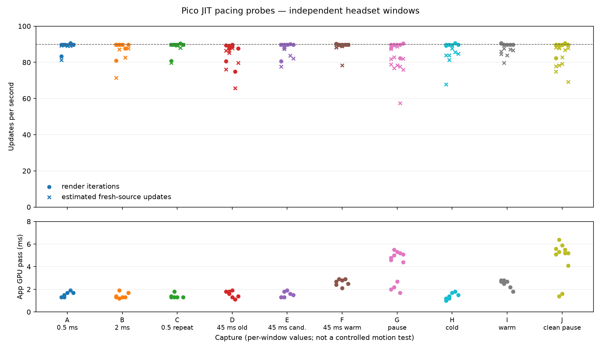

# ASTC JIT pacing probes

Short, off-head, stationary WayVR captures compare several JIT sleep caps. They are separate headset windows, not a controlled motion test. Pause and idle gaps are outside these windows: near-90/s samples after a pause do not mean uninterrupted 90/s across that gap. “Counted windows” means valid app-reported intervals, not a continuous capture. No image-quality, motion, photon-latency, or sustained-90-Hz claim follows from them.

Each point is one app-reported window. Circles show render iterations/s; crosses estimate new-source updates/s from the printed rate and `new-source` count. The app prints duration to 0.1 s and rate to 0.1/s, so the derived source rate is approximate. Lower points in G and J include an intentional server-process pause. The lower panel is this app's own GPU pass time, not total headset GPU time.

| Run | Setting / capture | Counted windows | Median iteration/s | Median estimated new-source/s | App GPU pass range | Windows with any nonzero logged deadline count |
|---|---|---:|---:|---:|---:|---:|
| A | 500 us cap, original APK | 7 | 89.70 | 89.20 | 1.3–1.9 ms | 0 |
| B | 2,000 us cap, original APK | 7 | 89.70 | 87.71 | 1.2–1.9 ms | 0 |
| C | 500 us repeat, original APK | 7 | 89.70 | 89.70 | 1.3–1.8 ms | 0 |
| D | 45,000 us cap, original APK | 8 | 88.55 | 85.81 | 1.1–1.9 ms | 3 |
| E | 45,000 us cap, candidate APK | 7 | 89.70 | 87.40 | 1.3–1.9 ms | 1 |
| F | candidate warm repeat | 8 | 89.80 | 89.05 | 2.1–2.9 ms | 1 |
| G | candidate APK, controlled producer pause | 12 | 89.80 | 80.32 | 1.7–5.5 ms | 0 |
| H | half-period candidate, cold-start run | 7 | 89.80 | 83.81 | 1.0–1.8 ms | 0 |
| I | half-period candidate, warm repeat | 7 | 89.70 | 86.00 | 1.8–2.8 ms | 0 |
| J | clean final build, controlled producer pause | 12 | 89.80 | 84.81 | 1.4–6.4 ms | 0 |

These medians describe selected complete windows only; they do not combine sessions into a single throughput estimate. A–D used APK digest `41603c40…`; E–G used `0662e875…`; H–I used `0aab7ee9…`; J used the clean final `4073507c…` build from commit `86e0d678`. The source and native hashes for the H–I and J package manifests are in [source-artifacts.json](source-artifacts.json). Run metadata and all input-log hashes are in [capture-manifest.json](capture-manifest.json).

H began with a temporary 45,000-us debug override during roughly the first second; the override was then cleared. Its final metadata therefore records an empty override, while complete windows report the app's dynamic cap rising from 2.0 to 5.6 ms. I reports a 5.6-ms cap throughout. H, I, and J have zero app-reported missed, overrun, late, or skipped-refresh counts in included complete windows. This is a short stationary observation, not a general pacing guarantee.

G's headset-clock sequence is preserved in [device-events-g.csv](device-events-g.csv). It logs producer-pause begin at 08:19:07.220, stale-frame warning at 08:19:08.216, fresh-view resume at 08:19:09.774, then the device-side END marker at 08:19:09.805. The headset session later goes idle at 08:19:10.063 and becomes visible/focused again at 08:19:11.221. On wake, the stale-frame warning at 08:19:11.227 precedes the fresh-view resume callback at 08:19:11.228. They are ordered events, not evidence that the selector chose an old frame while a fresh pair was already available. `push_blit_handle()` skips publication while the XR session is hidden, so the old retained frame can be selected before the first visible callback. This is a short wake race, not a producer-recovery or network-recovery guarantee.

J repeats the controlled producer pause with the clean final build. Its device log records BEGIN at 08:37:29.418, stale warning at 08:37:30.427, XR session idle at 08:37:31.210, END marker at 08:37:31.912, session visible/focused at 08:37:32.040, and fresh-view resume at 08:37:32.049. No second stale warning appears before this capture ends. The server SIGSTOP/SIGCONT records are stored separately in [host-events-g.json](host-events-g.json) and [host-events-j.json](host-events-j.json); host UTC and headset log clocks are not aligned here, so do not infer cross-clock causal intervals.

The `source-target to refresh-target` fields compare source timestamps with predicted display targets. They are not capture-to-photon latency. A–J used stationary WayVR and included no motion or complex-scene validation.

The clean final APK also received a separate planar/RGB/planar smoke. K was warm after a prior pause run; L and M were fresh reconnects, so their app-GPU timings are not a mode A/B. See the [final native-mode appendix](final-native-smoke/README.md) and its per-window plot.

Files:

- `client-windows.csv`: extracted per-window rates, freshness counts, GPU pass, and pacing counters.
- `run-summary.csv`: descriptive medians and ranges above.
- `device-events-g.csv`, `device-events-j.csv`: short headset-clock event timelines.
- `host-events-g.json`, `host-events-j.json`: independent host UTC signal timestamps.
- `capture-manifest.json`, `source-artifacts.json`: capture and build provenance.
- `build_report.py`: local regeneration script; reads the scratch captures named in its header.
- `manifest.json`: SHA-256 for every report artifact except itself.
