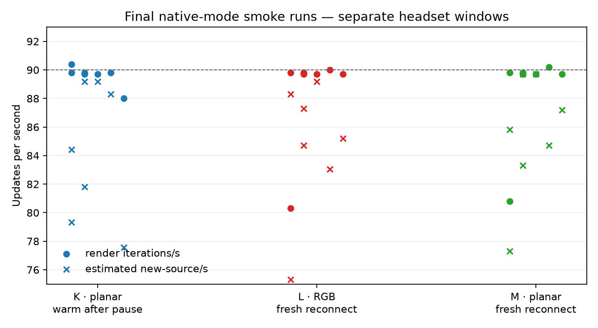

# Final planar/RGB/planar smoke

Three short, stationary native ASTC 8×8 captures used the same clean final APK (`4073507c…`, source commit `86e0d678`). K used planar input while the app was already warm after the producer-pause run. L used RGB input after a fresh reconnect. M returned to planar input after another fresh reconnect. This is not a controlled A/B/A sequence.

The startup/reconnect windows are retained in [windows.csv](windows.csv). The chart omits only each 1-iteration startup row; it keeps the first full reconnect windows (80.3/s for L and 80.8/s for M). Later windows settle to 89.7–90.0/s and 89.7–90.2/s respectively. Those later windows report 167–179 new sources per roughly two seconds for L and 167–180 for M. All observed deadline counters are zero.

K's app GPU pass ranges 4.6–5.5 ms; L's ranges 1.2–1.8 ms; M's ranges 1.2–1.9 ms. K was already warm and L/M were fresh reconnects, so this sequence cannot attribute K's higher GPU values to RGB versus planar input. The chart omits GPU time to avoid suggesting a mode comparison from those mismatched phases; per-window values remain in the CSV.

L's server startup explicitly reports `make_images: direct RGB compositor output enabled`. K and M report native ASTC with no direct-RGB enable line. These startup records identify the mode but do not timestamp or measure per-frame quality. No visual-quality, motion, photon-latency, or sustained-90-Hz test was performed.

Each run's filtered client extract, server extract, server mode excerpt and provenance, server stage extract, and metadata are preserved under `k/`, `l/`, and `m/`. [capture-manifest.json](capture-manifest.json) records their hashes. [manifest.json](manifest.json) hashes every appendix artifact except itself.
