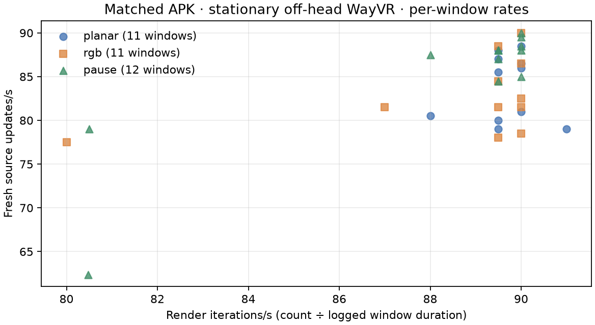

# Matched native ASTC handoff capture

Three short off-head, stationary WayVR captures used the same installed APK and 2176×2176-per-eye native ASTC 8×8 input. The client had no foveation, field warp, or blur enabled. These are observed runtime windows, not a motion, complex-scene, perceived-quality, or photon-latency test. Quality and bytes were not controlled as an A/B comparison.

| Capture | PID | client stat windows | steady render rate median | fresh-source rate median | server nonblack / idle-black windows | own GPU pass min–max |
|---|---:|---:|---:|---:|---:|---:|
| planar | 9916 | 12 (11 steady) | 89.5/s | 85.5/s | 18 / 2 | 1.2–2.8 ms |
| rgb | 9918 | 12 (11 steady) | 89.5/s | 81.5/s | 18 / 2 | 1.3–2.9 ms |
| pause | 9920 | 13 (12 steady) | 89.5/s | 87.8/s | 24 / 0 | 1.4–6.4 ms |

Each plotted steady point uses the individual `iterations in N s` duration printed by the app for its rate denominator. The initial partial startup rows (1–2 iterations in 2.1–2.2 seconds) are retained in `windows.csv` but omitted from the graph. The graph shows app iteration count and `new-source` count, not network throughput or newly encoded pixel quality. GPU cost varied materially: the pause capture reached 6.4 ms per iteration, so the captures do not establish a stable pass-time advantage.

The old client log label `source->first` is a signed offset to a predicted display target, not photon-to-photon latency; this report makes no latency/recovery claim from it. The pause run's stop/resume markers were recorded by the PC; their clock is not reliably aligned to the headset timestamps, so they cannot establish causal recovery timing. A separate device-side NXPause-marker repeat is pending.

The first RGB capture attempt stopped on a PID race before producing a valid timed run. The included RGB capture is the successful rerun (PID 9918). All three included captures report the same installed APK SHA-256. Source was clean at commit `9d05f4d`; the manifest records source/native/APK/signing hashes and installed-package verification. The APK and unfiltered/private startup logs are not included.

`*-client-extract.txt`, `*-server-extract.txt`, and `*-server-stages.txt` preserve filtered per-window evidence. `windows.csv` preserves each app window, its logged duration, computed rates, and nearby GPU-pass stat. `pause-host-markers.json` preserves the PC markers with the clock limitation above. `manifest.json` hashes every report file.
