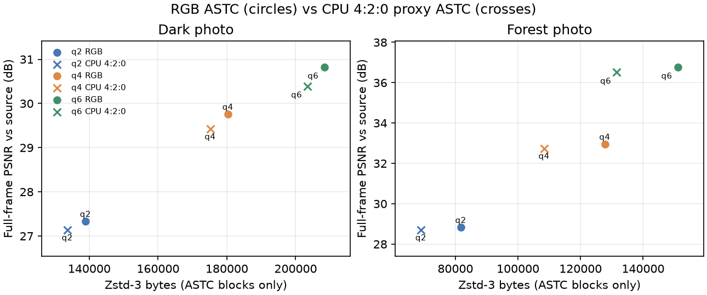
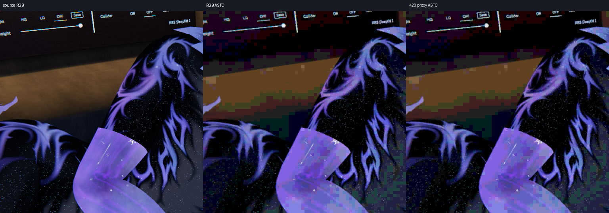
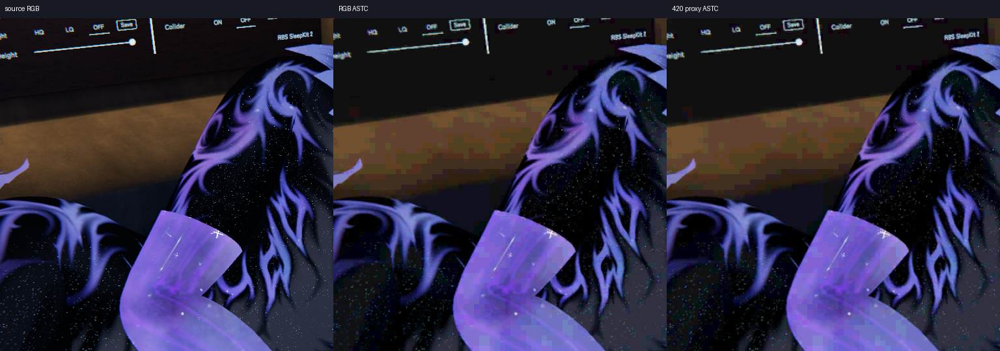
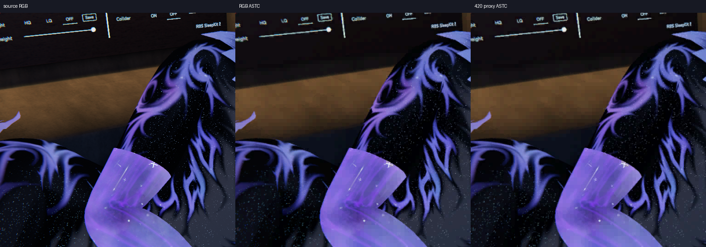
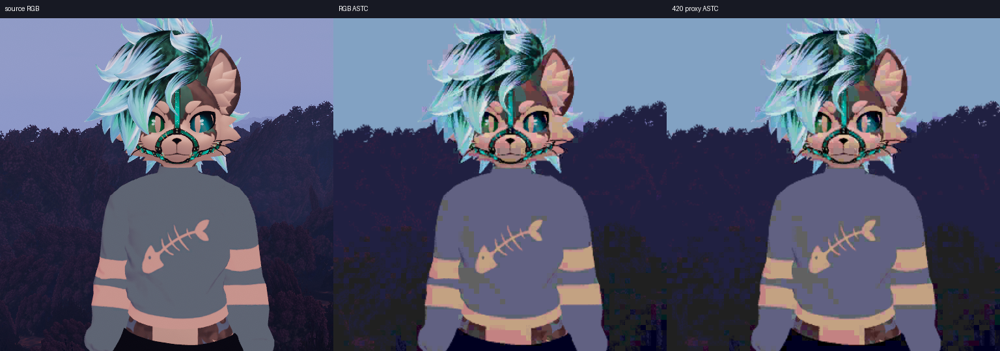
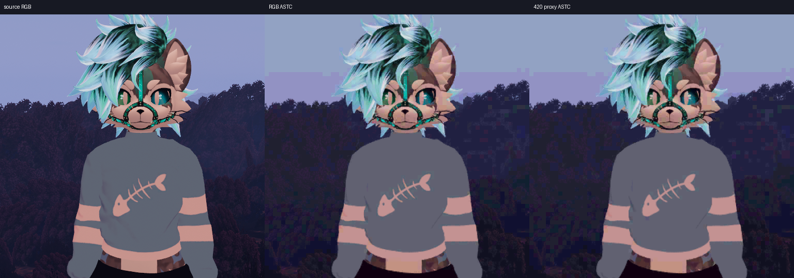
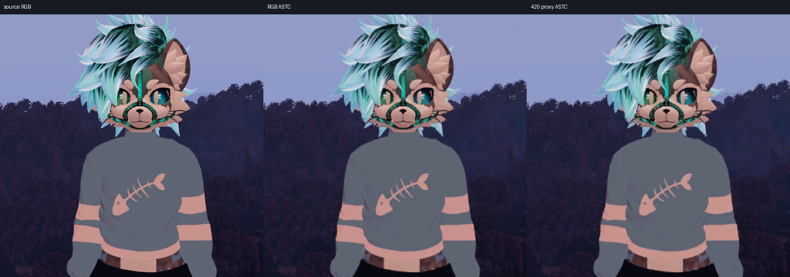

# ASTC input: RGB versus a CPU 4:2:0 proxy

Bounded offline comparison on two exact 1920×1080 photo inputs. The selected 8×8 ASTC CEM8/fit-3 shader encoded original RGB and a CPU-reconstructed BT.709 full-range 4:2:0 proxy at q2/q4/q6. Only the six proxy cases were newly GPU-encoded; matching RGB ASTC baselines were reused. GPU timings are omitted; this report makes no speed claim.

**The 4:2:0 data is a CPU reference proxy, not captured production-GPU output.** It follows the foveation shader matrix coefficients, per-pixel R8 luma, rounded 2×2 average R8G8 chroma; it then applies the ASTC shader inverse matrix and nearest p/2 chroma fetch and rounds reconstructed RGBA8. It omits production foveation geometry and source resampling, and CPU ties-to-even rounding may differ from GPU UNORM conversion. Therefore results isolate a plausible subsampling effect; they do not prove the headset compositor produces these exact pixels.

The 512×512 ROI crops are dark `(320,240)` and forest `(704,128)`. Full/ROI PSNR is measured against the source photo. Edge CbCr MAE covers source pixels whose 4-neighbour chroma gradient is at least 12 code values. Existing LZ4 columns are the harness 30-sample means for compressed ASTC blocks. Zstd-3 values below are exact CPU `zstd -3` lengths of each raw ASTC block payload (the 16-byte ASTC file header excluded); they are not packet sizes.

| Photo | q | Full PSNR RGB → proxy (dB) | ROI PSNR RGB → proxy (dB) | LZ4 mean RGB → proxy (B) | Zstd-3 blocks RGB → proxy (B) | Edge CbCr MAE RGB → proxy |
|---|---:|---:|---:|---:|---:|---:|
| Dark | 2 | 27.331 → 27.134 | 26.534 → 26.412 | 184,350 → 179,098 | 138,929 → 133,652 | 10.20 → 10.86 |
| Dark | 4 | 29.756 → 29.420 | 29.334 → 29.197 | 219,060 → 211,896 | 180,335 → 175,190 | 10.07 → 10.75 |
| Dark | 6 | 30.821 → 30.393 | 30.075 → 29.936 | 250,484 → 244,752 | 208,322 → 203,504 | 9.80 → 10.53 |
| Forest | 2 | 28.824 → 28.692 | 27.471 → 27.357 | 109,729 → 92,398 | 81,761 → 69,022 | 5.98 → 6.20 |
| Forest | 4 | 32.948 → 32.739 | 30.215 → 30.019 | 150,725 → 129,824 | 127,799 → 108,404 | 5.10 → 5.50 |
| Forest | 6 | 36.767 → 36.518 | 31.316 → 31.139 | 177,783 → 157,268 | 151,115 → 131,603 | 4.56 → 5.09 |

Across these rows, proxy full-frame PSNR is 0.13–0.43 dB lower and ROI PSNR 0.11–0.20 dB lower. Zstd-3 block payloads are 2.3–15.6% smaller (LZ4 means 2.3–15.8% smaller), while edge-chroma MAE rises 0.22–0.73 codes. The proxy round-trip itself has RGB MAE 1.345 dark / 0.652 forest, with localized maximum absolute channel errors 168 / 123. This is evidence that 4:2:0 can contribute to colour-edge loss; it neither attributes all softness to subsampling nor estimates the exact production contribution.

Each panel is its own photo, avoiding a pooled comparison across different content. Circles are RGB ASTC; crosses are ASTC fit from the CPU proxy. Smaller payload accompanies the measured modest PSNR drop.

| Photo | q2 | q4 | q6 |
|---|---|---|---|
| Dark |  |  |  |
| Forest |  |  |  |

The panels show source, RGB-ASTC, and CPU-proxy-ASTC crops; full photos, full-resolution decoded outputs, and ASTC payloads are not included. `comparison.csv` and `comparison.json` preserve row metrics and input/output hashes. `proxy-manifest.json` and `evidence-manifest.json` document the proxy and test artifacts; `manifest.json` hashes the published report files.
