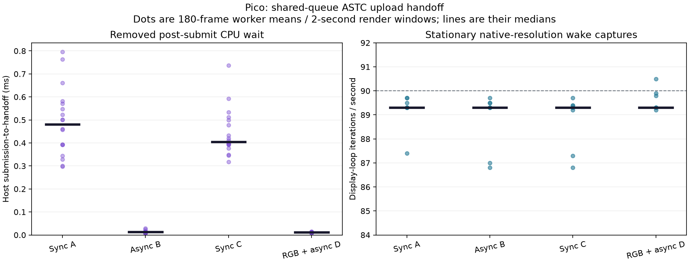

# Pico live upload handoff

The same native ASTC client APK was tested with synchronous uploads, asynchronous
uploads, then synchronous uploads again. Async upload eliminates the post-submit
CPU fence wait. The corresponding host submission-to-handoff time fell from
roughly 0.40–0.48 ms to 0.013 ms per eye worker. The display loop remained near
90 iterations/s; this is a host scheduling saving, not measured photon latency.

Pico A8110 / Android 10 / Adreno 650; ASTC 8×8; 2176×2176 per eye; 90 Hz;
neutral presentation; no foveation, JPEG, blur or motion-field warp. Each short
stationary capture used six wake events three seconds apart and the existing
WayVR application. Off-head XR focus transitions remain a limitation.

| Case | Post-submit CPU wait | Host submit-to-handoff | Fresh sources per 2 s | Display iterations/s |
| --- | ---: | ---: | ---: | ---: |
| Sync A | 0.465 ms | 0.480 ms | 153–175 | 87.4–89.7 |
| Async B | 0 ms | 0.013 ms | 158–179 | 86.8–89.7 |
| Sync C | 0.390 ms | 0.405 ms | 160–176 | 86.8–89.7 |
| RGB + async D | 0 ms | 0.011 ms | 171–180 | 89.2–90.5 |

CPU columns are medians of the captured **180-frame worker averages**, not
per-frame latency percentiles. Fresh-image counts differ from display refresh
counts. These captures do not establish 90 fresh frames/s under sustained motion.
RGB D additionally enabled the opt-in full-colour compositor input; it is a live
smoke test, not a controlled colour-quality or bitrate comparison.

All four cases had 18 non-black encoder reporting windows. B additionally had
two idle-black windows; the other captures had none. Captured traces showed no
stall/resume transitions. App GPU window means ranged 1.2–2.1 ms across cases.
There were no ASTC decoder or network exceptions in these sessions. A prior
failure with repeated focus activation and mismatched eye histories remains
recorded in [the colour integration report](../dualplane-integration/README.md);
absence of that failure here does not prove every recovery condition is solved.

The installed APK SHA-256 was verified as
`bf87dad1273b2d6b492a6d8157ae2ea5996c9e4b640be587c87efc70931c86e3`.
It was built from `6d03c633` plus the client patch subsequently committed as
[`62eff3af`](https://github.com/nerdrx/wivrn-nx/commit/62eff3af).
The server used the same embedded source version, plus the opt-in RGB patch.
Existing APK signature and app data were preserved. No test scene was launched.

The implementation relies on upload and presentation using the same graphics
queue, and on the producer's transfer-write → fragment-read image barrier.
The worker fence still protects command-buffer/staging reuse, and the render
fence and retained handles protect sampled images. See
[implementation notes](https://github.com/nerdrx/wivrn-nx/blob/pyrowave-probe/docs/ASTC_UPLOAD_HANDOFF.md)
and [the isolated native-size sampler check](../astc-samequeue-upload/README.md).

An earlier timeline-semaphore candidate failed during decoder construction with
`vkCreateSemaphore: Incomplete` despite advertised support. Its automatic
synchronous fallback subsequently streamed successfully. The final same-queue
implementation removes that semaphore dependency altogether.

`received_from_decoder` now stamps host decompression and upload submission.
The GPU upload can still be pending until the queue barrier orders sampling.
Comparing that earlier stamp with the previous completion stamp would overstate
a latency improvement. Negative source-time offsets in retained traces are also
unsuitable for absolute end-to-end latency. No photon-latency claim is made.

The CSV, JSON and filtered logs retain original stage means and render windows;
private screenshots, APKs and full startup logs are not included.
