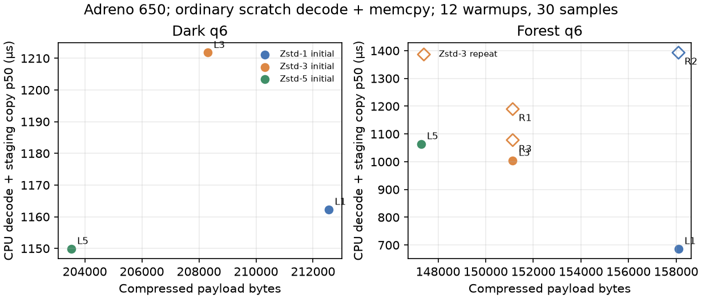

# Pico ASTC q6 Zstd level cost

Bounded Adreno 650 test of Zstd-1, Zstd-3, and Zstd-5 on dark and forest 1920×1080 q6 ASTC block streams generated under an earlier experimental .95 quality policy. These are not the shipped guarded .80 q6 fixtures, so this is a codec-level test on those fixed inputs, not a measurement of current production payloads. The unchanged Android harness used its ordinary CPU scratch decompression plus memcpy into the existing VMA sequential-write staging allocation. Each case had 12 warmups and 30 measured samples; payload headers (16-byte ASTC file header) were excluded. Harness binary SHA-256: `be85e296644e00b50f9935bd06cf7a6f1756dfb1899c89e5a6f9a772b30943d0`. No production code/settings or APK changed.

| Scene | Zstd level | Payload bytes | CPU decode + copy p50 (µs) | p95 (µs) | GPU upload p50 (µs) | GPU sample p50 (µs) | GPU total p50 (µs) | wall p50/p95 (µs) | decoded output |
|---|---:|---:|---:|---:|---:|---:|---:|---:|---|
| Dark | 1 | 212,551 | 1162.29 | 1902.40 | 35.05 | 761.09 | 796.09 | 2524.64 / 3620.26 | max Δ 1 |
| Dark | 3 | 208,306 | 1211.77 | 2653.12 | 36.15 | 761.35 | 798.07 | 2977.29 / 3891.93 | max Δ 1 |
| Dark | 5 | 203,523 | 1149.90 | 1982.19 | 35.42 | 761.51 | 797.24 | 2604.95 / 3387.55 | max Δ 1 |
| Forest | 1 | 158,102 | 686.56 | 1811.93 | 35.16 | 761.51 | 797.03 | 2530.99 / 3370.10 | max Δ 1 |
| Forest | 3 | 151,138 | 1004.38 | 1432.45 | 35.62 | 761.77 | 797.34 | 2347.71 / 3345.78 | max Δ 1 |
| Forest | 5 | 147,282 | 1064.17 | 1372.24 | 34.43 | 762.19 | 796.62 | 2192.19 / 3033.02 | max Δ 1 |

Zstd-5 reduced payload relative to Zstd-3 by 2.3% dark / 2.6% forest, but showed no reliable decode-cost reduction: dark p50 was 1.16 / 1.21 / 1.15 ms (levels 1/3/5); forest was 0.69 / 1.00 / 1.06 ms. These small sequential runs are noisy; the forest values rise with run order, so do not interpret them as a compression-level slowdown. The supported conclusion is that denser compression reduced bytes but did not demonstrate a CPU decode win here. The unchanged GPU sample median stayed near 0.76 ms across cases.

All three output hashes matched byte-for-byte within each scene. The Vulkan output differed from the external reference by at most one channel value (not bit-exact to the external decoder). Device was not streaming: pre/post checks found no WiVRn/VRChat/test process. Thermal status stayed 0; `dumpsys battery` showed 100% and 29°C battery. HAL temperatures started at CPU 48–52°C / GPU 48.3°C / skin 48.0°C, and ended at CPU 45–47°C / GPU 42.8°C / skin 44.6°C. Cached framework sensor values were stale and are not used. Dedicated `/data/local/tmp/nx-astc-vma-probe` test scratch was removed afterward.

`comparison.csv` summarizes exact payload/output hashes and metrics. `samples/` contains all six raw 30-row sample CSVs. `device-results.json` preserves case manifests. No payloads or decoded full-resolution images are published. `manifest.json` hashes all report files.

## Short ordered forest repeat (Zstd-3 / 1 / 3)

The earlier forest medians were 0.687 / 1.004 / 1.064 ms for levels 1/3/5. A three-run repeat did not reproduce a level-1 win: Zstd-3 was 1.190 ms, Zstd-1 1.393 ms, then Zstd-3 1.078 ms. All cases decoded to the same hash; external-reference maximum channel delta remained 1. This short repeat is noisy, with a clear run-order shift between its two level-3 readings; it gives no persistent evidence that Zstd-1 decodes faster. Leave the level-3 choice unchanged. Raw ordered repeat samples and payload/output digests are in `repeat-forest-313.json` and `samples/repeat/`.

The repeat began cooler than the first batch (HAL CPU 38.0–40.3°C / GPU 38.4°C / skin 40.6°C, thermal status 0), so its absolute times should not be compared across sessions as a controlled frequency-matched pair.
