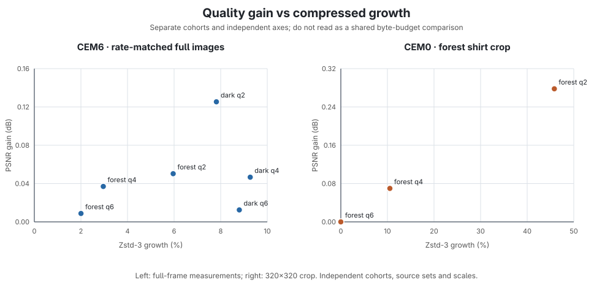

# ASTC colour-mode follow-ups

Offline, PC-only comparisons of CEM6 RGB+scale and CEM0 direct-luma candidates. These probes changed no nx-warp source, build, runtime, or Git state. The folder contains only compact shirt/collar crop panels; full-frame CEM6 rows below are numeric summaries, with no full photographs copied here.

## Tradeoff

The left panel is rate-matched CEM6 across two full input images. With source-colour gates, gains were +0.009 to +0.125 dB for +2.0% to +9.3% Zstd-3 bytes. The right panel is a single 320×320 forest-shirt crop: CEM0 gained +0.278 dB at q2 for +45.8% bytes, +0.070 dB at q4 for +10.5%, and no quality or size change at q6. The panels have independent axes and different source scopes; they are not a common byte-budget comparison.

The focused CEM6 fit gives larger crop gains, but also larger compressed payloads:

| Crop | Quality | PSNR gain | Zstd-3 growth |
| --- | ---: | ---: | ---: |
| Forest shirt, 320×320 | q2 | +2.977 dB | +59.0% |
| Forest shirt, 320×320 | q6 | +0.104 dB | +71.7% |
| Dark collar, 480×400 | q2 | +1.885 dB | +53.7% |
| Dark collar, 480×400 | q6 | +0.073 dB | +42.0% |

These rate/quality results do not support shipping either CEM6 or CEM0 under the current payload target. For both, the output remains ordinary 8×8 ASTC blocks and is decoded by the existing ASTC client path. CEM6 uses CEM=6 RGB+scale; CEM0 uses two direct luma endpoints. Candidate blocks are accepted only when decoded RGB SSE beats the projected-PCA baseline. The per-block decoded-SSE fallback is practical; global exact-error ranking across a frame is an offline oracle, not a proposed runtime gate. CEM6 feature thresholds were tuned on these two input images. No latency claim was measured.

The compact image panels show the shirt and collar crop comparisons only:

- [Forest shirt, CEM6 q2](crops/forest-shirt-cem6-q2.png) and [CEM0 q2](crops/forest-shirt-cem0-q2.png).
- [Dark collar, CEM6 q2](crops/dark-collar-cem6-q2.png). CEM0 was not tested on this crop.

## Synthetic dual-plane gate audit

A matched, externally decoded synthetic audit tested flat RGB, a neutral-gray ramp, a colourful checker, and a diagonal negative-span pattern at q2/q4/q6. On that pre-final candidate pair, all selected mode `0x442` blocks beat baseline block SSE by the intended 5%; there were zero external false wins. Flat RGB and neutral gray selected no dual-plane blocks. The checker selected 641/615/615 tiles and gained +0.510/+0.401/+0.401 dB; the diagonal selected 299 q2 tiles and gained +0.249 dB, with no q4/q6 selections.

**This is not evidence for the final blue-sort patch.** The final SPIR-V pair was produced after the synthetic run and has not been rerun on these fixtures. Treat these measurements as a diagnostic legal-mode/gate check only; they do not establish photo quality, runtime performance, or Pico behavior.

## Reproducibility

- `metrics.csv` contains the full numeric rows and separates full-image, focused-crop, and CEM0-crop cohorts.
- `manifest.json` records source, baseline, candidate, synthetic fixture, SPIR-V, and panel hashes. Full source photos are not included.
- `tradeoff.svg` and `tradeoff.png` are generated from `metrics.csv` by `make_chart.py`.
- CEM6 measurements use Zstandard level 3, external ASTC decode, and the exact source-buffer hashes listed in the manifest. CEM0 crop measurements use the same external decoder and per-block fallback; the external audit found 0 false wins among selected tiles.
- Synthetic audit fixture and ASTC artifact hashes are in the manifest. The audit folder is identified as pre-final to prevent accidental attribution to the latest shader.
