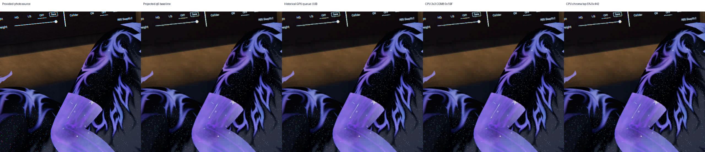
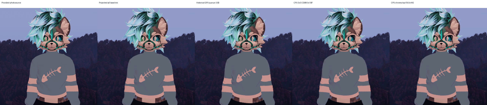
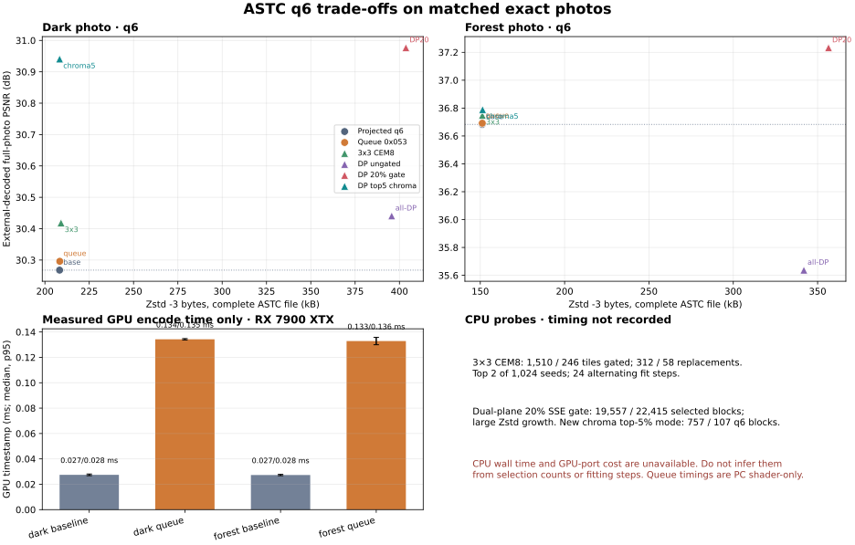

# ASTC colour and palette probes

Offline matched-source comparison of block-palette candidates against the current projected-line ASTC 8x8 baseline. Inputs are the exact supplied 1920x1080 dark and forest photos; their source PNG and RGBA hashes are in `checksums.csv` and `manifest.json`. Crop panels show only 512x512 source-photo regions and corresponding decodes. The older crowd crop is smoke-only: its source provenance and foveation are unresolved, so it is excluded from the photo comparisons.

The strongest new quality result is a CPU dual-plane candidate: ASTC 8x8, one RGB CEM8 partition, legal 4x4 dual-plane weights, six-bit endpoint lattice, and top-5% chroma targeting. It keeps blocks only when external-decoded RGB SSE is at most 95% of the matched q-specific projected baseline. All six q2/q4/q6 photo comparisons improve while complete-file Zstd -3 growth stays below 6%. At q6, dark improves +0.673 dB for +16 bytes (0.008%) and forest +0.106 dB for +213 bytes (0.141%). It is a promising offline CPU quality candidate; CPU wall time and GPU-port cost are not measured, so no speed, live bitrate, or headset-quality claim follows.

| Photo | q | PSNR gain | Full ASTC Zstd -3 bytes | Selected of 32,400 |
|---|---:|---:|---:|---:|
| Dark | 2 | +0.431 dB | 128,807 → 134,892 (+4.72%) | 1,231 |
| Dark | 4 | +0.560 dB | 179,367 → 180,372 (+0.56%) | 829 |
| Dark | 6 | +0.673 dB | 208,269 → 208,285 (+0.008%) | 757 |
| Forest | 2 | +0.096 dB | 80,802 → 85,440 (+5.74%) | 971 |
| Forest | 4 | +0.058 dB | 127,688 → 128,558 (+0.68%) | 351 |
| Forest | 6 | +0.106 dB | 151,145 → 151,358 (+0.141%) | 107 |

Byte counts are recompressed uniformly with Zstd 1.5.7 level 3 over the complete ASTC file, including its 16-byte header. `metrics.csv` contains the measured values and source links for every row.

## Legal block modes and other probes

**Later shader review found undefined memory accesses in the historical GPU queue probe:** zero-coefficient padding entries could index outside interpolation arrays. Its retained quality, crop and timing rows describe those old executions only. They do not validate the error gate, stability or performance of a corrected shader. CPU probes and the production projected-line shader are independent of that path. No queue shader is selected for integration.

All modes below were read from encoded block headers and selection counts were checked against actual occupancy. Each block remains 128 bits, as required by ASTC LDR; these probes change legal per-block mode/partition choices, not the standard container or client format.

- Baseline `0x0F3`: 8x8 footprint, 5x5 weights, one CEM8 partition.
- GPU queue `0x053`: 8x8, 2 partitions with shared CEM8, legal 5x5 weights. One fixed seed selected only 82 dark / 17 forest blocks; it gained just +0.028 / +0.009 dB for +109 / +30 bytes, while measured GPU median rose from about 0.027 ms to 0.134 / 0.133 ms (p95 about 0.135 ms). This queue path is rejected on the measured GPU-time/quality tradeoff. GPU timestamps are RX 7900 XTX, 12 warmups and 30 samples; they are not Pico or live-stream results.
- CPU 3x3 CEM8 `0x1BF`: 8x8, two partitions, shared CEM8, 3x3 weights (27 BISE weight bits; 29-bit two-partition configuration and 72 endpoint bits). It improves +0.151 dB dark and +0.066 dB forest for +809 / +68 bytes, with 312 / 58 winning replacements after gates and top-two-of-1,024 seed fitting. The whole-image gain is modest; the dark hair ROI gained only +0.017 dB and the scratch report notes visible softening. CPU time and GPU cost were not measured, so it is not selected over the newer chroma-targeted candidate.
- Dual-plane `0x442`: 8x8, one RGB CEM8 partition, legal 4x4 dual-plane weights. The older broad 20% SSE gate selected 19,557 / 22,415 blocks and raised q6 PSNR +0.709 / +0.550 dB, but complete-file compressed size rose about 94% / 136%; reject. Ungated encoding regressed forest by 1.045 dB and grew payload substantially; reject. These are distinct from the new six-bit, chroma top-5% candidate above.

The tradeoff graphic keeps CPU quality/size probes separate from the measured GPU queue timestamps. CPU selection counts and fitting steps are algorithm work, not elapsed time. No CPU probe timing or GPU-port timing is available yet.

Reproduce the compact report from the scratch inputs with `python generate_report.py`. The script recomputes whole-file Zstd sizes, validates legal mode IDs and selection counts, renders only the two small source-linked crop panels, and writes the hash manifest. No production/runtime/build/Git changes are part of this report.
