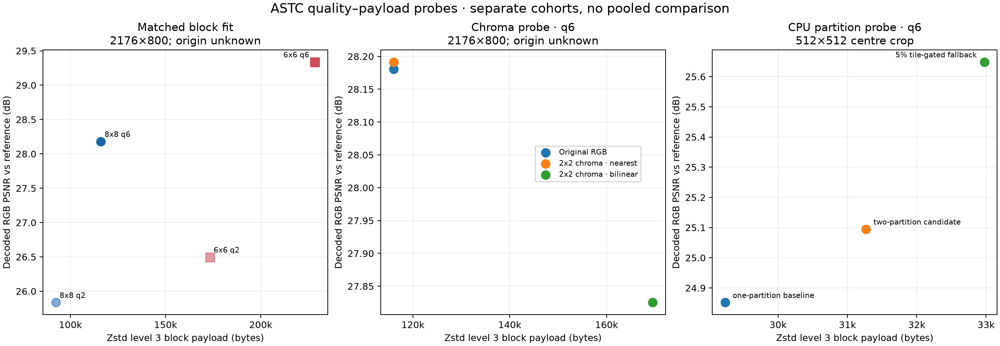
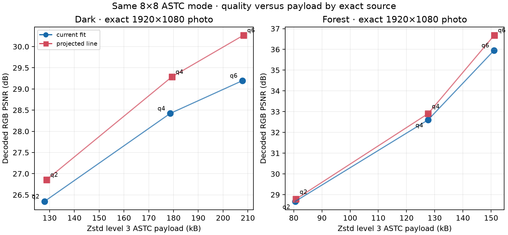
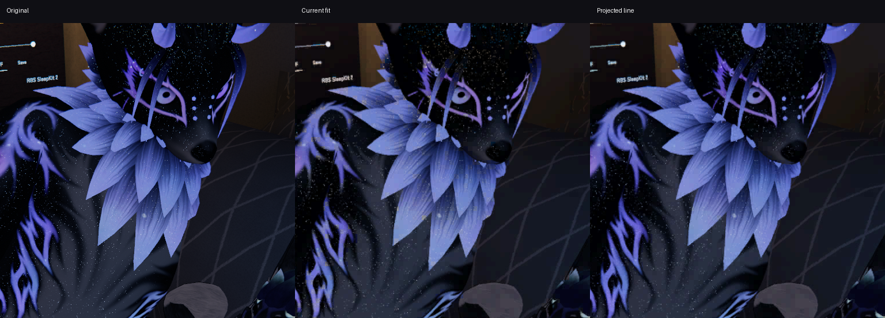
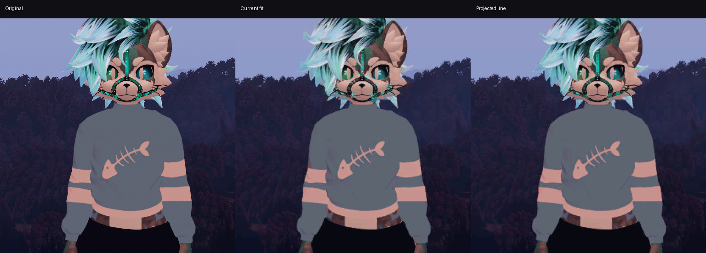
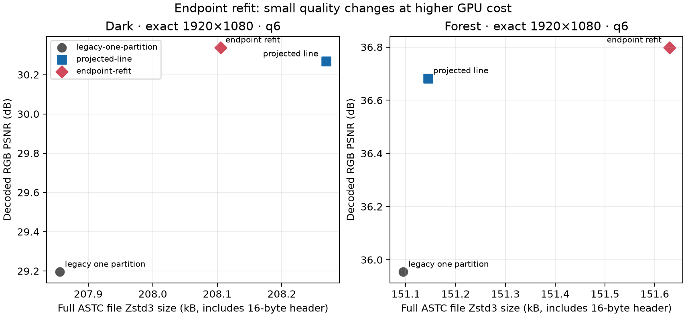

# Dense-colour ASTC study

**Status: PC colour fit integrated; bounded validation.** The projected-line fit is in WiVRn commit `668eea70`; the desktop server and matched runtime were built with pinned Vulkan headers, and the server was restarted. A short, stationary headset check is now recorded below. Sustained motion quality and broad Pico validation remain unverified; no Android APK change is reported.

The quality problem is structural: the tested encoder assigns one endpoint line and one interpolated weight to each 8×8 block. A block containing several unrelated colors can fall far from that single gradient. ASTC permits multiple texel partitions with separate endpoint pairs while keeping each compressed block at 128 bits ([Khronos ASTC format specification](https://github.com/KhronosGroup/DataFormat/blob/main/astc.txt#L2282)). The shipped PC fit projects endpoint selection onto the source block’s PCA line while keeping the same 8×8 ASTC mode and client path. It does not alter ASTC’s 128-bit block format.

## Evidence by cohort

The chart keeps the three older datasets separate because their sources and extents differ. Its PSNR and Zstd3 payload points are measurements from each cohort’s own reference. The exact-photo projected-line results are shown in a separate figure below.

### Matched 8×8 and 6×6 fit

Both footprints use the same Basis ASTC 5×5 weight-grid interpolation pseudoinverse and fitting path. On the 2176×800 `crowd-500-reference` fixture, 6×6 raised q6 PSNR from 28.18 to 29.34 dB and q2 from 25.84 to 26.50 dB. Zstd3 payload grew from 116,060 to 228,492 bytes at q6 and from 92,425 to 173,362 bytes at q2. That is a real quality gain for a large payload increase. The footprint test alone does not establish a useful rate/quality trade-off for the user’s original material.

The block-size timing measured on the RX 7900 XTX host was 0.2268 ms for 8×8 q6 and 0.1433 ms for 6×6 q6; q2 was 0.2257 and 0.1424 ms. Vulkan timestamps used a 10 ns timestamp period and 64 valid bits. Raw query ticks reproduce the recorded milliseconds at the saved precision. These are shader timestamps from this PC harness, not headset or end-to-end measurements.

The crowd fixture’s origin is undocumented. Its requested temporary original was absent during the provenance check, and the existing 2176×800 file does not prove a direct, unfoveated crop. Prior foveation status remains unknown. The dense comparison crop is the 500×400 rectangle `[350, 80, 850, 480]` from that fixture, displayed at 1:1.

### Synthetic 4:2:0 chroma probe

On the same unresolved 2176×800 crowd fixture at q6, nearest reconstruction of 2×2-shared chroma measured 28.191 dB and 116,021 Zstd3 bytes; the original RGB path measured 28.181 dB and 116,060 bytes. Bilinear reconstruction measured 27.825 dB and 169,506 bytes. The synthetic chroma reconstruction itself measured 46.57 dB vs. the source for nearest and 37.66 dB for bilinear. This is an offline RGB model of the sampling choices, not the live YCbCr shader path or Pico cost.

Its 1:1 crop uses `[928, 250, 1248, 470]` (320×220 pixels) and shows five views: original, nearest input, bilinear input, nearest ASTC q6, and bilinear ASTC q6.

### CPU two-partition q6 probe

A separate 512×512 centre-crop cohort scored 24.852 dB / 29,240 Zstd3 bytes for the one-partition baseline and 25.095 dB / 31,270 bytes for the CPU two-partition candidate. The scorer’s 5% per-tile fallback measured 25.649 dB / 32,975 bytes. Candidate MAE was higher than baseline (8.136 vs. 6.923), so the PSNR change alone does not describe the full error distribution. The fallback reduced MAE to 6.699.

The existing three-panel crop comparison covers `[0, 12, 512, 512]` within the 512×512 centre crop (512×500 pixels, 1:1). The metric table also includes full 512×512 results. Crop coordinates were recovered from the existing comparison image by matching its reference panel to the supplied centre-crop source. The scorer, CPU probe, and compact 16-seed partition-pattern LUT are included. The separate large decoder interpolation LUT and build products are omitted. This CPU result is separate from the GPU partition tests below.

### Exact-photo projected-line fit

The exact user-provided dark and forest photos are 1920×1080 RGB sources, copied byte-for-byte and encoded as row-major RGBA8 for the harness. The comparison uses the current endpoint min/max fit and the projected-PCA-line endpoint fit, with the same 8×8 ASTC mode, quantization levels, fit path, and host decoder. Each decoded output was scored over the full source image. The figure plots measured PSNR against the Zstd level 3 compressed ASTC payload; points are grouped by photo, not pooled.

| Photo / quality | Current PSNR / MAE / bytes | Projected-line PSNR / MAE / bytes | Change |
|---|---:|---:|---:|
| Dark q2 | 26.344 dB / 8.485 / 127,892 | 26.857 dB / 8.272 / 128,778 | +0.514 dB; +0.69% bytes |
| Dark q4 | 28.422 dB / 5.181 / 178,663 | 29.286 dB / 4.905 / 179,350 | +0.864 dB; +0.38% bytes |
| Dark q6 | 29.196 dB / 3.199 / 207,835 | 30.268 dB / 2.898 / 208,254 | +1.072 dB; +0.20% bytes |
| Forest q2 | 28.671 dB / 7.715 / 80,509 | 28.784 dB / 7.681 / 80,780 | +0.113 dB; +0.34% bytes |
| Forest q4 | 32.605 dB / 4.438 / 127,677 | 32.908 dB / 4.379 / 127,688 | +0.303 dB; +0.01% bytes |
| Forest q6 | 35.955 dB / 1.822 / 151,075 | 36.683 dB / 1.734 / 151,125 | +0.728 dB; +0.03% bytes |

The supplied q6 1:1 comparison crops show the current fit and projected line against each source. All q2/q4/q6 payload figures use the encoder harness’s Zstd level 3 block-payload counts. The small payload increase is not a bitrate guarantee. The host GPU benchmark is reported separately below. These host-side image scores do not establish perceived Pico quality.

The same exact-source GPU harness tested a fixed three-pattern partition branch against the projected-line fit. All outputs passed the independent ASTC host decoder. The gain was only 0.057 dB on dark and 0.019 dB on forest, while median encode time rose to 0.362 ms and 0.306 ms from 0.016 ms and 0.027 ms. The partition branch is rejected for this quality/cost trade-off.

| Source | Variant | PSNR | GPU encode median / p95 | Full ASTC Zstd3 bytes |
|---|---|---:|---:|---:|
| Dark | Projected line | 30.2679 dB | 0.01560 / 0.02020 ms | 208,269 |
| Dark | Three-pattern | 30.3245 dB | 0.36228 / 0.37344 ms | 208,487 |
| Forest | Projected line | 36.6826 dB | 0.02652 / 0.02704 ms | 151,145 |
| Forest | Three-pattern | 36.7018 dB | 0.30612 / 0.32748 ms | 151,178 |

These compressed-size counts include the 16-byte ASTC file header; the projected-line table above reports compressed block-payload bytes without the header.

These are desktop Vulkan timestamp measurements on AMD Radeon RX 7900 XTX (RADV NAVI31), with 12 warmups and 30 timed samples. The harness reads the device timestamp period and valid-bit count, subtracts query timestamps modulo valid bits, then scales ticks by the period; this host reports 10 ns and 64 valid bits. GPU timing describes this harness only, not the VR headset.

### Endpoint-refit rejection

An endpoint least-squares refit retained the projected-PCA endpoints and fitted 5×5 weight symbols, then solved for RGB endpoints and requantized. On these q6 photos it added only 0.070 dB on dark and 0.116 dB on forest. Dark MAE improved 2.898→2.868; forest MAE slightly regressed 1.734→1.736. Median GPU encode time rose from 0.0156→0.0556 ms on dark and 0.0265→0.0555 ms on forest, so this refit is rejected for the current path.

| Photo | Variant | PSNR / MAE | GPU median / p95 | Full-file Zstd3 bytes |
|---|---|---:|---:|---:|
| Dark | Projected line | 30.2679 dB / 2.89811 | 0.01560 / 0.02020 ms | 208,269 |
| Dark | Endpoint refit | 30.3383 dB / 2.86790 | 0.05564 / 0.05644 ms | 208,105 |
| Forest | Projected line | 36.6826 dB / 1.73418 | 0.02652 / 0.02704 ms | 151,145 |
| Forest | Endpoint refit | 36.7983 dB / 1.73627 | 0.05548 / 0.05568 ms | 151,630 |

The table and plot use Zstd level 3 counts for the complete ASTC file, including its 16-byte ASTC header. These counts are kept separate from the preceding payload-only table.

### CEM6 RGB-scale rejection

The final fixed-seed CEM6 RGB-scale candidate uses legal quint4 endpoint packing: a 29-bit two-partition configuration plus 48 weight bits leaves 51 endpoint bits for eight values. The exact quint4 mapping fills that budget, and all tested output files passed the external decoder. The earlier plain-six-bit trial is excluded.

| Photo | Candidate | PSNR | Full-file Zstd3 bytes | GPU encode median | Delta vs projected line |
|---|---|---:|---:|---:|---:|
| Dark | Projected line | 30.2679 dB | 208,269 | 0.0156 ms | — |
| Dark | Two-partition CEM6 | 30.2848 dB | 208,557 | 0.4300 ms | +0.017 dB; +288 bytes |
| Forest | Projected line | 36.6826 dB | 151,145 | 0.0265 ms | — |
| Forest | Two-partition CEM6 | 36.6856 dB | 151,157 | 0.3616 ms | +0.003 dB; +12 bytes |

Size counts include the 16-byte ASTC header. The tiny quality change does not justify the 14–28× encode cost in this host probe, so CEM6 is rejected. Its exact source comparison and packing facts are in `rgb-scale/`.

### Short live WayVR check

The fresh paired capture ran 2026-10-04 02:14:52–02:15:05 UTC through four wakeups at three-second intervals, with WayVR stationary and no scene launched. Five 2-second client windows logged 89.2–89.8 render iterations/s, 173–180 fresh source frames, and 1.8–2.7 ms application-owned GPU passes at 2176×2176 per eye. The client reported zero pose shifts and no active motion fields.

The paired server U_LOG summary contained 12 non-black encoder mean windows and zero idle-black windows. Its q6 Zstd per-eye means were around 125–126 kB during most of the sample, followed by an approximately 81 kB transition. U_LOG has no wall-clock timestamps, so these server packet means cannot be matched to individual client windows. The capture only checks wake/reconnect headroom under stationary conditions; it does not establish 90 Hz on complex content, sustained head-motion performance, photon latency, or perceived image quality.

The first WayVR start hit a startup race; retry PID 1551761 ran against server PID 1551212. The paired excerpts and SHA-256 metadata for the running binary, SPIR-V, pinned Vulkan headers, and shader sources are under `live-check/`. SPIR-V validation passed for Vulkan 1.3. The current capture reports a 1.8–2.7 ms application GPU-pass range; it does not support a speedup claim against an earlier 1.7 ms sample. The server shader change and measured outputs use the standard 8×8 ASTC block. This stationary sample does not verify Pico image quality.

### Pan-phase and input-transform checks

Eight synthetic pan phases kept the projected-line q6 gain stable: mean PSNR rose 29.201→30.263 dB on dark and 35.934→36.610 dB on forest. Motion-aligned adjacent-frame RGB RMS error fell 14.9% and 6.0%, respectively. These are deterministic ASTC grid-phase checks, not measured headset jitter or user motion.

An approximate 4:2:0 input transform was also scored against each original full photo. At q6, decoded PSNR rose 29.157→30.001 dB (dark) and 36.000→36.476 dB (forest); Zstd3 payload fell 203,424→202,241 bytes and 130,268→129,805 bytes. These numbers belong to the transformed-input cohort and are not directly comparable to the full-RGB results above. Constant 1×1 q0 and odd 17×9 q6 test blocks also passed the external ASTC decoder.

## Source and decision limits

The old crowd fixture is shared by the dense and chroma probes, so those results are correlated by input. The CPU centre-crop cohort is separate. Exact dark and forest source provenance is confirmed as byte-for-byte 1920×1080 photos from 2026-08-05 and 2026-09-17; the older 2176×2176 dark/forest fixture metrics in `dense-colour/fair-results.json` are legacy and are not plotted or used here. The full photos are not duplicated in this report.

The original crowd source remains unresolved; prior processing is visually coarse, while exact foveation history is unknown. A prior GPU partition comparison used mismatched sources and is invalid; exact-source runs above support rejecting both the three-pattern and endpoint-refit branches. The projected-line PC fit is shipped in WiVRn `668eea70`, but the short stationary client burst is not paired with the server packet-size subset. Sustained motion and perceived Pico quality remain open.

## Files

- `manifest.json` records source hashes, dimensions, provenance limits, cohort membership, and displayed crop extents.
- `dense-colour/fair-results.json` contains full matched-fit fixture metrics, timestamps, and quality values; `dense-colour/crowd-q6-fair-crop.png` is the dense-colour q6 comparison.
- `chroma-probe/source-chroma.csv`, its scorer, report, and crop preserve the synthetic chroma experiment.
- `cpu-partition/cpu-two-partition-metrics.csv` and `.json` contain reproduced full-frame and display-crop scores; `score.py`, `probe.cpp`, and `partition-lut.txt` preserve the CPU method.
- `exact-q6/results.json` and `.csv` preserve exact-photo q6 metrics; q2/q4/q6 measurements are graphed in the source-separated figure. `exact-q6/validation.json` and `validate_motion.py` preserve the bounded pan-phase and transform checks. `gpu-partition-comparison.csv` and its manifest preserve the exact-source GPU comparison and method.
- `endpoint-refit/comparison.csv` and its manifest preserve the endpoint-refit q6 comparison. `live-check/paired/` contains the fresh bounded client/server excerpts; `production-build-metadata.json` records the live server, SPIR-V, Vulkan-header, and shader-source hashes.
- `rgb-scale/comparison.csv`, its manifest, and concise source report preserve the rejected CEM6 RGB-scale result.
- `figures/quality-vs-zstd3.csv` is the data behind the older separate panels. Regenerate figures and CPU metrics with `python3 build_report.py` while the referenced scratch result folders remain available.
