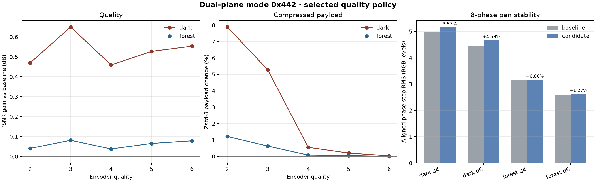
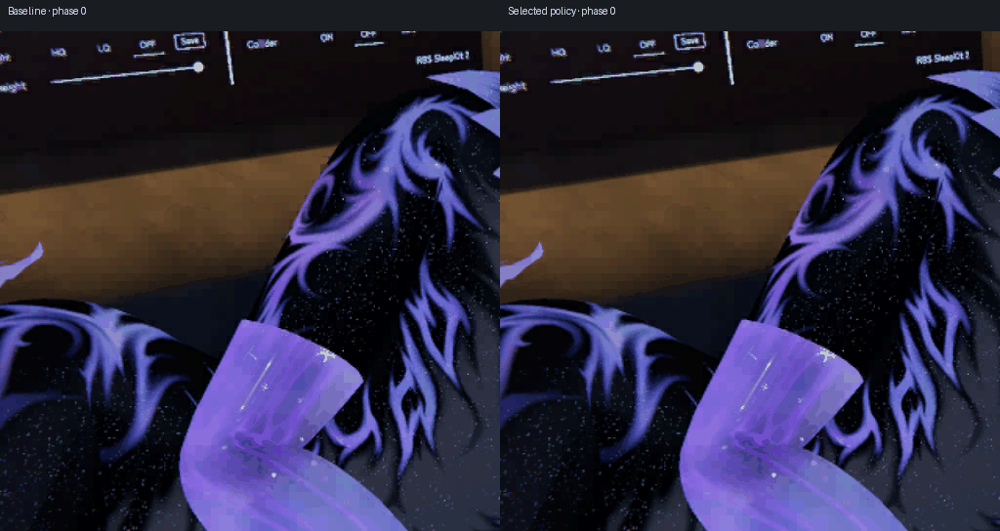
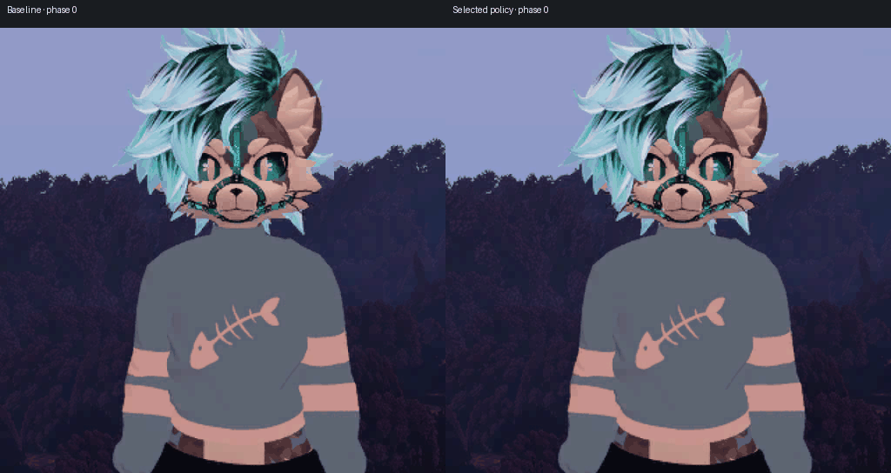
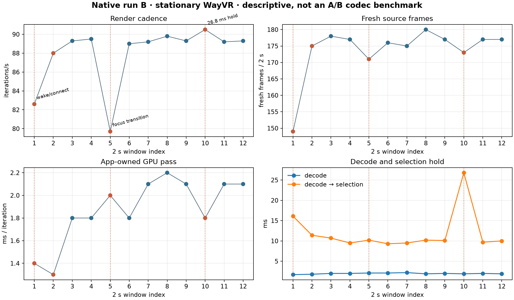

# Dual-plane colour policy integration

The selected branch emits legal 128-bit ASTC 8×8 CEM8 blocks with two colour gradients. It keeps the existing ASTC client sampler and spatial footprint; it does not create smaller blocks. The PC encoder performs extra per-block colour fitting and selects the dual-plane mode only when the chroma gate and quality-dependent decoded-error gate pass.

The selected gate is `candidate error < baseline error × 0.95` at q2–q3 and `< baseline × 0.80` at q4–q6, with the existing chroma threshold of 500. The offline table below comes from the exact guarded quality-policy SPIR-V in the manifest and independent external ASTC decode. All ten scene/quality results had zero external-decode gate failures.

| Scene | Q | Gate | PSNR gain | Zstd-3 change | Selected blocks | External gate failures |
| --- | ---: | ---: | ---: | ---: | ---: | ---: |
| Dark | 2 | 0.95 | +0.470 dB | +7.886% | 2,110 | 0 |
| Dark | 3 | 0.95 | +0.650 dB | +5.277% | 1,795 | 0 |
| Dark | 4 | 0.80 | +0.459 dB | +0.549% | 646 | 0 |
| Dark | 5 | 0.80 | +0.527 dB | +0.202% | 568 | 0 |
| Dark | 6 | 0.80 | +0.553 dB | +0.032% | 543 | 0 |
| Forest | 2 | 0.95 | +0.040 dB | +1.213% | 231 | 0 |
| Forest | 3 | 0.95 | +0.081 dB | +0.628% | 150 | 0 |
| Forest | 4 | 0.80 | +0.038 dB | +0.078% | 50 | 0 |
| Forest | 5 | 0.80 | +0.065 dB | +0.051% | 39 | 0 |
| Forest | 6 | 0.80 | +0.079 dB | −0.007% | 35 | 0 |

`metrics.csv` carries the exact compressed byte counts, selected blocks, and pan measurements. Zstd-3 sizes are compressed ASTC blocks, not network packet or end-to-end transport measurements.

## Final production checks

The final production SPIR-V was timed on an RX 7900 XTX with resident 1920×1080 inputs (12 warmups, 30 samples, fit3). Across dark/forest at q2/q6, final output bytes were identical to the prior coarse production build; median GPU encode was 0.178–0.198 ms and transfer+encode+readback 0.218–0.237 ms. These four photo cases therefore establish final-build timing, not the cost of blocks where the new mode is selected. Full values and SPIR-V/output hashes are in `manifest.json`.

Production synthetic checks covered flat RGB, a neutral-gray ramp, a colour checker, and a diagonal negative-span pattern at q2/q4/q6. Flat and gray selected zero dual-plane blocks in all six cases. The checker improved PSNR by +0.510/+0.401/+0.401 dB; Zstd-3 changed −2.4%/−1.8%/+3.8%. The diagonal q2 case gained +0.246 dB but grew from 778 to 2,406 Zstd-3 bytes; q4/q6 selected no blocks. All 36 production/external-decode outputs had zero quality-gate failures. These are synthetic targeted checks, not broad natural-image claims.

## Phase-stability previews

The crop animations compare baseline and candidate output over eight aligned horizontal roll phases at q6. They visualize a synthetic phase-sweep stress test, not natural motion or a live headset recording.

At q4, aligned phase-step RMS rose 3.57% on dark and 0.86% on forest. At q6 it rose 4.59% and 1.27%, respectively. Baseline and candidate phase-to-phase PSNR ranges are recorded in `metrics.csv` and `temporal.csv`.

## Production and live evidence

The root-owned production port passed 14 byte-identical photo/quality packed-output cases; the selected policy also passed 10 q2–q6 external-decode quality-gate cases. The stdlib ASTC table test passed, including the optional external-decoder endpoint blue-contraction counterexample. See the test at [astc_colour_tables_test.py](https://github.com/nerdrx/wivrn-nx/blob/pyrowave-probe/tests/astc_colour_tables_test.py). No hardware-sampler change is required.

Native run B used the existing stationary WayVR session with six wakeups at three-second intervals and no demo. The server recorded 20 non-black windows and zero idle-black windows. Across eight steady two-second client windows, cadence was 89.0–89.8 iterations/s, with 175–180 fresh source frames, 1.8–2.2 ms app-owned GPU passes, 1.9–2.2 ms decode, and 9.3–10.7 ms decode-to-selection. The per-window chart retains the wake/connect, session-focus, and 26.8 ms selection-hold outliers:

The earlier native A attempt produced zero non-black server windows. The host OpenXR/Monado runtime versions were mismatched; relinking the host against the matching runtime fixed startup before run B. Keep the failed A attempt in the record, but do not attribute it to the colour policy. Run B is a stationary operational check, not a matched codec A/B: it does not establish the candidate's GPU cost, visible image-quality benefit, complex-motion performance, photon latency, or sustained 90 Hz in demanding scenes.

Native run C is a failed pacing check and does **not** validate 90 Hz. Over 24.9 s it produced only 20 non-black server windows and 2 idle-black windows; client two-second summaries ranged from 23 to 65 iterations/s, despite an app-owned GPU pass of 1.9–2.1 ms. Decoder timing remained around 2–3 ms, while decode-to-selection climbed to 27.2 ms in the last sampled window. The measured CPU stage costs were about 0.6 ms/eye for LZ4 or 1 ms/eye for Zstd-3 and 0.005 ms/packet; reported eye-0 fence was 1.7 ms and eye-1 about 0.002 ms. These costs do not explain the cadence on their own.

C had repeated activity/focus churn: 183 input-profile loads, 182 runtime swapchain creations and PCTP uploads, 91 GPU performance-level policy applications, and 548 performance-level API calls. B had 4 profile loads, 6 swapchain creations, 3 PCTP uploads, 1 policy application, and 8 API calls. C's XR log shows FOCUSED→VISIBLE at 06:22:39.352, STOPPING at 06:22:44.993, IDLE at 45.001, and READY/VISIBLE again at 46.708/46.749; repeated internal scene focus work is therefore not explained by XR state transitions alone. The log also has 788 “Failed to find a common frame” warnings and 48 no-shard messages. C's current thermal HAL reading was 42 °C/status 0; the previously cached 85 °C value is stale and not evidence of current heat.

Read-only source tracing found a plausible churn path, not a proven sole cause: the stream's readiness check accepts retained, nonempty frames without testing their age, while the render watchdog marks a stream stalled when its selected frame is older than one second and pops the scene. A later datagram can mark it streaming again using that same nonempty-buffer readiness check, sending the scene through lobby push/focus work again. The focused/unfocused callbacks also reapply performance levels. A targeted fix is to align resume readiness with fresh-frame state while preserving held frames during the explicit reconnect state; it has not been validated in a native rerun here. C differs from B in activity/focus and stream churn and is not a matched codec comparison, so it cannot attribute the regression to the colour mode.

### Remaining integration validation

- Matched native baseline-versus-candidate session with equal scene and capture conditions: **pending**.
- Complex motion, longer-duration headset performance, and direct visual-quality review: **pending**.
- The eight-phase crops are synthetic roll-phase comparisons; they are not proof of real-scene temporal quality.

## Evidence and reproduction

- `metrics.csv`, `temporal.csv`: exact quality, payload, and phase-stability results.
- `live-windows.csv`: full two-second client windows; the single-frame startup summary is intentionally excluded.
- `manifest.json`: source image hashes, policy SPIR-V and source hashes, phase-crop hashes, live capture hashes, and report-artifact hashes. Full photographs are not included.
- `dualplane-pico-native/`: sampler decode/timing validation and its hash-checked fixture/run manifests. It establishes legal decoding and comparable synthetic sampler cost, not speedup or live image quality.
- `render_report.py` regenerates the scientific charts and compact crop animations from those inputs.
- Run metadata and original captures remain under the absolute paths recorded in the manifest. Native run B APK SHA-256: `a6a3f44a538057b91e5489d970bbfaa1a6c6653fcdd9ca6da57e2f9dcbb166a5`.
