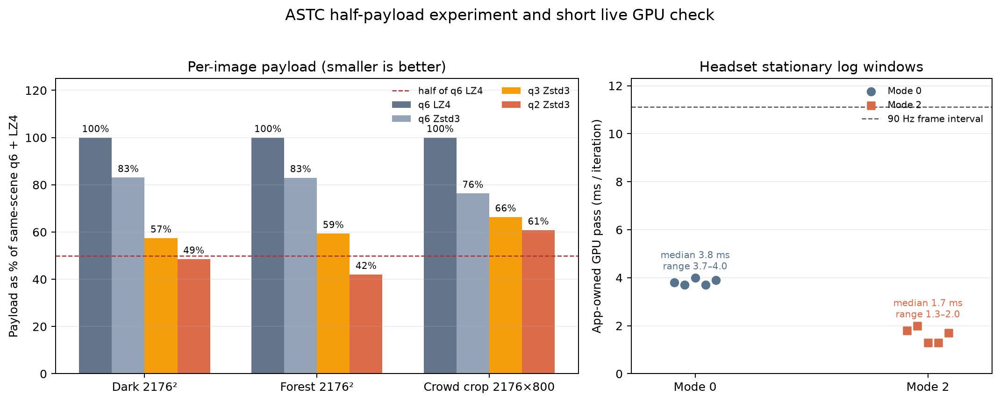
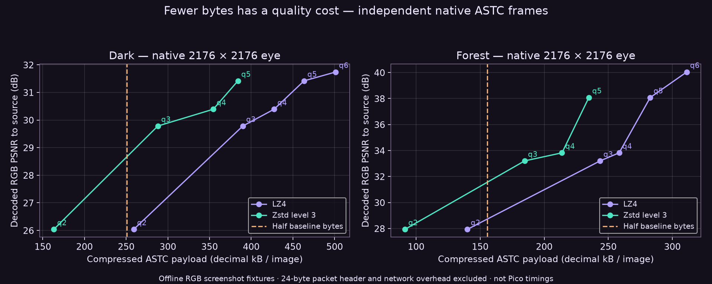
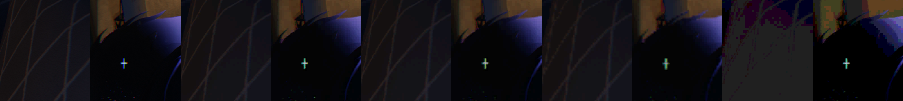
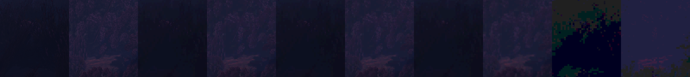

# Native ASTC: smaller payloads and cheaper presentation

> Fixture provenance correction (Oct 4): these older screenshot-derived fixtures
> are not verified raw, unfoveated images. The crowd reference visibly contains
> prior spatial preprocessing, and the original clipboard image is unavailable.
> Native dimensions describe output geometry only. Byte/quality comparisons
> remain valid for the same processed inputs; do not generalize them to raw
> full-detail VR scenes. The separate live Pico timings are unaffected.

## Per-eye quality follow-up and live presentation check (Oct 4)

The earlier experiment below uses a separate **4352×2176 stereo fixture**. This
follow-up uses 2176×2176 single-eye dark and forest fixtures, plus a 2176×800
crowd crop (non-native aspect ratio). These payloads exclude the 24-byte packet
header and transport/FEC overhead. q6+LZ4 is the original detail baseline; q6+Zstd3
is shown separately as a lossless packing baseline.

| Fixture | q6 + LZ4 | q6 + Zstd3 | Current q2 + Zstd3 | Saved vs q6 + LZ4 | q2 RGB PSNR |
|---|---:|---:|---:|---:|---:|
| Dark, 2176² | 501,248 B | 416,383 B | 243,333 B | 51.5% | 27.29 dB |
| Forest, 2176² | 311,230 B | 258,375 B | 130,834 B | 58.0% | 28.73 dB |
| Crowd crop, 2176×800 | 151,943 B | 116,063 B | 92,424 B | 39.2% | 25.84 dB |

The current q2 reaches half-size on dark and forest, but not the crowd crop. Its
color banding and blockiness are visible; text remains roughly legible in the
reviewed crop. Treat q2 as a fallback, not an imperceptible quality change.
q3+Zstd3 does not reach half-size on any of these three fixtures. Higher Zstd
levels improve q2 savings to 56.6%, 62.1%, and 45.3% at level 9, while costing
roughly 3.9–9.7 ms per host compression call for q2 versus about 1–2 ms at level
3. The byte gain is small relative to the extra CPU time.

Two endpoint alternatives were rejected. A contrast-threshold gate increased
Zstd3 bytes by 6.5–12% and flipped precision on 1,254 then 1,395 of 73,984 dark
blocks across a synthetic one-pixel pan. A luma-preserving transform increased
bytes by 12.3–34.7% across dark, forest, and crowd (16.4% on dark); it did not
consistently improve the other scenes. Details, source hashes, crop sheets, and
reproduction scripts are in [quality-improve](quality-improve/README.md).

### Live presentation sample

The connected headset log contains five stable windows for mode 0 and five for
mode 2, each with at least 170 iterations. The app-owned GPU pass was 3.7–4.0 ms
(mode 0, median 3.8 ms) and 1.3–2.0 ms (mode 2, median 1.7 ms). The sampled
windows ran at 87.8–89.8 iterations/s. A separate final-default warm window
reported 164 fresh sources out of 180 iterations (~82/s), followed by 179/179
(~89.5/s); this startup dip is retained in `live-validation/default-warm-windows.csv`.
A warmed simple-to-complex controller test now records two significant overruns
instead of the old model's seven oversized outputs; the subsequent q2 packet is
inside the existing 10% tolerance. This is a model, not a delivery deadline. The stable sample is short and stationary: it does not establish sustained
motion performance or photon latency, and the GPU number covers the app-owned
pass rather than full frame latency.

The final presentation default is mode 2; mode 0 remains an opt-out. The selected
path is guarded so other effects restore the general shader. Latest installed APK
SHA-256: `95e549812fa6ec09c04d0407bfb5b1aae23924733372b22da71be6449f2d0934`,
paired with the matching test server. Final validation evidence is copied to
[live-validation/final-validation.json](live-validation/final-validation.json).
Rate, packet, and header checks passed; BBR regression checks passed 73 cases
and 4,346 budget checks with zero failures.

Quiet active-session telemetry recorded q6/Zstd packets of 119,287–136,412 B per
eye, with all 180 sampled frames per stream at q6/Zstd. The 157-byte idle-black
sentinel is excluded. These are mean packet sizes including the 24-byte header, observed in a quiet scene,
not a throughput guarantee. Compact source-linked extracts and the figure
generator are in `live-validation/`; the raw logs remain in the local scratch
fixture tree and are not copied into this report.

## Earlier stereo experiment

The lower-bandwidth candidate meets the size goal on two offline fixtures:
**50.6% fewer bytes on dark, 58.1% fewer on forest**, keeping the same output image
dimensions. The quality loss is visible. This is not a general guarantee across
scenes, sustained 90 FPS proof, or a photon-latency measurement.

The integrated candidate quantizes ASTC endpoints to three bits and weights to
four legal levels, then uses Zstd level 3 to pack the ASTC blocks losslessly.
The existing hardware texture sampler still displays ASTC 8x8. There is no new
full-frame GPU reconstruction pass, foveation, or temporal reference dependency.
Quality adapts to actual packet size and the bitrate budget; higher quality remains
available when it fits. Raw/LZ4 is retained when Zstd saves less than 10%.

## Same-source comparison

These are 4352x2176 screenshot-derived stereo fixtures. Bytes exclude the 24-byte
NX ASTC header and UDP/FEC overhead. Savings compare the exact fixture at each mode.

| Fixture | Baseline q6 + LZ4 | Four weight levels, 3-bit endpoints + Zstd3 | Payload saved | RGB PSNR, before / after |
|---|---:|---:|---:|---:|
| Dark | 508,605 B | 251,029 B | 50.6% | 31.74 / 27.41 dB |
| Forest | 318,924 B | 133,680 B | 58.1% | 40.04 / 28.80 dB |

For the dark fixture, 90 such stereo frames/s require 180.7 Mbit/s of candidate
payload versus 366.2 Mbit/s before overhead. Forest is 96.2 versus 229.6 Mbit/s.
These rates are arithmetic projections, not measured network throughput.

## What did not work

Larger ASTC 12x12 blocks removed 55.4% of raw block bytes, but LZ4 had already
compressed many of those bytes. Actual packets saved 0–17%, with lower quality.
Lossless byte-plane and neighbouring-block XOR transforms expanded the captured
packets. Zstd alone saved 27.5% on two real WayVR captures; it did not halve them.
Previous-frame XOR plus Zstd saved about 37% on small synthetic pans, fell short
on larger shifts, and would introduce reference recovery state.

Smoothing weights into 3x3 or 2x2 fields did not provide a compelling compression
win. The chosen four-level mode preserves more edge shading than binary weights,
but coarse colour remains conspicuous, especially in forest. It is a bandwidth
fallback, not an invisible replacement for the highest-quality mode.

## Precision ladder and visual evidence

The graph below is a separate **2176x2176 single-eye** experiment. Its q2 uses
the earlier binary-weight mode; it is **not the integrated four-level q2**.
The two datasets must not be mixed when computing bitrate or quality differences.

Below, left to right: source, q6 baseline, 3x3 weights, 2x2 weights, and the chosen
four-level weights with three-bit endpoints. All crops show decoded ASTC.

## Validation and reproduction

Zstd/LZ4 experiments verify byte-exact decompression of compressed ASTC blocks;
this does not undo lossy ASTC encoding. Shader compilation and native server/runtime
build passed. Packet tests check old raw/LZ4 compatibility, truncated and malformed
Zstd, content-size bounds, and trailing/concatenated frames. Rate-control tests
check budget changes, stable selection, and recovery after older size estimates
expire. BBR regression checks prevent packet loss from increasing a backoff budget.

`zstd-quality-results.json` and `zstd-manifest.json` preserve single-eye source hashes,
sizes, PSNR and host compression timings. `regularized-zstd-results.json` records
the stereo smoothing experiment. `compare_zstd_levels.py` requires the referenced
fixture tree; `plot_results.py` regenerates the graph from the included JSON.
Reproducible shader/harness source is retained in the local experiment bundle
`nx-scratch/astc-half-rate-20261004/{quality,regularized}`. Host timings do not predict
Pico decompression cost.

## Pico CPU cost and PC packing

The standalone Android/AArch64 benchmark ran on the connected A8110/Pico 4 with
preallocated output and 30 measured calls after five warmups. Every result matched
the original ASTC blocks. It does not measure network, Vulkan upload, rendering,
or motion-to-photon latency; the headset screen was initially off.

| Native 2176x2176 eye payload | Bytes | Decode median | Decode p95 |
|---|---:|---:|---:|
| q6 LZ4 | 501,248 | 0.433 ms | 0.442 ms |
| q6 Zstd3, same ASTC detail | 416,379 | 1.052 ms | 1.293 ms |
| Four-level weights, three-bit endpoints, LZ4 | 339,571 | 0.400 ms | 0.407 ms |
| Four-level weights, three-bit endpoints, Zstd3 | 243,394 | 1.019 ms | 1.215 ms |

The chosen lower-quality single-eye payload saves 51.4% against the same-source
q6 LZ4. Zstd adds about 0.6 ms per eye in this isolated CPU test, while preserving
the ASTC blocks exactly. The frame still needs upload and presentation afterward.

An additional PC bottleneck was unoptimized bundled compression in the Debug
server build: Zstd medians ranged from 4.49 to 14.99 ms per eye. Optimizing only
the LZ4/Zstd targets, while keeping debug symbols and assertions, brought the
rechecked q6/q3 dark/forest Zstd medians to 1.37–2.29 ms and LZ4 to 0.67–0.96 ms.
The compressor output sizes stayed identical. This removes diagnostic-build
overhead; it is not a new algorithmic compression improvement.
