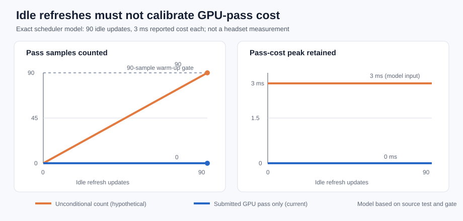

# JIT GPU-pass warm-up check

**Result:** the signed JIT APK produced four short stationary WayVR windows
at 89.3–90.3 render iterations/s, with 177–180 fresh source frames per window.
The app-owned GPU pass measured 2.3, 2.7, 2.7, and 3.0 ms. The JIT scheduler
was on. This is a short wake/reconnect check, not sustained motion or a quality test.

The figure applies the exact `jit_scheduler` gate from the source test to a
model: each idle update reports 3 ms loop cost; the orange series shows the
hypothetical old behavior that counts every idle update as a submitted GPU
pass, while the blue series uses the current submitted-pass flag. This is a
model, not a measured headset trace. After 90 idle updates, old-style counting
would reach the 90-sample warm-up gate and record 3 ms; current logic remains
at zero pass samples and zero pass-cost peak. The same test confirms that 90
actual submitted passes do complete warm-up.

The capture ran 2026-10-04 02:34:46–02:34:59 UTC, with four wakeups about
three seconds apart and no demo scene. Twelve non-black server encoder means
and two idle-black means were recorded. Typical later q6/Zstd means were
125.1–125.7 kB per stream; the idle means were 157 B. The server log has no
wall timestamps, so these values cannot be paired with individual client windows.

WiVRn source commit: `71ee1246`, pushed on `pyrowave-probe`.
The package preserves manifest/classes/resources, uses the existing signing certificate,
and keeps all native libraries uncompressed and 16 KiB aligned.

The capture metadata identifies APK SHA-256
`430ae866e7820783b5bd5382cd123864b6b484ad99a421426764c9e94f191e8b`.
Android signing and unchanged APK-entry checks are in the
[packaging manifest](packaging-manifest.json).

This sample does not demonstrate sustained 90 Hz under motion or complex
scenes, a latency improvement, photon latency, or perceived Pico image quality.
It reports only the client’s own GPU pass; do not claim a speedup from it.

See `client-windows.csv`, `server-extract.txt`, and `source-evidence.md` for
compact evidence. `manifest.json` records input hashes and scope.
