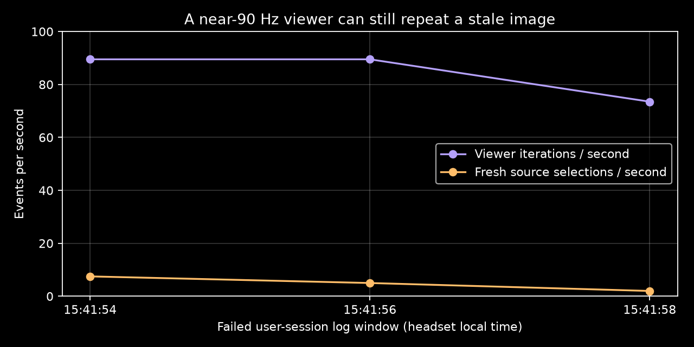
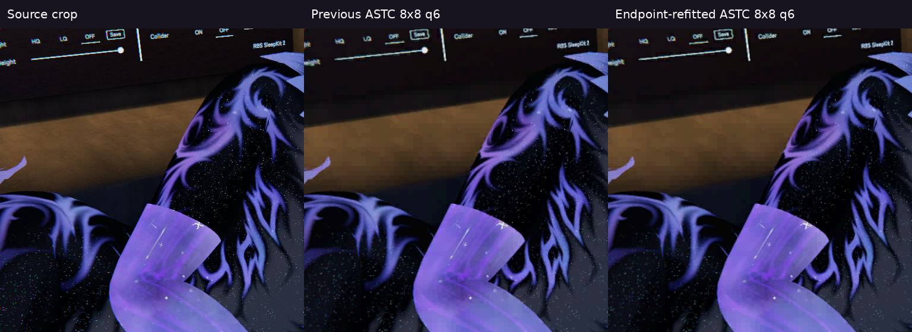
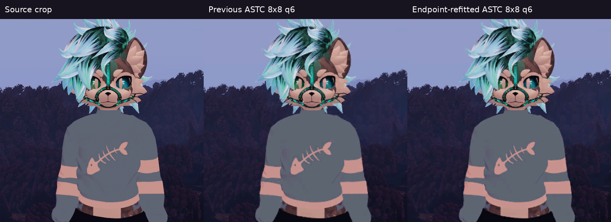

# Failed live VR trial and bounded recovery work

The user rejected the adaptive ASTC block / colour-smoothing trial as stuttery and low quality. They also rejected the fixed 8×8 baseline against HEVC, including after testing adaptive bitrate. **There is no usable-motion or HEVC-parity result here.**

The last three two-second user-session windows show 179/179/147 viewer iterations but only 15/10/4 fresh source selections. Rendering a layer again is not delivering a fresh image. The server was already using 8×8 q6 in the failed tail; these logs cannot assign the delivery failure to the reverted small-block or smoothing features. Stage delays include repeated stale images and do not measure photons.

Matched source `d95fbe99` restored the fixed 8×8 baseline and disabled the optional colour blur. Its installed APK SHA-256 was `bdb4e0caedf31897d901def4bbcea8f977160986f215d42c60a48671fa581546`; on-device digest matched. The server required forced termination of its validated owned process group after graceful shutdown stalled. The client reconnected, but XR then became idle. **Reconnect and idle decode are not motion validation.**

Source `94f71b95` fixes a concrete frame-retention error. Default three-slot retention previously placed each frame at `frame_id % 3`: arrivals 0, 1, 2, 9, 12 retained 1, 2, 12, evicting frame 9 that a slower eye could still match. The same existing newest-distinct-ID policy now handles three and four slots, and frame lookup scans those slots. Regression checks pass for sequential and sparse strides at both capacities, duplicates, stale/out-of-order arrivals and the explicit 2/9/12 retention case. No added images, copies or GPU passes. Follow-up source `7d9624f3` also retains the last coherent ASTC stereo pair when no matching newer pair exists, and rejects candidates older than the displayed pair. This avoids independent-eye salvage and backwards frame transitions during loss; it cannot supply missing source pictures. This repairs a proven bookkeeping bug; its contribution to the reported live stutter remains unmeasured.

A PC-only q6 greedy weight refinement was tested and rejected. On the same direct-RGBA 1920×1080 dark-scene proxy, external decode PSNR increased only 30.8213 → 30.8587 dB, while median GPU encode time grew 0.238 → 43.487 ms and LZ4 bytes grew 250,484 → 251,027. Twelve warmups and thirty timing samples were used. This does not justify deployment, and the shader change was removed. Proxy timing does not measure the production texture input or Pico presentation.

Raw failed-session extracts and `delivery.json` accompany this report. These are uncontrolled user-session observations; they establish the failure, not a controlled causal comparison. Next gates are fresh stereo delivery under motion and visually cleaner colour at an attainable wire budget.

The matched `7d9624f3` host and Android builds passed, and the data-preserving Pico update was installed and verified against APK digest `a2fafb1a4f36acd6ee879896702271434acb525f51a0ec5adb8f591c89d3ea99`. Reconnect is a smoke check; perceived smoothness and complex-scene delivery remain unvalidated.

## Small accepted encoder improvement; large compression gap remains

Source `c514841f` fits q6 endpoints once more against the actual decoded weight grid, then accepts them only when decoded RGB squared error falls. It preserves the original dual-plane admission threshold and keeps the best eligible result. The 128-bit 8×8 format, Pico sampler and upload path are unchanged. Independent external decoding found **zero regressed blocks** in four dark-scene phases and the forest fixture. Dark phase-zero PSNR improves 30.8213 → 30.8901 dB; forest improves about 0.12 dB. These are modest gains, not a fix for all visible colour blocks or HEVC equivalence.

The 4352×2176 padded stereo SSBO proxy measures GPU encode median 0.468 → 0.638 ms (+0.170 ms), p95 0.531 → 0.734 ms. It uses a deterministic photo-derived fixture, twelve warmups and thirty samples. It excludes production texture sampling and live delivery. Dark compressed blocks shrink by 15–200 bytes depending on phase; forest grows by 644 bytes. Freshly compiled q2/q4 baseline and candidate packets match exactly. Both differ from some older stored canonical fixtures; those are not used as proof of an unchanged version. `endpoint-validation.json` retains the qualified results.

High-quality packing also tries Zstd first. A valid result at most half the raw size avoids the additional LZ4 attempt; weaker results retain the previous comparison and raw fallback. This deliberately favors worker time over exhaustively comparing both lossless encodings. No encoded pixels change. Earlier live logs charged roughly 1 ms per eye worker to LZ4 even when Zstd won every frame. Removing that work is not proof of a 1 ms photon-latency improvement; final live stage logs must verify it.

Lossless experiments: byte-plane shuffling increased compressed bytes and was rejected. Previous-frame dictionary compression mostly saved 0.3–3.6% in nonaligned pans. A corrected local 3×3 block-predictor plus XOR prototype saved 19–24% at a 1-pixel synthetic pan and 7–11% at 4 pixels; block-aligned 8-pixel pans saved 95–97%. **These wrapped translations are favorable synthetic cases, not general VR proof.** An initial prototype had unsigned selector-offset wrap; it was corrected before these results were recorded, and residual-popcount and exact reconstruction checks now pass. Reference acknowledgement, loss recovery, native implementation cost and Pico decoding are absent. This is future-work evidence, not an enabled live feature. The JSON files retain host-only measurements.

## Final matched installation

Host and Android builds of `c514841f` passed. The data-preserving Pico installation matched APK SHA-256 `021077c6873ee8a626b35442e3c27d36c2cbb1727e23e91f41e0cae5e3386e5b`; the signed packaging manifest and on-device digest check accompany this report. The owned server and client were restarted together. Optional colour smoothing remains disabled.

The final passive reconnect capture confirms high-quality packing logged **LZ4 0.000 ms** with Zstd selected. It then encoded idle 157-byte pictures; this verifies the branch and installation, not savings on complex content, motion delivery or photon latency. No test scene was launched. The real-scene acceptance gates remain open.
