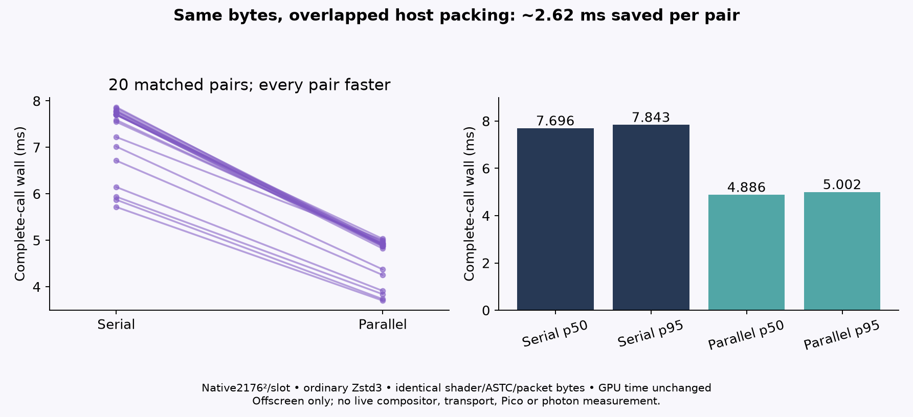
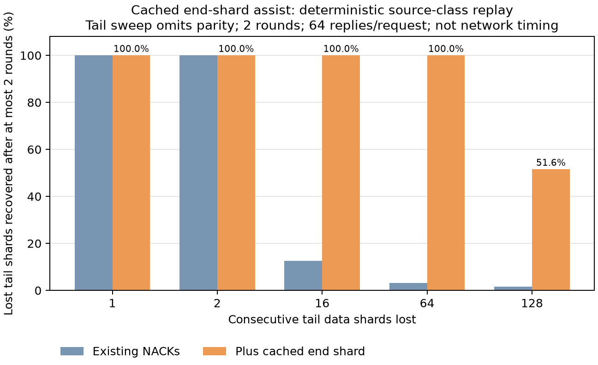

# Native NXVC: overnight evidence and remaining gates

Updated 2026-10-05 03:41 UTC. Work window ends04:00UTC /06:00Berlin.

## Current position

The last recorded live profile is native **2176×2176 per eye, ASTC8×8**, without foveation, JPEG, blur or object motion warp. The last recorded headset client is c514841f; this run performed no installation. Source improvements are built and pushed separately; the server was not restarted and experimental options were not enabled. Native90 fresh frames/s, parity with hardware HEVC and photon latency are still **unproven**.

The strongest new result is reduced PC host work: an ordinary-Zstd3 native stereo harness improves by2.620ms paired mean through overlapping eye packing, with identical texture and packet bytes. GPU work itself stays essentially unchanged. The largest earlier fence wait no longer reproduces under the later observed GPU context; that is not credited as a code optimization.

## What has evidence

| Change or check | Actual result | Scope / rollout |
|---|---|---|
| Ordinary-Zstd3 parallel eyes | Full-callp50/p95 7.696/7.843→4.886/5.002ms; all20matched pairs improve | Offscreen PC; default-off source option |
| Recheck of earlier GPU fence wait | First waitp50/p95 .934/.943ms; earlier median9.461ms not reproduced | Changed readonly load context; no cause or code win inferred |
| Cached terminal-shard assist | Two-round fixture recovers64/64 lost tail shards, baseline2/64 | Actual classes, parity withheld; source7b7ae360, default off |
| Archived-client compatibility | Old c514841f receiver accepts current packets and completes after the selected terminal reply; normal and strict sanitizer checks pass | CPU protocol path; valid nonempty metadata fixture, no installed-client or session proof |
| Repair history1→2MiB/encoder | Holds all521 shards two frames back at synthetic1Gbit/s90Hz stereo budget; old ring0 | Actual history/serialization; built, not installed |
| Readiness-count cache | Asleep Pico helper due-query mean5.287→2.932µs, matching decisions | Tiny metadata CPU component; not stream/FPS latency |
| Quiet-stream recovery polling | First host-adapter request opportunity20.06→3.08ms in controlled signal test | Default off; excludes actual Wi-Fi/repair/Pico delivery |
| UDP receive reuse | Approx40KiB allocations−95.7%, timing effectively unchanged | Loopback allocation win; source built, not installed |
| Compact independent records | Payload−5.01–5.77%; extra PicoCPU .055–.126ms/eye | Lossless blocks, requiresv4 client; default off |

The rows use different fixtures and timing boundaries. They must not be summed into a claimed end-to-end latency saving. Source7b7ae360 is pushed to `pyrowave-probe`; live installation is a separate gate.

## What was cut or held

Repeated per-pixel conversion loses156µs GPU time. Caching converted tile pixels saves about84µs in its generated-image GPU test but doubles driver scratch; packed caching reduces scratch yet costs another30µs. None is integrated. Their source-format, masking, layers, bounds and compositor input-lifetime gates remain.

Deferred sender-wait placement duplicates an earlier rejected prototype: mixed timings under high unknown GPU load, with no robust complete-cycle win. Its original fixtures are unavailable for a faithful bounded recheck. No new source proposal was retained. Whole-eye receiver completion also blocks a small compatible partial-band transport change; no idealized region replay is presented as a production result.

## What must happen next

1. Validate the default-off eye overlap and recovery options in a short real compositor/Pico run, including head movement, fresh stereo frame IDs, decode/presentation cost and network recovery. Keep the ordinary native profile as the comparison.
2. Measure the actual sender wait, GPU readback and CPU pack spans. Current source holds its two-image pool through packet preparation and earlier-send completion; removing those holds without a per-frame ownership contract is unsafe.
3. Confirm the terminal assist's duplicate traffic and adaptive-loss feedback under real link loss. It does not rescue a newest unknown tail without an ordinary NACK;128lost tail shards remain incomplete in two rounds.
4. Obtain physical display timing before making photon-latency claims. Viewer loops and kernel timers cannot substitute for that measurement.

The existing Perfetto CPU lanes also need an actual concurrent capture before they are used to infer eye overlap. The current build has Perfetto disabled and no SDK/trace processor; the shared-lane nesting concern is a source audit, not a proven runtime fault.

Detailed runnable checks, raw rows and limitations: [active queue](OVERNIGHT.md), [host overlap](../overnight-recovery/fence-overlap-recheck/README.md), [end assist](../overnight-recovery/end-shard-assist/README.md), [earlier component results](../overnight-recovery/README.md). The [actual-history concurrency check](../overnight-recovery/endpoint-concurrency/README.md) now passes normal, strict ASan/UBSan and TSan, including full frame identity and concurrent enable/disable cycles. It is finite validation, not a new performance result.

The [archived-client compatibility gate](../overnight-recovery/end-assist-compat/README.md) retains exact revisions, a runnable mixed-header driver and captured normal/sanitizer logs. It keeps the old empty-vector parser limitation explicit.
