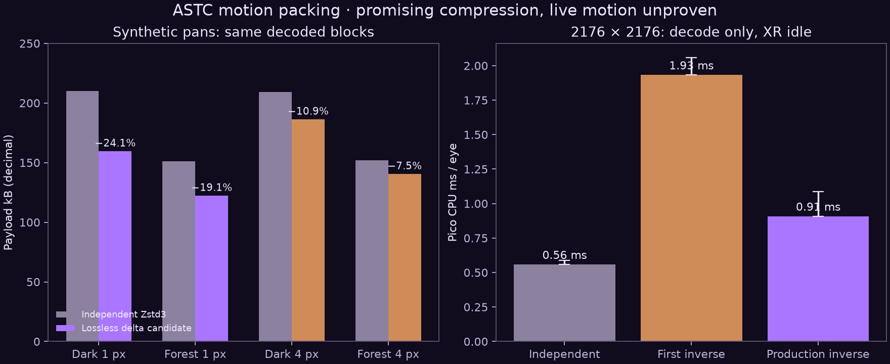

# Lossless motion packing: fewer bytes, same encoded pixels

**Experimental integration is implemented, built and pushed; default off.** It preserves ASTC blocks exactly and does not extrapolate display motion. The existing live profile remains on independent packets. This is not a live smoothness or HEVC-parity result.

## What changed

WiVRn NX source `3a4c4a0b` adds v3 native ASTC packets. The PC picks one of nine neighboring blocks from a recently acknowledged frame, then sends losslessly compressed selectors and XOR residuals. A delta must be at least **15% smaller** than the independent anchor. Losing trials back off for three frames while independent pictures continue. Receipt alone cannot acknowledge a reference: a positive decode timestamp is required. A reference must be 1–8 frame IDs old and match the bounded cache. Missing or expired references cause independent anchors; no frame waits for acknowledgement.

The client reuses sixteen CPU block buffers per eye and reconstructs the exact encoded frame. Row offsets and two 64-bit XORs replaced the initial byte-loop inverse. There is no new Pico shader, GPU reconstruction dispatch or display-motion estimate. At native size the extra reference storage is about 18.1 MiB per eye; real presentation/memory/thermal cost remains to be tested. Legacy v1/v2 packets are unchanged and their normal path allocates no reference block buffers. The private encoder option is enabled only by string `"1"`.

## Measured results

| Test | Independent | Motion candidate | Limit |
|---|---:|---:|---|
| Dark screenshot, synthetic 1 px pan | 210,122 B | 159,574 B (−24.1%) | 1920×1080 wrapped translation |
| Forest screenshot, synthetic 1 px pan | 151,105 B | 122,286 B (−19.1%) | Same favorable model |
| Dark / forest, synthetic 4 px pan | — | −10.9% / −7.5% | Rejected by the 15% admission rule |
| Tiled native single-eye Pico fixture | 211,559 B | 161,864 B (−23.49%) | 2176×2176; photo-derived repetition |
| Pico production decoder median / p95 | 0.559 / 0.590 ms | 0.908 / 1.086 ms | CPU decode only; five warmups, thirty samples |
| Initial Pico inverse, repeat median / p95 | — | 1.933 / 2.059 ms | Superseded implementation |

The production decoder's added median CPU work is about **0.35 ms per eye** on this fixture. No decoded byte differed. This excludes reference-buffer rotation, staging copy, GPU upload, application rendering, system compositor, network and photons. XR was idle; frequency and affinity were not locked. The existing streamer was not restarted for these CPU tests.

Block-aligned eight-pixel pans saved 95–97%, but these almost perfectly reusable cases do not generalize to real VR. Unrelated random data grew by 3.6%; it must use the independent fallback. The stereo native benchmark was corrected to **544×272 8×8 blocks**, not the initial erroneous 4×4-sized grid. Only corrected results are published.

Stronger independent Zstd levels saved roughly 2–5% while adding PC time. Current-frame left/above/selectable XOR prediction increased compressed size by 14–20% or more. Those paths were rejected, and raw results are included.

## Validation and remaining gates

Host server/runtime and Android builds passed. Legacy packet checks, v3 exact round trips, positive decode ACKs, reordered feedback, age limits, malformed selectors/compressed frames and independent recovery checks passed; host sanitizer checks also passed. The packet checks and production decoder ran on Pico A8110. They do not test complete Wi-Fi loss recovery or fresh stereo delivery in a moving scene.

Next acceptance gate: a matched, moving-scene comparison of fresh source FPS, wire bytes, worker CPU time, complete-pair gaps and visual stability. Ordinary 8×8 image fidelity is still below the user's HEVC expectation. Saving bytes may permit more local colour detail later, but this integration itself does not alter image quality.

Reproduction requires the private screenshot-derived fixtures retained in scratch. `production_decode.cpp`, `native_delta.cpp`, CSV/JSON evidence and hashes are included; full user photos, APKs and encoded fixture payloads are not published. The source repository's `docs/ASTC_MOTION_PACKING.md` documents the experimental configuration and runnable packet checks.
