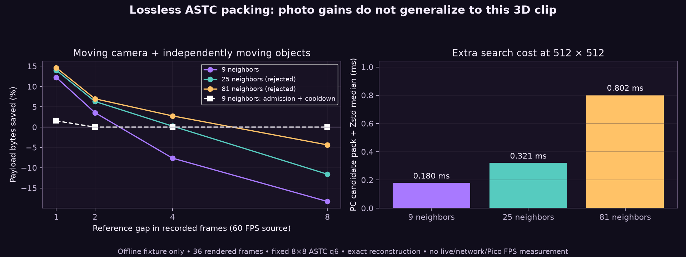
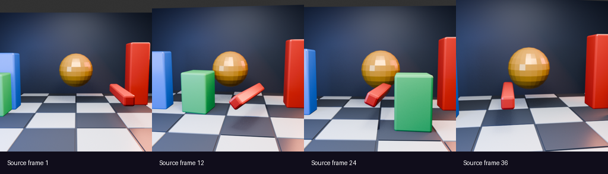

# Motion stress: favorable photo gains are not general VR savings

**Decision: retain motion packing as default off. No new live speed or quality win is claimed.** This continuation tests a moving camera, changing visibility, independent translation and rotation using 36 previously rendered Blender frames. The lossless decoder reproduces every encoded byte; the difficulty is obtaining useful packet savings cheaply.





## Results

At a one-frame reference gap, nine-neighbor candidates save 12.24% in aggregate if sent without admission. The 15% per-packet admission rule accepts 9/35 pairs and reduces aggregate payload by **4.34%**. Replaying the current three-frame losing-probe cooldown accepts only 3/35 and saves **1.55%**. Reference gaps of two, four or eight recorded frames produce **zero accepted deltas**. The earlier 19–24% wrapped-photo-pan result remains valid for that fixture, but does not generalize to this clip.

The table shows **all trial candidates**, including rejected ones. Positive percentages mean fewer bytes; these percentages are not delivered-wire savings. The graph's white curve includes admission and cooldown. Packet headers, transport overhead, startup anchor and feedback are excluded. Reference age is held fixed; this is a policy replay, not a live acknowledgement or Wi-Fi simulation.

| Reference gap | Search | Accepted pairs before cooldown | All-candidate savings | PC candidate median |
|---:|---|---:|---:|---:|
| 1 | neighbors9 | 9/35 | +12.24% | 0.180 ms |
| 1 | radius2_25 | 15/35 | +14.02% | 0.321 ms |
| 1 | radius4_81 | 16/35 | +14.63% | 0.802 ms |
| 2 | neighbors9 | 0/34 | +3.56% | 0.185 ms |
| 2 | radius2_25 | 0/34 | +6.32% | 0.323 ms |
| 2 | radius4_81 | 0/34 | +6.97% | 0.818 ms |
| 4 | neighbors9 | 0/32 | -7.64% | 0.200 ms |
| 4 | radius2_25 | 0/32 | +0.24% | 0.331 ms |
| 4 | radius4_81 | 0/32 | +2.76% | 0.805 ms |
| 8 | neighbors9 | 0/28 | -18.31% | 0.208 ms |
| 8 | radius2_25 | 0/28 | -11.60% | 0.346 ms |
| 8 | radius4_81 | 0/28 | -4.38% | 0.821 ms |

Wider 25/81-neighbor searches modestly improve candidate compression while increasing PC work. Neither admits a two-frame-or-older reference. They would also need a new selector wire format; they remain scratch-only and are rejected here.

A fixed same-position XOR predictor cuts packing cost on the earlier photo pans, with less than 1% extra bytes, but fails admission for every pair of this 3D clip. It is not integrated. Exact-zero early exit and word-wise residual XOR showed no meaningful measured gain in the bounded photo benchmark. Stateless 8/4/2/1-byte lane rearrangement made all four tested fixtures larger, with extra copy work; it is rejected too. `shuffle.csv` retains those trials.

## Method and validation boundary

This clip is **512×512**, from a 60 FPS source timeline: 64×64 ASTC 8×8 blocks, scratch PC encoder fit3/q6. It is neither headset-native imagery nor a 90 Hz live session. That encoder predates the later endpoint refit; the binary and shader hashes are in `manifest.json`. The 129 distinct frame pairs at four gaps were compressed and reconstructed exactly. Timings are one call per distinct pair, with median/p95 across pairs rather than repeated fixed-input latency trials. CPU scheduling and frequency are uncontrolled; repeated runs varied. Do not extrapolate these timings to native Pico decode.

The source packet test now checks ACK age-out after missing feedback and recovery after a later successful decode. The host ASan/UBSan run passes. This does not establish complete live cache/transport recovery. No client installation, stream restart, image-quality change or live-profile activation occurred during these experiments.

## Reproduce

`scene-astc.tar.gz` contains only the 36 procedural-scene ASTC frames, not private screenshots. With the WiVRn NX common headers from commit `3a4c4a0b`:

```sh
mkdir frames
tar -xzf scene-astc.tar.gz -C frames
c++ -O3 -std=c++20 -I /path/to/wivrn-nx/common sequence.cpp -lzstd -o sequence
./sequence frames > results.csv
c++ -O3 -std=c++20 -I /path/to/wivrn-nx/common wide.cpp -lzstd -o wide
./wide frames > wide-results.csv
```

Further compression work needs stronger prediction on moving scenes or a different representation. Expanding this byte-domain search indiscriminately is not a demonstrated route to usable low-latency VR.
