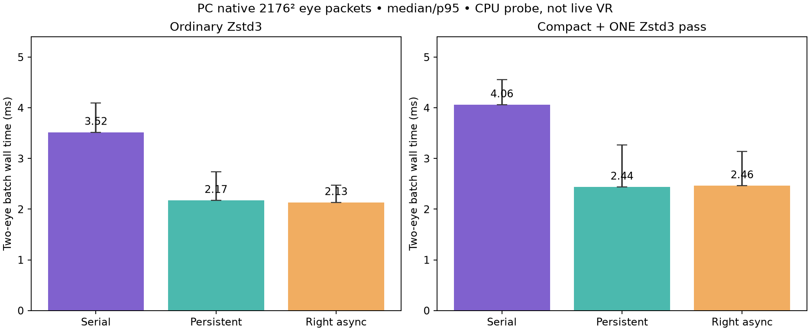
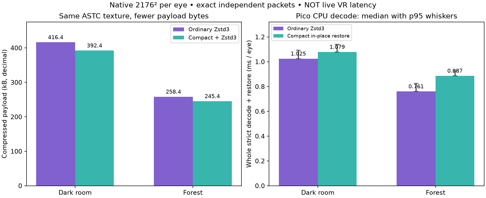
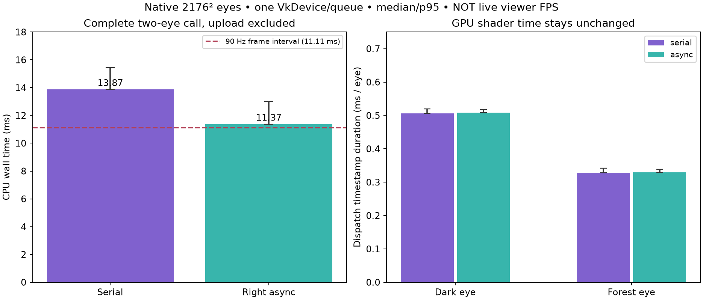
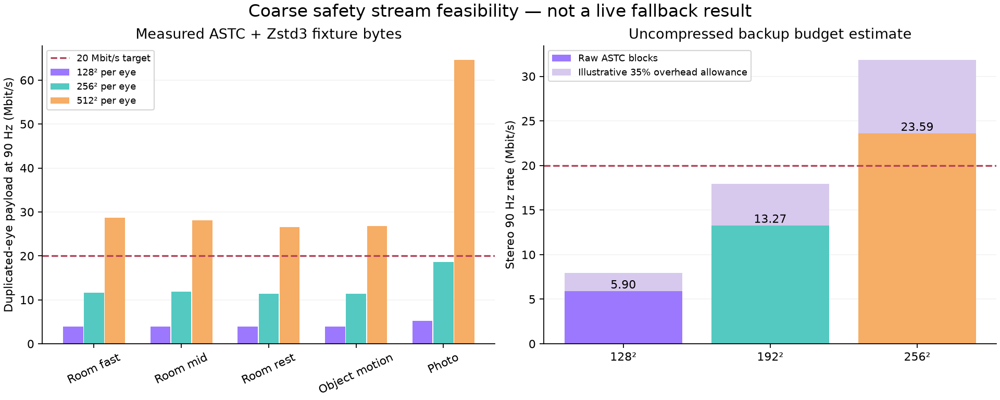
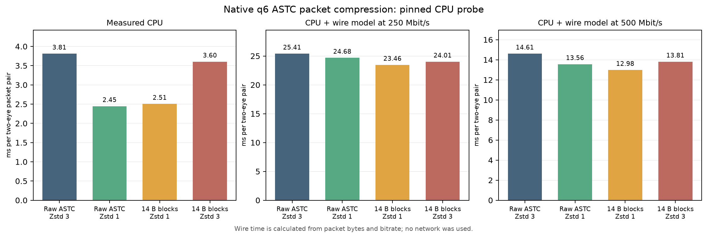
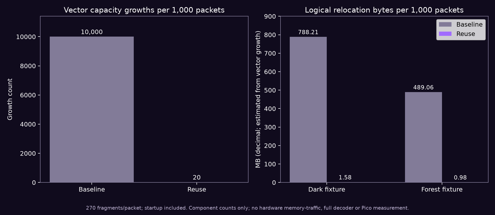
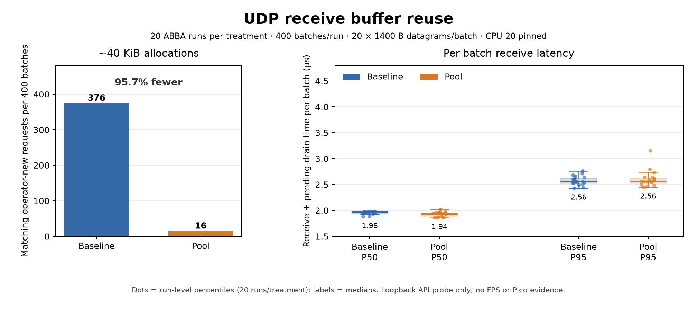

# Overnight recovery work — 4 October 2026

**Source experiments; live profile unchanged.** The live profile stays native ASTC 8×8. Three questions are being tested: can independent packets carry identical detail
in fewer bytes, can the PC encode both eyes concurrently, and can smaller
independent delivery units cover losses before bitrate adaptation catches up? None of these tests is a measured photon-latency
result or proof of sustained 90 fresh frames/s.

## Completed source experiments

- **Parallel eye packing, opt-in:** the CPU-only two-eye batch falls from
  **3.516/4.096 to 2.130/2.474 ms p50/p95** using a right-eye async task and the
  existing left-eye worker. Packet bytes are identical. Host/server build and
  ownership review pass. The same-device Vulkan follow-up below adds fence
  waits; actual sender pacing and live motion remain unverified. [Method, samples and figure](stereo-packing/README.md).
- **Compact independent records, opt-in:** removing fixed ASTC mode bits saves
  **5.01–5.77%** on two native fixtures with identical decoded texture bytes.
  Pico strict CPU decode adds about **0.055–0.126 ms per eye**. It uses one Zstd
  attempt and restores blocks in existing scratch, without a GPU pass. PC and
  Android builds, compatibility tests and sanitizers pass. It remains off in
  the live profile. [Exact format, timings and figure](compact/README.md).
- **Independent regions, modeled only:** 256px regions recover about
  **98.7–99.1% of area per send** at modeled 2% random packet loss, versus
  **61.5–73.9%** complete whole-frame sends. Estimated payload/FEC overhead
  rises **1.6–5.7%**. The native inputs are repeated static snapshots; this
  proves neither motion quality nor temporal freshness. Square regions remain slower on Pico. Full-width bands with a reused
  context decode near whole-frame cost and directly update contiguous ASTC
  rows. These are CPU probes; partial transport and pose-safe presentation
  are still unimplemented. [Pico costs and rejected allocator churn](band-cpu/README.md). [Model and procedural
  animation](regions/README.md).

## Same-device Vulkan follow-up

The offscreen two-eye test now includes both native image dispatches, readback,
fence waits and packet compression on one RX 7900 XTX device/queue. Async eye
processing reduces complete-call p50/p95 from **13.865/15.432 to
11.364/13.007 ms**, with identical ASTC and packet bytes. GPU dispatch durations
are unchanged; this is CPU overlap. Dominant CPU fence waits remain about 9ms
and are being investigated. Upload is excluded; actual live compositor, Wi-Fi,
viewer and photon latency are not measured. [Source, 100 interleaved pairs,
external decode checks and graph](stereo-gpu/README.md).

## Small independent safety image

Five static inputs were encoded at 128², 256² and 512² per eye with the older
standalone ASTC fit3/q6 encoder, then compressed with Zstd level 3. The bytes
include the 16-byte ASTC file header, exclude transport/FEC overhead, and are
normalized to two **duplicated** eyes at 90 updates/s. The photographic input is
private; only size measurements are published. These are neither distinct stereo
images nor live Wi-Fi measurements. The initial thumbnail preprocessing used
Lanczos resizing; the separate image-input shader probe below uses linear
texture sampling.

At 256², measured payload spans **11.34–18.56 Mbit/s**. That leaves little
headroom for the highest-cost fixture. At 512² it spans **26.55–64.61 Mbit/s**.
Compression cannot guarantee those rates for other scenes.

The raw ASTC bound makes **192² per eye** a more conservative starting point:
576 blocks × 16 bytes × 2 eyes × 90 × 8 = **13.27104 Mbit/s**. The graph's 35%
extra allowance is an illustrative budget, **not measured packet/FEC overhead**.
The corresponding raw 256² rate is already **23.59296 Mbit/s** before overhead.
Main-image resolution would remain native; the smaller image would be used only
when detail delivery stalls.

An independent sampled-image Vulkan harness now creates a standard coarse ASTC
texture directly from a native RGB source in one encode dispatch. It needs no
intermediate downscale image/pass. Native 2176² dark/forest inputs and 192²/256²
outputs decode correctly with an external ASTC decoder; repeated outputs match.
The PC GPU dispatch is sub-millisecond in this probe, but **8.7–9.0 ms median
fence waits dominate the synchronous host call**. These measurements do not prove
a live encoder or headset latency improvement.

## Integration requirements

The current ASTC profile has separate left/right streams and no auxiliary
safety-stream role. The existing NX Warp safety implementation is for a
different paired-eye representation. A thumbnail alone cannot be plugged into
that path safely.

An integration must reserve transmission opportunity for safety packets, keep
their decoding outside the primary stereo join, select a coherent backup pair
after two missed refresh periods, and return only to newer coherent primary
content. A backup still cannot bypass an already congested kernel/AP queue or
recover a complete link outage. No live takeover has been implemented or timed
in this report yet.

A standalone selection-policy draft tests mismatched eyes, duplicate frames,
late primary arrivals, stale per-eye decoder completions, future predicted
display targets, clock rollback and focus reset. `view_info.display_time` is a
**server-predicted display target**, not source capture time. Its ordering can
prevent backwards selection; its age cannot prove content or photon latency.

## Rejected delivery/entropy shortcuts

- `sendmmsg` improved one loopback datagram microprobe by about 2.3%; it excludes
  production serialization, pacing and FEC costs. No sender change is justified
  by that measurement.
- Row-reset byte residuals increased compressed bytes about 10.6% over the
  36-frame camera/object scene and 18.9% over the native photo fixtures.
- Separating mode/endpoint/weight bit fields increased the moving-scene output
  about 16.1%. Compact per-block records are documented above with their
  measured Pico CPU cost.
- The old session's UI/font activity was not reproduced as a current bug.
  Current readiness transitions already have fixes; it is not evidence that
  font loading caused the present delivery problem.

## Faster packet preparation with the same texture data

A pinned four-condition native q6 CPU probe combines compact records with
Zstd level 1. Against ordinary level 3, two-eye packet work falls from
**3.812/4.597 to 2.505/2.913 ms p50/p95**, and combined packet bytes fall
**2.95%**. Every tested representation expands to identical ASTC blocks.
Calculated serial CPU-plus-wire cost also falls at 250 and 500 Mbit/s;
those byte-transfer calculations do not measure network latency or overlap.
The private fast-Zstd source option is default off. Compact records require a
v4 client and add the separately measured Pico decode work documented above.
[Matched source, 800 samples, hashes and limits](zstd-level/README.md).

## Bounded packet recycling and cheaper FEC recovery

A single spare vector now removes repeated ASTC assembler growth while
preserving payload inserts and CPU-to-staging copies. In a production-helper
component probe, growths fall **10,000 to 20 across 1,000 packets** with a
one-frame-late worker return. Normal, ASan/UBSan and threaded checks pass;
the full Vulkan lifecycle is not measured. [Ownership checks, counts and
reproduction](packet-recycle/README.md).

FEC recovery now XORs existing serialized spans directly, without another
full present-shard blob. A matched host probe reduces median cost across
condition/block loop averages **1.844 to 1.665 µs** and requested bytes
**6,135 to 4,727 per recovery**. Malformed testing exposed an existing invalid
boolean load; checked decoding now rejects it while preserving protocol
hashes and valid wire bytes. **4,292 production FEC checks** pass normally and
with halt-on-error ASan/UBSan. This work only applies when recovering losses;
it is not a measured per-frame saving. [Final source, wire comparisons and
matched measurements](fec-span-xor/README.md).

## Shorter reassembly tolerance — trial off by default

The generic window can keep a complete ASTC successor behind an incomplete
older frame until a frame four indices newer is complete. An ASTC-only Android
property now permits one or zero indices of tolerance, while other codecs keep
three. Production window tests pass **188 checks** normally and under sanitizers.
Shorter waits can lose FEC/NACK repairs or reduce matching stereo pairs; no
headset property was set. Frame indices are not display deadlines, especially
when source updates slow down. [Policy, arithmetic graph and live test gate](reassembly-trial/README.md).

## Receive buffers: less allocation work

The production UDP receive path now reuses a bounded 32-slot batch pool. In
40 matched desktop loopback runs, approximately 40 KiB allocations fall from
**376 to 16 per 400 batches (95.7% fewer)**. Receive/drain p50 stays around
**1.94–1.97 µs per 20-datagram batch**, with **2.56 µs p95** for both versions.
A one-shard handoff also uses a stack span. Packet contents and ordering are
unchanged; retained owners keep their bytes alive even after cache eviction.

Actual UDP lifetime/order/move/oversize tests pass normally and with ASan/UBSan;
server/OpenXR and Android native-client builds pass. Source commit
`27026bbd` is pushed, but no APK was installed and the live processes were not
restarted. This removes allocator work; it is not a measured headset FPS win.
[Matched protocol, raw runs, source hashes and reproduction](udp-reuse/README.md).

## Rejected sender overlap

Preparing the next independent ASTC packet while the previous one sends was
not a robust tail-latency win. The faithful same-device FIFO simulation submits
both eyes before either backend wait, matching production. At500Mbps cycle
p50 improved0.653ms, but p95 worsened0.203ms; at250Mbps median was essentially
unchanged. These runs had99–100% observed GPU activity and modeled pacing,
without actual Wi-Fi/Pico delivery. The shared-base production prototype was
removed after its successful build; the experiment is retained for inspection.
[Code, sample counts and full comparison](sender-overlap/README.md).

## Small context-reuse probe

Reusing a strict Zstd decode context saves **33–36 microseconds per eye** on
validated native2176² Pico inputs, with no meaningful PC gain. All decoded
bytes match, and malformed-then-valid reuse checks pass ASan/UBSan. This is
about3–4% of the isolated CPU decode stage; it is too small to justify another
production option by itself. The live decoder is unchanged.
[Method, raw measurements and hashes](context-reuse/results.txt).

A calibrated GPU/CPU timestamp diagnostic failed its own ordering sanity check:
its mapped GPU completion appeared after the host fence had already returned,
beyond the reported calibration uncertainty. Its derived queue-delay numbers
are discarded. [The tiny empty/compute probe](gpu-wait-diagnostic/README.md) reproduced
the failed ordering check. The independent wall-clock and GPU-duration
measurements above remain separate measurements; they do not identify a driver cause. A later
read-only snapshot found99% GPU activity while probes were active; it cannot
separate test work from other applications. Upcoming wait probes serialize
our own GPU jobs and record load between runs, leaving user apps untouched.

## Reproduction and limits

`thumbnail-payload.json` contains the measured fixture byte counts.
`python3 plot_budget.py` regenerates the figure. Raw user photos are excluded.
This report separates measured payload, calculated bandwidth, standalone GPU
work, standalone policy checks and unimplemented live behavior. The next tests
target independent-region delivery under packet loss rather than assuming an
incomplete whole frame must freeze every pixel.

## Combined stereo candidate and actual Pico CPU cost

A matched 150-row same-device Vulkan probe combines parallel eye packing with level1 and optional compact records. Offscreen native stereo wall p50/p95 falls **4.956/5.657 →2.634/3.137 ms**, and selected packet bytes fall **2.97%** versus ordinary serial level3 in that run. Exact ASTC output is retained within the run. This includes GPU/readback/packet preparation, excludes uploads/network/presentation, and is not production fresh FPS. [Source, load telemetry and graph](combined-stereo/README.md).

On the idle Pico, a separate300-row production strict CPU decode check of the pinned CPU probe's native ASTC fixtures gives **1.865/1.936 →2.041/2.150 ms** for sequential paired decode with compactlevel1. Added median cost is0.176ms; ordinarylevel1 is near baseline. CPU clocks changed between before/after snapshots. [Pico method, exactness checks and graph](fast-zstd-pico/README.md). Stage timings and sizes from different fixture-generation runs are not one end-to-end measurement.

The upload-fence audit rejected six per-image command buffers/fences for now: the median prior-upload wait across180-frame window means is only0.8us. It could move the wait into GPU backlog without worthwhile savings. [Decision and actual window statistics](upload-fence-audit/README.md).

## Bounded metadata reuse and a rejected default deadline

Fixed view/timing metadata serializers now reuse private per-thread capacity, following the socket send path. Warm encoding removes metadata allocations; matched desktop FEC reconstruction loop means fall **1.635→1.325 µs**, with allocation calls **65→2**. Wire bytes remain identical; 4296 checks pass normally, with ASan/UBSan, and TSan. This is a small CPU component improvement, not a live latency claim. Server/OpenXR and Android native-library builds pass; no install or live change. [Source, 680 measurement rows, lifetime rationale and graph](fec-metadata-reuse/README.md).

The two-display-period reassembly trial remains **default off**. Production per-eye window replay retires incomplete fronts earlier, but a stereo repair race loses a repairable common frame and holds the previous pair for one extra refresh. The selector in that replay is idealized; these are deterministic model results, not headset measurements. The next gate is coherent stereo availability before forfeiting repair. [Runnable replay, exact scenarios and tradeoff graph](reassembly-deadline/README.md).
