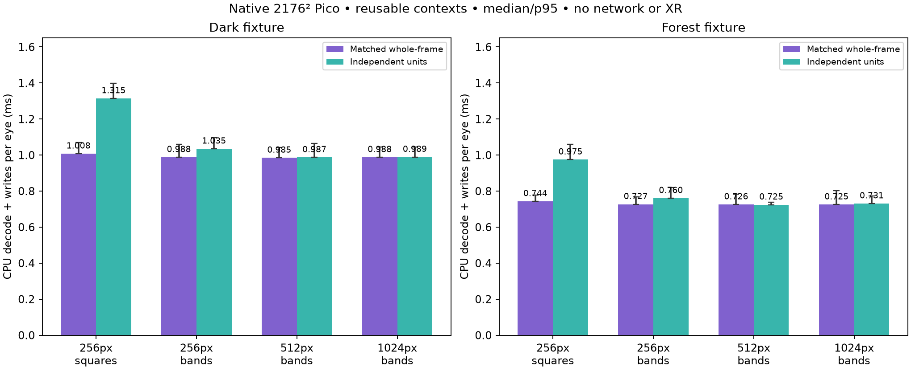

# Independent bands: Pico CPU cost

Standalone exact ASTC reassembly experiment, not an integrated partial-frame decoder. Native 2176×2176 ASTC 8×8 q6 snapshots, 20 warmups and 200 measured samples, alternating whole/candidate order. One reusable Zstd decode context per comparator/candidate, allocated outside the timer. Whole decode and band decode both verify exact standard ASTC output after timing. Private pixels and payloads are excluded.



Full-width horizontal bands decompress directly to their contiguous rows in the final CPU ASTC buffer. They require 9, 5 or 3 independent records at 256, 512 or 1024px height (the final band is 128px). There is no row-scatter copy or GPU reconstruction. Square regions need 81 records at 256px and a scatter merge; they remain slower even after context reuse.

| Layout | Dark whole / candidate p50 | Forest whole / candidate p50 | Forest whole / candidate p95 |
|---|---:|---:|---:|
|256px square regions|1.008 /1.315 ms|0.744 /0.975 ms|0.779 /1.059 ms|
|256px full-width bands|0.988 /1.035 ms|0.727 /0.761 ms|0.767 /0.819 ms|
|512px full-width bands|0.985 /0.987 ms|0.726 /0.725 ms|0.782 /0.738 ms|
|1024px full-width bands|0.988 /0.989 ms|0.725 /0.731 ms|0.802 /0.773 ms|

The near-equal results do not establish a speedup. The 256px band path adds about 4.6–4.7% median CPU cost, while increasing independently recoverable delivery units. The [loss model](../regions/README.md) estimates 93–95% recovered area at 2% random packet loss with256px bands, rather than 62–74% complete whole-frame sends. Those are separate transport simulations on static snapshots, not combined live latency measurements.

## Partial writes

A dark→forest fixture change retains the final 128px bottom band from the previous image, updating 94.12% of the image. At 512px band height, partial direct decode takes 0.671/0.749ms p50/p95 versus whole forest 0.732/0.805ms; estimated payload plus 8-byte band headers is 242,777B versus 258,395B (6.04% less). Resetting the retained buffer and verification are outside the timed interval. This exposes the cost of decoding only received bands; it does not justify periodically skipping a fixed bottom strip. In real head motion, retained pixels carry an older pose and can create seams/jitter. No pose alignment, stereo policy, deadlines, network reassembly or partial upload has been implemented.

## Why the initial square test looked much worse

The first probe used `ZSTD_decompress` separately for every record, which allocates/frees a context on each call. Pico 256px squares then cost 1.92–2.36ms versus 0.76–1.02ms whole decode. Reusing one context reduces that penalty substantially. Raw original timings are retained in [results.txt](results.txt); matched reused-context measurements and source hashes are in [results-dctx.txt](results-dctx.txt). The original square source was overwritten by the reused-context revision; its original hash is recorded in the first log, while the published source reproduces the updated benchmark.

Pico asleep/display OFF before/after; cpu0 frequency readings 1,804,800kHz, thermal status 0, clocks unlocked. CPU vector memory only: no mapped upload memory, GPU work, active XR, network, presentation or photons. Header sizes are estimates. These results support a transport prototype, not live enablement.

```sh
c++ -std=c++20 -O2 -Wall -Wextra -Werror bench.cpp -lzstd -o bench
c++ -std=c++20 -O2 -Wall -Wextra -Werror addbands.cpp -lzstd -o bands
./bench dark-q6.astc forest-q6.astc
./bands dark-q6.astc forest-q6.astc
```
