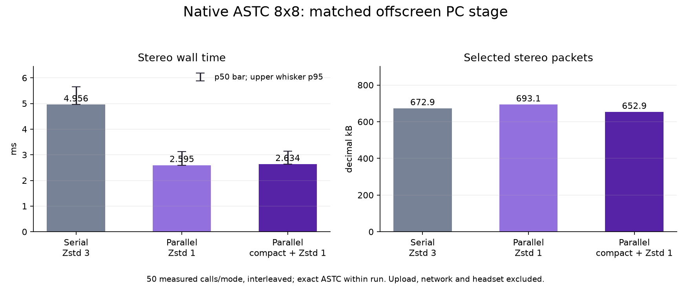

# Three-mode paired-eye ASTC benchmark

This is an offscreen, same-device Vulkan benchmark copied from the existing stereo harness and extended only in this scratch directory. It ran on an AMD Radeon RX 7900 XTX (RADV NAVI31), one Vulkan device and one compute queue, with two distinct native 2176x2176 RGBA inputs and the production ASTC 8x8 q6 / fit3 shader. Input uploads and network transport are excluded. Both eye dispatches are submitted before either eye's fence is waited. Each eye retains its own reusable Zstd context and scratch buffers; asynchronous modes use one `std::async` right-eye worker while the caller processes the left eye and joins before returning.

The three matched treatments are:

| Mode | Production option mapping | Eye packet work |
| --- | --- | --- |
| `serial_l3` | `_wivrn_astc_fast_zstd` unset; compact off | Serial, ordinary ASTC Zstd level 3 |
| `parallel_l1` | `_wivrn_astc_fast_zstd=1`; compact off | `WIVRN_ASTC_PARALLEL_EYES=1`; right eye async, left on caller; ordinary Zstd level 1 |
| `parallel_compact_l1` | `_wivrn_astc_fast_zstd=1`, `_wivrn_astc_compact=1` | `WIVRN_ASTC_PARALLEL_EYES=1`; right eye async, left on caller; 14-byte compact blocks plus one Zstd level 1 attempt |

All three use the production q6 selector: attempt Zstd, run LZ4 on raw ASTC only when Zstd errors or exceeds half the raw size, then choose Zstd only when it saves at least 10% against the selected fallback; compact Zstd must also fit in the compact input. Packet headers use `nxastc_packet::make_header`; measured output packets were parsed and round-tripped through the production `decode_payload` helper. Every measured raw eye output was compared byte-for-byte with the first output.

The benchmark used 20 warm-up and 50 measured two-eye calls per treatment. The order was symmetric `ABCCBA`: ten blocks warmed each treatment twice, then 25 blocks measured each treatment twice. The CSV has 150 rows. Percentiles use sorted sample index `floor((n-1)*p)`. GPU dispatch duration comes from Vulkan timestamp queries; dispatch-to-readback spans the recorded start timestamp through the post-copy timestamp. Fence waits are host wait-call durations; the two per-eye values overlap in asynchronous modes, so their sum is not elapsed wall time. `wall_ms` covers command recording, both submits, readback/fence handling, and packet selection/packing.

| Mode | Paired wall p50 / p95 | Paired GPU dispatch p50 / p95 | Paired Zstd p50 / p95 | Paired packet bytes |
| --- | ---: | ---: | ---: | ---: |
| serial L3 | 4.956 / 5.657 ms | 0.852 / 0.987 ms | 3.956 / 4.418 ms | 672,903 |
| parallel L1 | 2.595 / 3.121 ms | 0.865 / 1.003 ms | 2.385 / 2.629 ms | 693,119 |
| parallel compact L1 | 2.634 / 3.137 ms | 0.880 / 1.045 ms | 2.226 / 2.559 ms | 652,905 |

Parallel L1 reduced paired host wall p50 by 2.361 ms versus serial L3, with a 20,216-byte paired-packet increase. Compact L1 was 0.039 ms slower at p50 than ordinary parallel L1 and selected 40,214 fewer bytes (5.80%). The benchmark does not measure network delivery, headset decode, or Pico frame timing; packet-size savings are not a transport-latency result.

`load-snapshots.csv` contains read-only DRM telemetry. Card 1 busy percent ranged 50–66% in the pre-run snapshot and 50–70% during the run; post-run was 52%. VRAM readings ranged 5,779–6,059 MiB during the run (pre-run 6,005–6,074 MiB) and ownership cannot be inferred from this telemetry. The pre-run sample was collected about 104 seconds before the timed sequence, so it is context rather than a synchronized control. No other GPU test was intentionally run concurrently; this does not establish ownership of reported load.

## Reproduction

Build this copied source tree and compile the unchanged production shader:

```sh
cmake -S . -B build -DCMAKE_BUILD_TYPE=Release
cmake --build build -j2
glslc --target-env=vulkan1.1 -O -I shaders shaders/encode_primary.comp -o build/encode_primary.spv
mkdir -p results
build/stereo-gpu INPUT_LEFT_RGBA INPUT_RIGHT_RGBA results
```

Each input must be 2176x2176 8-bit RGBA. The original private fixture files and emitted ASTC/payload bytes are not included here.

## Provenance

- Production source revision: `221f68342bc82118d5df2487b1be48d776db7edf`.
- Production shader SHA-256: `05ec2dbb1bc7934ac4bece93b07df4049dfdfac3e02c145011ccad50cad8287d`; copied shader matches it.
- Public shader, source, helper-header, CSV, and telemetry hashes are in `SHA256SUMS`. The build binary and private fixture/payload files are excluded.
- `results/run.log` preserves the measured summary with private fixture paths removed.

## Scope of the timed harness

The timed wall interval includes command recording/submission, host fence handling, timestamp-query retrieval, fresh raw-output vectors, and packet-vector copying. It is an offscreen harness, not a live production/compositor measurement. The CPU-only probe used separately generated ASTC fixtures; absolute packet sizes from the two probes must not be compared as though their encoded inputs matched. Exactness here is established within this matched three-mode run.


