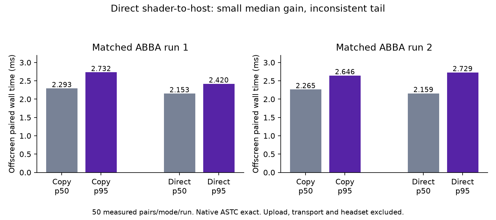

# Shader directly into cached host memory — hold integration

The offscreen stereo harness compares device-local shader output plus a buffer copy against shader output directly into the cached host readback allocation. Both modes reuse the same native 2176² inputs, production ASTC8×8 q6/fit3 shader, per-eye level1 compression, parallel eye packing and strict packet decoder. Descriptor update overhead is included equally. Both dispatches submit before either fence wait. Uploads, actual compositor semaphores, network and Pico presentation are excluded.

| Matched run | Copy p50 / p95 | Direct host p50 / p95 |
| --- | ---: | ---: |
| 1 | 2.293 / 2.732 ms | 2.153 / 2.420 ms |
| 2 | 2.265 / 2.646 ms | 2.159 / 2.729 ms |

**Decision: hold production integration.** Median savings are only 0.107–0.141 ms; the second run regresses p95 by 0.083 ms. This does not explain the earlier multi-millisecond fence waits. Direct writes remove one copy and its transfer dependency, but the CPU still waits for shader completion and needs visibility/invalidation. Additional mapping/storage support and allocator behavior across GPU drivers need justification.

Readback memory selected type5, flags14: HOST_VISIBLE, HOST_COHERENT, HOST_CACHED, heap0; current output type0 flags1: DEVICE_LOCAL, heap1. Both modes use the same host allocation with STORAGE_BUFFER and TRANSFER_DST usage, eliminating memory-selection differences within a run. Explicit compute-write to host-read barrier replaces compute-to-transfer/copy/transfer-to-host only in the direct treatment. Memory is invalidated after the fence in both modes, including coherent allocation.

Each run has 20 warmups and 50 measured pairs per treatment in matched ABBA order, for 200 measured CSV rows. Host clocks and GPU clocks are unlocked; only this owned process gets nice+5. Read-only card1 telemetry spans 50–73% busy; ownership cannot be inferred. Every raw ASTC output equals the first result; all timed packets round-trip exactly through strict production decode after timing. Payloads match at 425381 / 267738 bytes. A separate full run with VK_LAYER_KHRONOS_validation passes with zero validation errors/warnings; those timings are excluded. No source production changes or live session change.



## Reproduce

```sh
cmake -S . -B build -DCMAKE_BUILD_TYPE=Release
cmake --build build -j2
glslc --target-env=vulkan1.1 -O -I shaders shaders/encode_primary.comp -o build/encode_primary.spv
mkdir -p results
build/stereo-gpu INPUT_LEFT_RGBA INPUT_RIGHT_RGBA results
VK_INSTANCE_LAYERS=VK_LAYER_KHRONOS_validation build/stereo-gpu INPUT_LEFT_RGBA INPUT_RIGHT_RGBA results
```

Each input is 2176×2176×4 bytes. Private fixtures, ASTC outputs and packets are excluded. Shader and packet helpers originate from the previously validated combined stereo harness; these are standalone component measurements, not end-to-end runtime performance.
