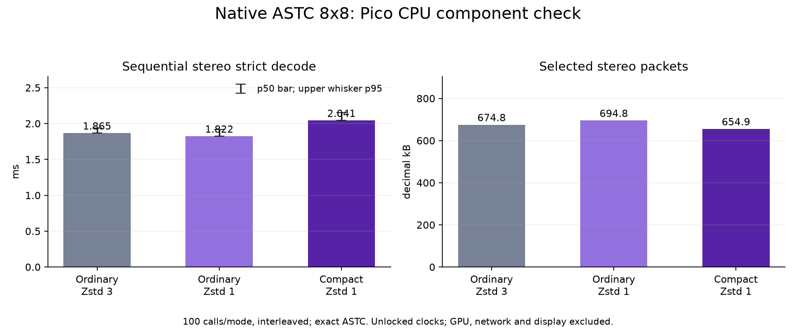

# Fast independent Zstd: native Pico CPU decode check

The fast packing candidate also passed a short isolated **Pico A8110 CPU** check. The production strict packet decoder reconstructed identical native ASTC blocks after every call. Compact records cost some CPU; they do not make the headset decoder faster.

| Packet representation | Sequential two-eye decode p50 / p95 | Left p50 | Right p50 | Two-eye packet bytes |
| --- | ---: | ---: | ---: | ---: |
| Ordinary Zstd 3 | 1.865 / 1.936 ms | 1.064 ms | 0.795 ms | 674,798 |
| Ordinary Zstd 1 | 1.822 / 1.920 ms | 1.031 ms | 0.789 ms | 694,843 |
| Compact + Zstd 1 | 2.041 / 2.150 ms | 1.111 ms | 0.926 ms | 654,922 |

Compact level 1 adds **0.176 ms** to the sequential paired median versus ordinary level 3, while saving **2.95%** of the packet bytes. The separate pinned PC probe saves 1.307 ms of serial packet preparation on these same ASTC fixtures. Those stage differences cannot be added into a measured end-to-end result: production overlap, network scheduling, GPU upload and display timing remain untested.



## Method and limits

- Current production `parse_packet`, `compact_blocks`, `make_header` and `decode_payload` helpers, snapshotted with their dependencies here. Source revision 221f6834; the later reassembly trial does not change these helpers.
- Two 2176x2176 ASTC 8x8 q6/fit3 fixtures; hashes in the manifest. Packet compression occurs on the PC before device transfer. Production Zstd-first selection is checked: all six outputs compress below half the raw size and satisfy the 10% saving rule, so no LZ4 fallback is selected.
- One reused output buffer per eye, pre-parsed headers; the strict decoder's own per-call context creation and compact validation/expansion are timed. No custom fast decoder, skipped validation or reference approximations.
- Sequential calls for both eyes on one CPU caller. 20 warm-up calls and 100 measured calls per mode, symmetric ABCCBA order.300 measured rows. Each decoded output is compared byte-for-byte with the raw fixture outside the timed interval. Packet reads/compression and stdout are outside timing.
- Percentiles use sorted index floor((n-1)*p). This is a short interleaved component probe, not a soak or production parallel-eye worker measurement.
- Headset asleep/display OFF before and after; no application, setting, clock or APK changed. Thermal status 0. CPU0 snapshots changed from 1,075,200 to 1,612,800 kHz; clocks were unlocked, these snapshots do not establish clocks during individual samples. Native GPU rendering, network, presentation, live motion and photon latency are excluded.
- Owned device test directory was removed after the run. Private ASTC sources, packets and executable are excluded from publication. Host normal and ASan/UBSan checks passed before the isolated device run.

## Reproduction

Build `decode.cpp` with C++20, `-O2`, headers in `include`, Zstd and LZ4. The NDK 29 ARM64 build used Android API 29, static libc++, the project's ARM64 LZ4 archive and its existing Android Zstd archive.

```sh
c++ -std=c++20 -O2 -Wall -Wextra -Werror -Iinclude decode.cpp -lzstd -llz4 -o decode-host
mkdir -p packets
./decode-host pack LEFT.astc RIGHT.astc packets
./decode-host decode LEFT.astc RIGHT.astc packets > host.csv
# On an idle device, use the ARM64 executable with the same source files and six packets.
# decode decode LEFT.astc RIGHT.astc PACKET_DIRECTORY > pico.csv
python3 plot.py
```

The fixtures must be 2176x2176 ASTC 8x8 images in the supported fixed block modes. Arbitrary raw/compressed inputs are not claimed to satisfy this selector gate. The installed live client has not been upgraded or enabled for compact v4.
