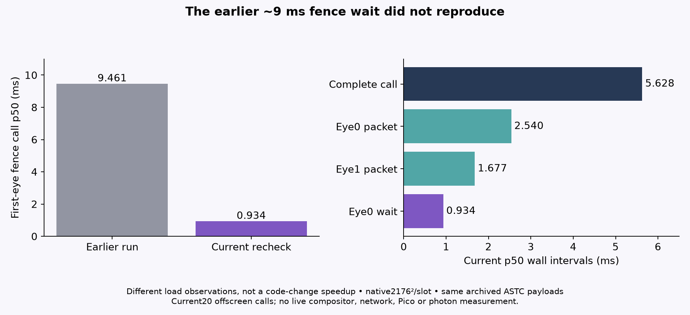

# Serial two-eye fence recheck

Scratch-only follow-up to the larger stereo fence probe. It runs only the serial L3 mode, with 5 warmups and 20 measured calls. Each call records both 2176×2176 eye command buffers and submits both to the same Vulkan compute queue before waiting sequentially on either fence, matching the native submit-before-wait ordering. Inputs are referenced locally, not copied into a report; their private local paths and raw payloads are deliberately excluded here. These are two unrelated photographic fixtures assigned to simulated eye slots, not a real binocular capture. Readback/ASTC bytes from both eyes exactly match the payload portions of the archived stereo ASTC files (`astc-payload-comparison.txt`), tying this check to the prior fixture output.

The copied primary shader and the current production `server/shaders/astc_encode.comp` at revision `d3f428bb302c0b63e0ac62845b8c4af875adc23e` have the same SHA-256. The exact existing SPIR-V was reused to avoid compiler-version drift. The C++ harness is the existing three-mode scratch harness, reduced to serial-only sampling and extended with explicit submit-to-fence wall timestamps; no production source changed. Build type is Release (`-O3 -DNDEBUG`) with the target's `-O3 -Wall -Wextra -Wpedantic`; see `compiler-flags.txt`, `cmake-build-settings.txt`, and `source-hashes.txt`.

## Result

On the RX 7900 XTX / RADV NAVI31, this run did **not** reproduce the earlier ~9 ms first-eye fence wait. Current p50/p95 were:

| Measurement | p50 | p95 |
| --- | ---: | ---: |
| Eye 0 `vkWaitForFences` call | 0.934 ms | 0.943 ms |
| Eye 1 `vkWaitForFences` call | 0.0011 ms | 0.0014 ms |
| Submit start → eye 0 fence return | 0.951 ms | 0.959 ms |
| Submit start → eye 1 fence return | 3.708 ms | 3.941 ms |
| Both submits returned → eye 0 fence return | 0.934 ms | 0.943 ms |
| Both submits returned → eye 1 fence return | 3.693 ms | 3.925 ms |
| Eye 0 / eye 1 GPU dispatch timestamp | 0.719 / 0.525 ms | 0.724 / 0.530 ms |
| Eye 0 / eye 1 dispatch-through-readback timestamps | 0.805 / 0.605 ms | 0.813 / 0.610 ms |
| Serial call wall | 5.628 ms | 5.872 ms |
| Eye 0 / eye 1 Zstd stage | 2.466 / 1.634 ms | 2.501 / 1.650 ms |
| Eye 0 / eye 1 full packet path | 2.540 / 1.677 ms | 2.743 / 1.701 ms |

The second submit-to-fence interval includes the serial eye-0 readback and packet work before the eye-1 wait. It is not a standalone GPU queue or fence-wakeup duration. No calibrated cross-domain subtraction was used. The old large run reported roughly 9.46 ms p50 for eye 0's fence wait; this recheck reports under 1 ms on the same ASTC payloads.

Read-only DRM samples immediately before and after this instrumented run reported 0% busy on both cards and unchanged card-1 VRAM use (2,473,099,264 bytes of 25,753,026,560). The older run recorded about 99% GPU busy and 9.34–9.40 GB VRAM usage around its test. That difference is context only: this experiment does not identify the source of the old activity or establish a cause for its longer wait.

`run.log`, `run.exitcode`, `three-mode.csv`, `summary.csv`, `load-snapshots.csv`, and payload comparison/hashes preserve the run. The earlier generated-input preliminary run is retained under `synthetic-run/` and is not used for the result above. The first failed launch from the build directory is also retained; it stopped before Vulkan initialization because the harness resolves its shader path from the project root.

No live runtime/profile/device settings, app state, clocks, or production sources were changed. This is a short offscreen host recheck, not a headset, compositor-frame, photon-latency, or GPU-cause measurement.

Root verified current shader/includes and all four packet headers byte-for-byte. It reconstructed the measured SPIR-V exactly using `glslc -O --target-env=vulkan1.1` (SHA256 `a237f4e5bf52e5bda3ad325d50edaafcd79e6812dc6e3f34365064a3857314c4`), then independently recomputed20 CSV rows. Original harness p50/p95 use sorted index `floor((n-1)*p)`, not interpolated medians. `checked-summary.json` also records the average of the two middle samples.

## Reproduce with your own input

Supply two headerless2176×2176 RGBA8 files. Inputs need not be public; changing input changes compressed sizes and GPU timings. Public CMake adds shader compilation to the measured host build; root compiled it and checked exact SPIR-V, without repeating GPU work. Run from the project root because shader loading uses `build/encode_primary.spv`.

```sh
cmake -S . -B build -DCMAKE_BUILD_TYPE=Release
cmake --build build -j4
nice -n 10 timeout 480s ./build/stereo-gpu "$LEFT_RGBA" "$RIGHT_RGBA" /tmp/fence-recheck-results
```

No validation-layer run is claimed for this check. GPU busy samples are before/after observations, not activity measurements throughout the timing interval. The earlier and current waits are observations under different conditions, not the effect of a code change.



Public runtime log preserves measurements with input paths redacted. Original runtime log hash is recorded in the manifest; unredacted source evidence stays local.
