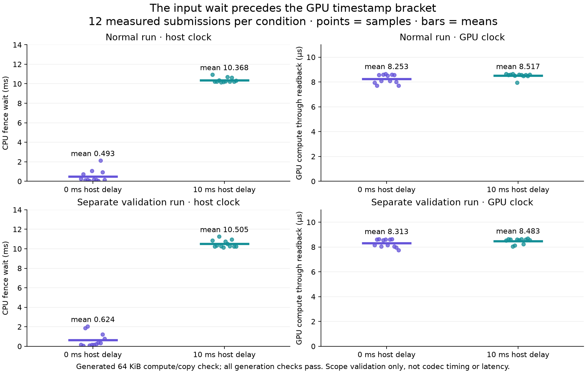

# Offscreen GPU timestamp scope check

This standalone Vulkan 1.3 / synchronization2 test checks timestamp placement
around a deterministic compute dispatch and device-buffer-to-host-buffer copy.
It reuses production `server/encoder/astc_gpu_timing.h` for valid-bit masking
and period conversion. It does not build or run the WiVRn codec.

## Test shape

The compute queue is selected only if it supports timestamps. On this run it was
the AMD Radeon RX 7900 XTX (RADV NAVI31), queue family 0, `timestampValidBits=64`,
`timestampPeriod=10 ns`. A storage-buffer shader writes 16,384 words using a
run-specific salt. The source is device-local; a copy lands in mapped
host-visible coherent memory. Every word is checked against that run's expected
salt after the fence, so stale output also fails.

Each submission waits on an owned timeline semaphore at
`COMPUTE_SHADER | TRANSFER`. The signaler thread is released only after submit;
it signals immediately or after a 10 ms sleep. The command buffer resets one
timestamp pair, writes the start at `COMPUTE_SHADER` immediately before dispatch,
then performs the production-shaped compute-write-to-transfer-read barrier,
buffer copy, transfer-write-to-host-read barrier, and `BOTTOM_OF_PIPE` timestamp.
Query results are fetched without `WAIT` only after the fence succeeds. CPU fence
wait is recorded separately.

There are four alternating warmups (0, 10, 0, 10 ms), then 24 alternating
measured submissions (12 per delay). `scope-alternating.csv` is the primary raw
run, `validation-alternating.csv` is a separate run with Khronos validation,
and `summary.csv` summarizes the 12 measured rows per condition. All readback
checks passed; the validation log contains no VUID or validation messages.

An earlier fixed-pattern run is retained privately as superseded evidence. It could not detect stale readback. Only the final run-specific output checks are published here.

## Results

| Mode | Host signal delay | CPU fence-wait mean / p50 | GPU compute-through-readback mean / p50 | GPU min–max |
|---|---:|---:|---:|---:|
| Normal | 0 ms | 0.493 / 0.157 ms | 0.00825 / 0.00830 ms | 0.00772–0.00864 ms |
| Normal | 10 ms | 10.368 / 10.233 ms | 0.00852 / 0.00856 ms | 0.00796–0.00864 ms |
| Validation | 0 ms | 0.624 / 0.282 ms | 0.00831 / 0.00836 ms | 0.00776–0.00864 ms |
| Validation | 10 ms | 10.505 / 10.308 ms | 0.00848 / 0.00858 ms | 0.00804–0.00868 ms |

The controlled host delay appears in CPU fence wait but not in the timestamp
interval, as intended: the start timestamp is stage-gated behind the semaphore
wait. This validates the bracket's scope on this queue; it does not identify a
real WiVRn queue cause, estimate codec performance, or support frame/photon
latency claims. The 0 ms condition still includes signaler-thread wakeup and
normal driver scheduling, so it is not a zero-overhead or isolated GPU baseline.
No GPU clock or system setting was changed.

## Reproduction

Replace `PATH_TO_THIS_REPORT` and `WIVRN_SOURCE_CHECKOUT` below with local paths. Use WiVRn source revision `d3f428bb`. Root rebuilt the public CMake target successfully; that check did not rerun GPU work alongside another benchmark.

```sh
cmake -S PATH_TO_THIS_REPORT \
  -B PATH_TO_THIS_REPORT/build \
  -G Ninja -DCMAKE_BUILD_TYPE=Release \
  -DWIVRN_SOURCE_ROOT=WIVRN_SOURCE_CHECKOUT
cmake --build PATH_TO_THIS_REPORT/build

VK_LOADER_LAYERS_DISABLE=~implicit~ \
  PATH_TO_THIS_REPORT/build/gpu_timestamp_scope \
  PATH_TO_THIS_REPORT/build/scope.comp.spv

VK_LOADER_LAYERS_DISABLE=~implicit~ VK_INSTANCE_LAYERS=VK_LAYER_KHRONOS_validation \
  PATH_TO_THIS_REPORT/build/gpu_timestamp_scope \
  PATH_TO_THIS_REPORT/build/scope.comp.spv
```

Implicit layers were disabled for these processes only to avoid the host's
broken LSFG layer and injected overlays. Khronos validation was explicitly
enabled for the second run. `run.log`, `validation.log`, tool versions, hashes, and build logs preserve
the run context. The single-submit timestamp duration is too short to approach
one counter wrap here; the production helper's multi-wrap ambiguity still
applies in general.

## Production diagnostic status

Source **d3f428bb** adds the exact-`1`, default-off `WIVRN_NX_ASTC_GPU_TIMING` option. One query pair per slot, masked timestamps, nonblocking collection after a valid fence, and fixed 180-frame summaries report compute-through-readback count/mean/p50/p95. Unsupported queries omit samples. Root reviewed generation validity and pool lifetime; 13 helper assertions pass normally and under halt-on-error ASan/UBSan, and the final server build passes. The source is pushed; no runtime activation, session restart or headset installation. The production codec path has not yet been measured with this option. Query retrieval adds host work inside its CPU fence+invalidate interval and can perturb scheduling.



The full server build log and focused helper source are included. `manifest.json` identifies the source revision and hashes these public artifacts. The helper assertions emit no text on success; successful exits were verified by the root tool calls.
