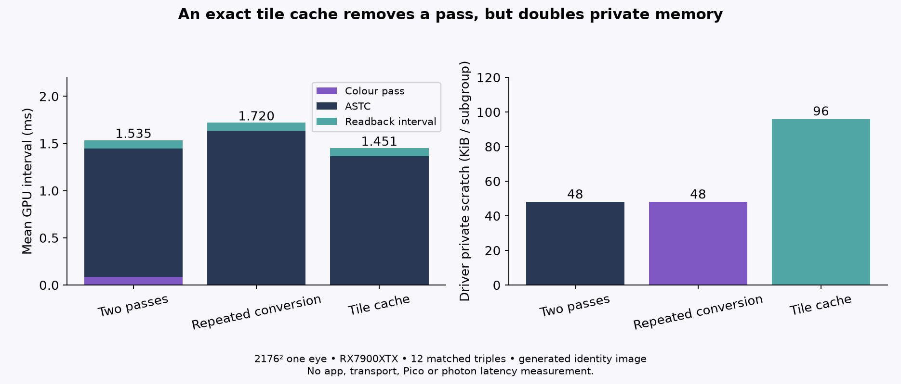

# Tile-cache follow-up

Scratch-only continuation of `../native-pass-fusion/README.md`. It leaves the production checkout and earlier naive/baseline artifacts untouched. Source checkout: `d3f428bb302c0b63e0ac62845b8c4af875adc23e`.

## Test

Compared three versions of the same generated 2176×2176 linear RGBA32F input and the same unmodified ASTC q6/fit3 logic:

- **Baseline:** identity sRGB conversion + RGBA8 UNORM intermediate, then production `astc_encode.comp`.
- **Naive:** scratch ASTC copy converts sRGB inside each `pixel()` call.
- **Cached:** scratch ASTC copy precomputes 64 quantized RGB values once per 8×8 tile; q6/fit3 fitting/reduction code remains unchanged and `pixel()` reads that cache for same-tile samples.

Four warmups per variant; 12 matched triples, with all six variant orders rotated twice. The shader uses an identity full-image rectangle: no rect offset, flip, array layer, foveation scaling, lens mask or runtime compositor. All three outputs were byte-identical in all 12 triples: 73,984 blocks / 1,183,744 bytes per eye. See `scope-alternating.csv` and `summary.csv`.

Run commands:

```sh
cmake -S . -B build -G Ninja
cmake --build build -j4
cd build
nice -n 10 timeout 480s ./native_pass_fusion
nice -n 10 ./native_pass_fusion --stats
```

The timing run does not enable pipeline-stat capture. `--stats` is a separate no-dispatch query using `VK_KHR_pipeline_executable_properties`. `pipeline-stats.txt` contains RX 7900 XTX / RADV results (64-bit timestamps, 10 ns period).

| Mean per run | Baseline | Naive fused | Cached fused |
|---|---:|---:|---:|
| Full-frame pass GPU | 89.59 µs | — | — |
| ASTC GPU | 1,359.70 µs | 1,637.89 µs | 1,367.59 µs |
| Full GPU interval incl. readback copy | 1,534.77 µs | 1,720.35 µs | 1,451.15 µs |
| CPU command-record/submit-to-fence | 1,705.23 µs | 1,883.94 µs | 1,608.89 µs |

Paired cached-minus-baseline means: ASTC stage **+7.89 µs**, total GPU interval **−83.62 µs**, CPU wall **−96.34 µs**. The cache did not make the ASTC stage measurably faster; the full-interval difference is consistent with removing the measured ~89.6 µs conversion pass. Naive fusion increased ASTC by 278.19 µs and the full interval by 185.58 µs.

CPU wall begins after command-buffer begin/query-reset/start timestamp recording and ends at the fence; it excludes CPU readback copying and packet compression. GPU timestamps include intervening barriers. Cache population is only tested at dimensions divisible by8; partial tiles need clamping before integration.

## Cache pressure

Driver executable stats for baseline / naive / cached: subgroup 64; allocated VGPR 252 and SGPR 108; reported SGPR/VGPR spills 0; maximum subgroups per SIMD 6. The cached shader's private scratch allocation is **98,304 bytes/subgroup**, double baseline/naive's **49,152**; VMEM instructions rise 175→334 and code size rises 85.8→109.1 KB. The extra 49,152 bytes matches the per-invocation `vec3[64]` cache storage. So the array is being backed by private scratch even though the explicit register-spill counters stay zero. This adds memory pressure and limits how far to generalize the result; the observed run is only evidence for this identity input and GPU.

The cached prototype preserves ASTC bytes, but it does not prove a production win. Rect/flip/layer mapping, dynamic foveation, optional masking, fallback squashing, cross-queue dependencies and source swapchain release safety still need to be preserved for integration. This test did not change or activate runtime configuration; no production edits, installs, device changes or commits were made.

Root recomputed all36 timing rows and verified the production shader/includes byte-for-byte against source d3f428bb. Compiler stats are driver-reported values, not measured runtime occupancy or VRAM traffic. No validation-layer run is claimed for this comparison.



The original host CMake build had an empty build type and no optimization flag; CPU-to-fence numbers include unoptimized command recording and must not be treated as a release-encoder CPU speedup. GPU timing is the principal comparison. `run.log` is the agent-consolidated execution summary, not raw captured runtime stdout. Root verified the rows and source, but did not rerun these GPU comparisons.
