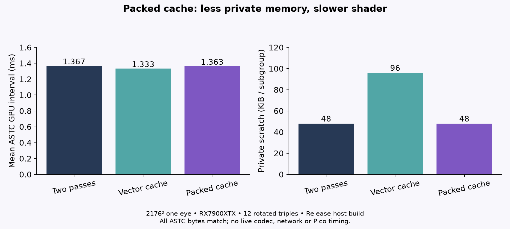

# Packed tile-cache scratch check

Scratch-only follow-up to `../native-pass-fusion-cache/`; that folder and its vec3-cache results are unchanged. Production checkout untouched. Test compares baseline, original vec3 cache, and packed `uint[64]` cache on the same generated 2176×2176 linear RGBA32F input with existing q6/fit3 ASTC logic. Packed entries store quantized byte RGB as `r | (g<<8) | (b<<16)` and unpack to the same 0–255 float values consumed by the ASTC path.

Four warmups per mode; 12 matched triples, using all six mode orders twice. Exact pairwise output check passed: 73,984 ASTC blocks / 1,183,744 bytes per variant, zero mismatching blocks. `scope-alternating.csv` contains the recorded runs; `summary.csv` contains per-mode and paired timing summaries. `run.log` has captured device/run output and `run.exitcode` records the successful exit. Timings are one short offscreen GPU replay on RX 7900 XTX / RADV NAVI31, not a codec/network benchmark.

## Result

Packed cache did not produce a meaningful speed improvement over vec3 cache. Its ASTC stage mean was 1,362.69 µs vs 1,332.79 µs for vec3 (+29.90 µs); full GPU interval was 1,446.61 vs 1,416.17 µs (+30.44 µs). Relative to baseline, packed full interval was 92.75 µs lower, primarily the removed 86.58 µs full-frame pass; that is the fusion result, not a packing win.

The driver reports packed private scratch 49,152 bytes/subgroup, matching baseline and half the vec3 cache's 98,304. Packed shader code is larger (136,772 bytes vs 109,068 vec3), with more instructions (27,505 vs 20,975). So packing reduces the vec3 prototype's scratch footprint but costs more instructions and ran slower in this sample. Reject packed cache as a speed optimization; retain only as evidence that byte packing reduces reported private scratch in this compiler/device configuration.

All three outputs were byte-identical for this identity full-frame fixture. Partial edge tiles, foveation, flips, layers, live ASTC timing, production lifetime/synchronization, and other hardware remain untested. No production configuration or source was changed.

## Reproduction

Build used CMake Release (`-O3 -DNDEBUG`); see `build-commands.txt`, `source-hashes.txt`, and `pipeline-stats.txt`.

```sh
cmake -S . -B build -G Ninja -DCMAKE_BUILD_TYPE=Release
cmake --build build -j4
cd build
nice -n 10 timeout 480s ./native_pass_fusion
nice -n 10 ./native_pass_fusion --stats
```

The timed harness did not capture executable statistics; `--stats` was a separate no-dispatch pipeline query. CPU wall begins after command-buffer begin, query reset and first timestamp recording and ends at the fence. It includes subsequent host recording, submission and waiting; driver optimization is unknown. GPU intervals include barriers and readback. GPU timestamps are the primary comparison.

Root verified all36 timing rows, actual captured zero-mismatch output/exitcode, and the baseline shader/includes against source d3f428bb. No validation-layer run is claimed. Partial tile cache loads lack bounds clamping; only the divisible-by8 native fixture is tested. Root public build is a compilation check, without a duplicate GPU run.


