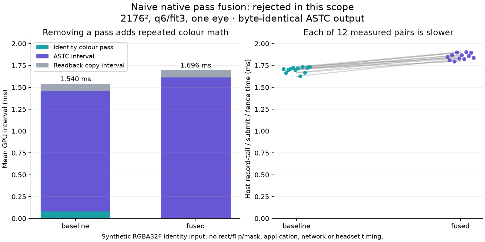

# Native ASTC pass-fusion scope

Scratch-only headless Vulkan experiment. No production sources were changed.
The source checkout used was `d3f428bb302c0b63e0ac62845b8c4af875adc23e`.

## Production path traced

- Native ASTC chooses the full rendered-eye dimensions at scale 1 and logs “no spatial foveation” (`server/encoder/encoder_settings.cpp:453-468`).
- Direct RGB is a separate opt-in (`WIVRN_ASTC_DIRECT_RGB=1`) limited to two enabled ASTC eyes with no enabled later encoder (`server/compositor/compositor.cpp:226-271`). It changes the compositor target to a three-layer RGBA8 UNORM image (`:278-300`).
- The compositor selects each source view/subimage rectangle and `flip_y` directly for one projection layer, or uses the squasher output for multiple layers (`server/compositor/compositor.cpp:866-940`). It then runs `foveation::foveate` into the RGBA8 target (`:1005-1018`).
- For native ASTC, foveation is 1:1 only when each selected source-rectangle extent matches the encode size: `compute_params()` then sets one run spanning the source extent (`server/compositor/foveation.cpp:504-528`). `fill_ubo()` still encodes rectangle offsets, negative extents and flips (`:659-688`, `:742-783`). The shader fetches/averages that mapped footprint, applies manual linear-to-sRGB, optionally paints masked tiles grey, then stores RGB to the RGBA8 image (`server/compositor/shaders/foveation.comp:133-178`). Its `texelFetch` ignores sampler filtering.
- The current ASTC encoder later samples that compositor image and uses the current ASTC shader, fit 3, selected quality, then submits behind the compositor semaphore (`server/encoder/video_encoder_astc.cpp:214-273`). Compositor submission signals before the encoder's separate slot fence finishes; it clears the submitted frame and waits only for its own semaphore (`server/compositor/compositor.cpp:1151-1167`, `:1196-1219`). A fused reader of the original app swapchain image cannot inherit safety merely by retaining a view: it must be recorded before the compositor signal or frame-image release must wait for encoder consumption. A multi-layer frame also cannot skip the squasher pass.

## Experiment

The baseline is generated linear RGBA32F input → an identity full-frame shader applying the same sRGB function and writing RGBA8 UNORM → the **unmodified production** `astc_encode.comp` and its three includes at q6/fit3 → ASTC block readback. The fused variant samples that same RGBA32F input inside a scratch copy of the production ASTC shader, applies the same transfer function and explicit 8-bit rounding, then runs the otherwise unchanged ASTC shader. Input is deterministic colour gradients/checker edges, 2176×2176 for one eye. Source rectangle is full-size at origin; no flip, array-layer offset, foveation scaling or lens mask. The identity pass is equivalent to the production foveation math only for this subcase. No app layer, compositor, runtime or network was involved.

Build and run (RX 7900 XTX, RADV; queue timestamp bits 64, period 10 ns):

```sh
cmake -S . -B build -G Ninja
cmake --build build -j4
cd build
nice -n 10 timeout 480s ./native_pass_fusion
```

Four warmups per variant, then 12 matched pairs alternating B/F and F/B. All 12 pairwise ASTC outputs matched exactly: 73,984 blocks (1,183,744 bytes) per run, zero differing words/blocks. The compiled source shader hashes are in `source-hashes.txt`; `scope-alternating.csv` contains the measured rows.

| Mean per run | Baseline | Fused |
|---|---:|---:|
| Full-frame pass GPU time | 78.50 µs | — |
| ASTC GPU time | 1,376.49 µs | 1,613.07 µs |
| ASTC + pass + readback-copy GPU interval | 1,540.02 µs | 1,696.21 µs |
| CPU record/submit-to-fence wall time | 1,701.76 µs | 1,853.97 µs |

Paired mean deltas (fused minus baseline): ASTC +236.58 µs, total GPU +156.19 µs, CPU wall +152.21 µs. These are this synthetic one-eye test only. CPU wall ends at the fence and excludes mapping/copying the host readback, compression, packetization and networking. GPU copy interval includes the ASTC-buffer-to-readback copy. These measurements do not predict live compositor or headset latency.

A first harness attempt waited on a fourth timestamp that the fused command never wrote and failed at query retrieval. The corrected harness requests only its three written timestamps; the run above completed successfully. `run.log` records both attempts. No physical GPU fault is inferred.

## Result and limits

The simple fusion is a no-go: it preserves the blocks but loses more in the ASTC stage than the removed full-frame pass saves. In the production shader, `pixel()` is called repeatedly while fitting a tile; placing `pow`/sRGB conversion directly inside that function repeats conversion work too. A future test could cache mapped/quantized source pixels once per ASTC tile, but that adds substantial per-invocation storage/register pressure and is a different experiment. It must also retain dynamic UBO mapping, rect/flip/layer behavior, optional lens masking, fallback squashing, cross-queue ordering, and source-image release safety before integration is considered.

The test did not change the direct-RGB environment or runtime profile. No production source was edited, installed or activated.

Root verified that the baseline shader and all three includes exactly match source revision `d3f428bb`. `checked-summary.json` recomputes means from 24 retained measurement rows. No private images or payloads are included. The colour conversion repeats inside the tile fitting loops; a separate cached-tile follow-up is being tested, with no production integration.



Root rebuilt these public CMake/shader files successfully without another GPU run. Published CSV line endings are normalized to LF. A read-only kernel journal check for the original attempt window found no matching GPU/fault/reset/timeout messages; the query failure is retained as a harness limitation, not a physical hardware diagnosis.
