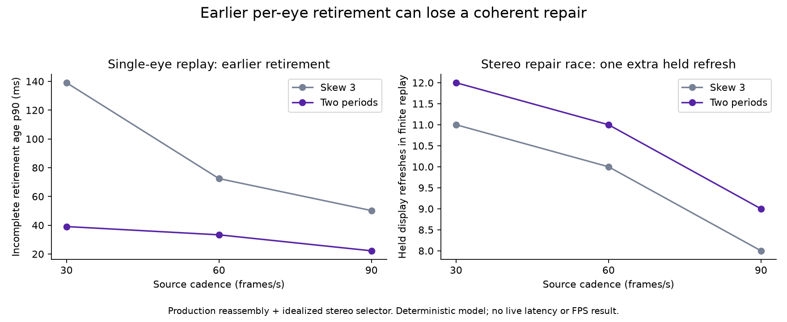

# Reassembly deadline replay — remain opt-in

**Decision: do not enable the two-period rule by default.** A faster per-eye retirement can forfeit a repairable coherent pair. This experiment changes the next design gate, not the live profile.



This tiny deterministic replay uses the production `frame_window`, `shard_set`,
`drain`, and deadline helper. It compares default skew 3 with the opt-in age
predicate for a 90 Hz display and 30, 60, or 90 source frames/s.

Each source frame has four shards. Every seventh frame loses its end shard;
every third frame delays its end shard by 5 ms; every fourth frame reorders two
interior shards. The same timestamped packets feed both policies. The replay
counts complete frames handed through the production window and incomplete
front retirement age. It has no network, codec, GPU, or XR runtime: these are
model results, not measured link latency or headset behavior.

| Source rate | Policy | Complete delivered | Incomplete retired | Retirement age p50 / p90 / max |
| ---: | --- | ---: | ---: | ---: |
| 30 | skew 3 | 66 | 11 | 134.08 / 139.08 / 139.08 ms |
| 30 | two display periods | 68 | 12 | 34.08 / 39.08 / 39.08 ms |
| 60 | skew 3 | 66 | 11 | 67.42 / 72.42 / 72.42 ms |
| 60 | two display periods | 68 | 12 | 33.33 / 33.33 / 33.33 ms |
| 90 | skew 3 | 66 | 11 | 45.19 / 50.19 / 50.19 ms |
| 90 | two display periods | 68 | 12 | 22.22 / 22.22 / 22.22 ms |

The opt-in predicate retires incomplete fronts earlier in this replay and lets
two complete tail frames through before the final incomplete frame can be
retired by a later arrival. It demonstrates the policy's timing arithmetic;
it does not establish a production quality or latency improvement.

Compile from the project checkout (paths below point to the local checkout and
its existing generated Boost headers):

```sh
g++ -std=c++23 \
  -I /run/media/nerdrx/Lex/claude/nx-scratch/wt-pyrowave-probe/common \
  -I /run/media/nerdrx/Lex/claude/nx-scratch/wt-pyrowave-probe/client/decoder \
  -I /run/media/nerdrx/Lex/claude/nx-scratch/wivrn-valclean-build/common \
  -I /run/media/nerdrx/Lex/claude/nx-scratch/wt-pyrowave-probe/external \
  -I /run/media/nerdrx/Lex/claude/nx-scratch/wivrn-valclean-build/_deps/boost-src/libs/pfr/include \
  -o /tmp/reassembly_deadline_replay \
  /run/media/nerdrx/Lex/claude/nx-scratch/overnight-recovery/reassembly-deadline/replay.cpp \
  /run/media/nerdrx/Lex/claude/nx-scratch/wt-pyrowave-probe/common/smp.cpp -lcrypto
/tmp/reassembly_deadline_replay
```

The executable checks expected counts for all three source rates and exits
nonzero if the replay changes.

## Stereo edge replay

`stereo_replay.cpp` uses the same production per-eye window and deadline helper,
plus production `retained_frame_slot` with three retained images per eye (the
fourth image slot is opt-in). `stream.cpp` performs exact frame-ID intersection
inline in `common_frame()`; it has no reusable selector to link in isolation.
The replay therefore labels its small selector idealized: intersect retained
IDs, choose newest common ASTC ID, and retain current coherent pair when no
newer common ID exists. It does not compile or claim to reproduce renderer code.
Other bounded history sizes in source: 3 retained images per eye by default
(4 opt-in), 32 motion-pose metadata entries, 16 ASTC motion references with
maximum reference age 8, and 2 pending ASTC packets. The replay models only the
three-image eye rings.

Both eyes first decode pair 0, then lose frame 1's end shard. The right eye
completes a newer successor first. Boundary cases deliver both NACK-like end
shards one microsecond before or after the two-period age threshold, before any
other pump event. Both are accepted under the age rule: it has no timer. The
cross-eye race repairs left frame 1 one microsecond before its expiry trigger
and right frame 1 one microsecond after. The latter repair is refused after
right frame 1 has retired.

| Source rate | Policy | Coherent selections | Held refreshes | Right frame-1 repair |
| ---: | --- | --- | ---: | --- |
| 30 | skew 3 | 0 → 1 → 2 | 11 | accepted |
| 30 | two periods | 0 → 2 | 12 | refused |
| 60 | skew 3 | 0 → 1 → 2 → 3 | 10 | accepted |
| 60 | two periods | 0 → 2 → 3 | 11 | refused |
| 90 | skew 3 | 0 → 1 → 2 → 3 | 8 | accepted |
| 90 | two periods | 0 → 2 → 3 | 9 | refused |

The deadline mode loses one repairable coherent ID in this deliberately ordered
cross-eye race. The idealized selector keeps pair 0 during the mismatch, then
advances to the next exact common ID; it never creates a mismatched-eye pair.
The boundary cases also show why elapsed age alone does not retire a frame: an
arrival must run the pump while a newer complete frame exists. These are model
results, not network, decoder, or headset measurements.

Build with the include roots above, adding
`-I /run/media/nerdrx/Lex/claude/nx-scratch/wt-pyrowave-probe/client`, replacing
the output with `/tmp/reassembly_deadline_stereo`, and using `stereo_replay.cpp`
as the source.
