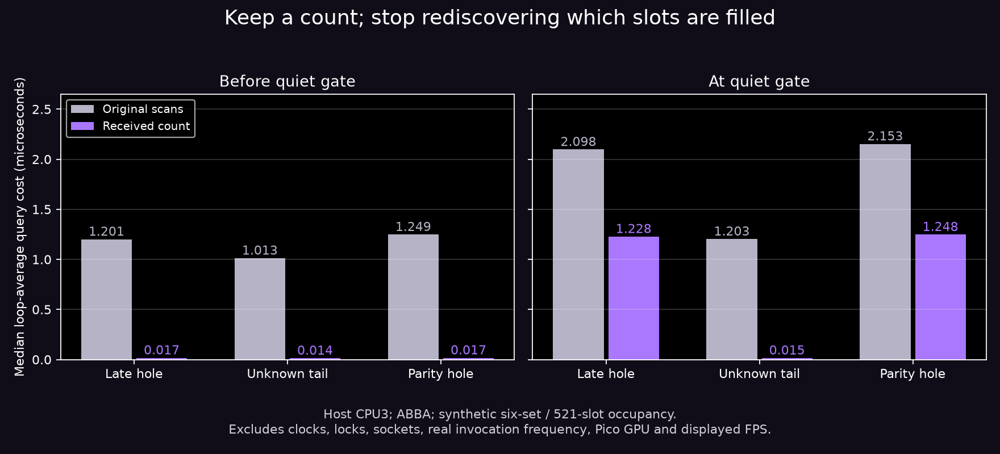
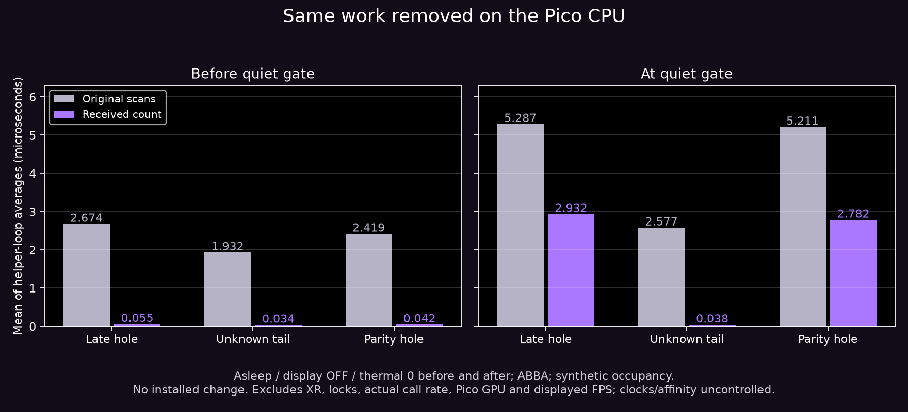

# Removing repeated shard scans

Source **8d339452** makes `shard_set::complete()` constant time and skips the missing-slot walk when all slots are already present. One private count tracks unique insertions; the data vector now has only a const reader accessor. Reset, duplicate handling, parity reconstruction, strong copy assignment and safe moved-from reuse preserve the invariant. Inferred older-frame tails and parity filtering remain unchanged. No wire, quality, GPU, FEC or repair-policy change. This internal optimization is active in source; **not installed on the headset**. Quiet-period recovery polling itself remains default off.

## Matched host check

Actual `frame_window<shard_set,6,3>`, `shard_set` and quiet-gate helper in production traversal order. Each fixture holds six 521-slot sets; these are deliberately undrained stress occupancies, **not measured live occupancy**. Known end markers and holes near the end exercise complete scans; unknown latest tails and parity suppression check exact eligibility. The baseline header is pinned to `bb76c0ef`; the treatment is final source `8d339452`.

Four complete runs in baseline/count/count/baseline order, owned host process pinned to CPU3 and nice5. Each run warms each phase, alternates before/due order across five blocks and measures 10,000 calls per row; 120 rows total. A compiler memory barrier prevents invariant scan hoisting. Expected deadline results are checked. Values below are **medians of loop-average query costs**, not individual-call latency percentiles.

| Fixture | Before due: old → count | At due: old → count |
|---|---:|---:|
| Late interior hole | 1.201 → 0.017 µs | 2.098 → 1.228 µs |
| Unknown latest tail | 1.013 → 0.014 µs | 1.203 → 0.015 µs |
| Parity-suppressed hole | 1.249 → 0.017 µs | 2.153 → 1.248 µs |

At due, actual holes still require a scan; known-contiguous prefixes do not. Clock queries, configuration/weak-pointer checks, mutexes, socket processing and sends are excluded. Actual invocation frequency, CPU utilization, device power, frame rate and photon latency are not established by these numbers.

## Pico CPU check

A short standalone ABBA CPU run on the asleep Pico A8110 checks the same final source/header. Late-hole query means fall **2.674→0.055 µs before due** and **5.287→2.932 µs at due**; parity due **5.211→2.782 µs**. All 120 rows agree on eligibility. The installed client remained untouched; display stayed off and thermal status0 before/after. Owned temporary binaries were removed. CPU frequency/affinity were uncontrolled, and clocks/locks/GPU/frame/photon work are excluded. [Raw rows, exact builds and conditions](pico/README.md).

## Correctness and build

- Actual accumulator/window suite: **251 checks**, normal and halt-on-error ASan/UBSan, zero failures.
- Actual shard/NACK/history/FEC suite: **816 checks**, normal and the same sanitizers, zero failures.
- Independent original-scan oracle: **600,000 completeness/missing-list comparisons** after 50,000 seeded mutations, normal and sanitizers. Includes resets, duplicate/out-of-order insertion, copy/move/self-move, moved-from reuse, invalid index and failed parity reconstruction after vector growth. Its missing-list oracle uses no held parity; actual NACK tests cover parity behavior separately.
- Final Android `wivrn` native-library build passes, including private-reader API call sites. No APK installation, UI change or stream restart.

## Reproduce

`build-run.sh SOURCE CONFIGURED_HOST_BUILD OUTPUT` compiles baseline/final helper costs and the differential oracle, then runs the paired comparison. Use source revision `8d339452`; the configured build supplies generated headers and fetched Boost PFR. `plot.py` regenerates the supplied figure (Python/NumPy/Matplotlib). Header snapshots, raw rows, logs and hashes are included; private photos and payloads are excluded.

Published CSV line endings are normalized to LF; numerical fields are unchanged.
