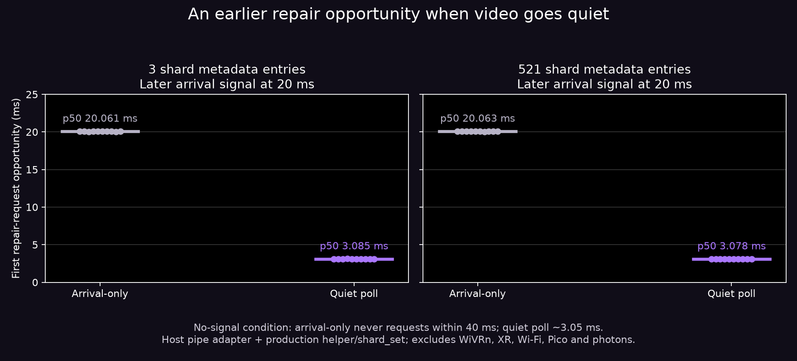

# Quiet-period recovery: opt-in source trial

The existing client checks retransmit requests when video/parity arrives. A missing packet followed by silence therefore has no video callback to request repair. The normal network loop can wait up to 100 ms; returning from that wait previously did not service NACKs.

Source **bb76c0ef** adds a **default-off** NXASTC option that checks existing repair deadlines on the existing network thread. It evaluates the wait after all pending packets are drained, uses the existing 2.5 ms quiet gate, and services the existing request policy after a successful poll. No new thread, frame retirement, larger request cap or wire change. Complete frames, exhausted rounds, disabled repair and expired targets remain ineligible. Unknown tails and parity-suppressed holes return to the 100 ms fallback after their quiet check.

## Host adapter result

Ten samples per condition and mode, alternating execution order; 80 rows total. An owned pipe signals a later arrival at 20 ms, or remains silent for a 40 ms observation. Actual production `nack_deadline.h` and `shard_set` supply the quiet gate and missing-hole semantics. Fixtures contain 3 or 521 metadata entries with a known interior hole; empty payloads. This adapter does **not** instantiate the WiVRn client, accumulator, sockets, XR clock, renderer or Pico. Timing ends at the first opportunity to issue a repair request, before any repair round trip.

| Fixture | Arrival-only p50 / p95 | Quiet-poll p50 / p95 |
|---|---:|---:|
| 3 shards, signal at 20 ms | 20.061 / 20.078 ms | 3.085 / 3.120 ms |
| 521 shards, signal at 20 ms | 20.063 / 20.074 ms | 3.078 / 3.104 ms |
| 3 shards, no signal | None observed within 40 ms | 3.054 / 3.056 ms |
| 521 shards, no signal | None observed within 40 ms | 3.052 / 3.053 ms |

The 40 ms cases are censored observations, **not 40 ms request latency**. Small host samples establish a scheduling opportunity, not an Android scheduling bound, Wi-Fi improvement, fresh FPS, live recovery or photon latency. The 2.5 ms gate rounds upward to whole milliseconds; due waits have a 1 ms floor to prevent busy polling.

## Verification and remaining gates

Shared helper and real shard-set checks: **225 checks, zero failures**, normal and halt-on-error ASan/UBSan. Cases include arrivals, complete frames, parity, unknown tails, exhausted rounds, rollback and integer overflow. Final Android `wivrn` native-library build passes, including the new poll overload and stream code. A bounded independent source audit found no concrete lock/order/shutdown issue. This is a build plus helper test, not a full stream runtime test.

Enabled operation adds two XR-clock queries per poll cycle and metadata checks under the existing decoder-array shared lock. A [synthetic host metadata stress check](HELPER_COST.md) measures roughly0.9–2.1 microseconds per query across six 521-slot sets. It excludes clocks, locking and actual invocation rate; no CPU-utilization or power inference. Device CPU/power, scheduling, adaptive FEC feedback and actual recovery remain gates. Send failures still consume the existing request round. The normal repair cap remains 64 shards and two rounds; waking earlier cannot restore unavailable history or exceed those limits.

Android startup flag: `debug.wivrn.nx.recovery_poll=1`; host: `WIVRN_NX_RECOVERY_POLL=1`. Exact value `1` only. **Not enabled, installed or restarted.** The user's live profile remains native ASTC8x8 without foveation, JPEG, blur or object motion warp.

## Reproduce

Use WiVRn NX commit `bb76c0ef` or newer and a configured host build tree containing generated `common/wivrn_config.h` and fetched Boost PFR. `build-run.sh SOURCE CONFIGURED_BUILD OUTPUT` compiles/runs the adapter and current component tests. `plot.py` regenerates the figure from the supplied CSV; requires Python, NumPy and Matplotlib. The source/header snapshots and manifest pin this run. No private photos or payloads are included.
