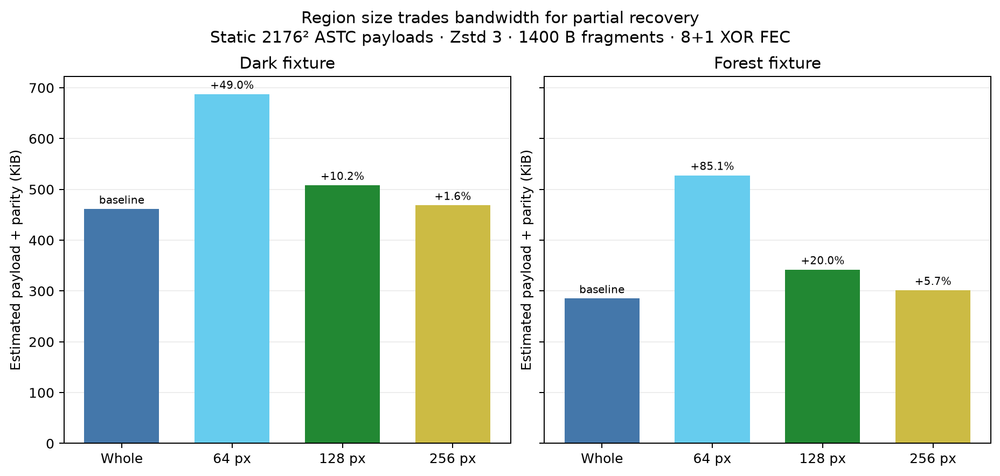
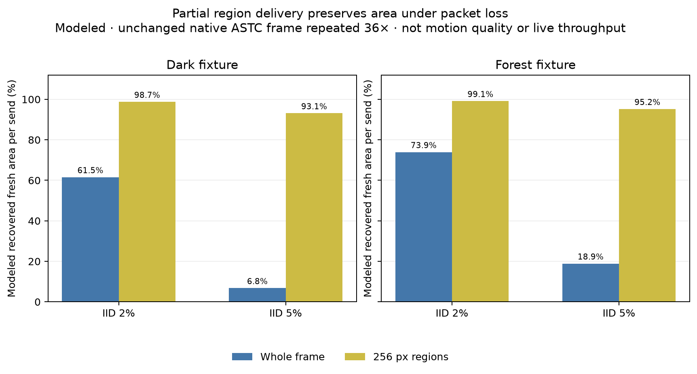
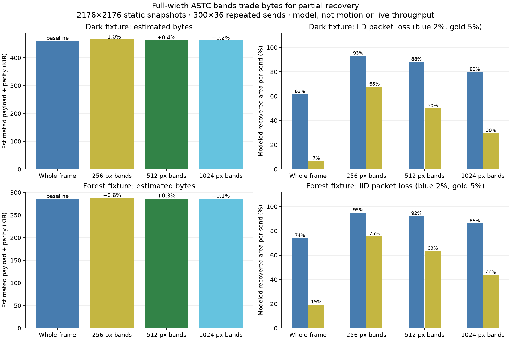

# Independent ASTC region-loss model

This public-safe report compares whole-frame delivery with independently compressed ASTC regions. It contains numeric aggregates and a procedural animation only. The two native photo-derived ASTC inputs are not included; their pixels are neither copied nor decoded here.

## Native payload snapshots

The native CSVs came from two static 2176×2176 ASTC 8×8 payload snapshots. Each unchanged payload was simulated across 36 sends per trial, so this stresses packet count and loss recovery only; it is not a moving-scene, image-quality, live-throughput, or headset result.

| Input label | Whole frame | 64 px regions | 128 px regions | 256 px regions |
|---|---:|---:|---:|---:|
| Dark fixture | 472,403 B | 703,915 B (+49.0%) | 520,378 B (+10.2%) | 479,920 B (+1.6%) |
| Forest fixture | 291,995 B | 540,407 B (+85.1%) | 350,343 B (+20.0%) | 308,658 B (+5.7%) |

Region records use an estimated 8-byte header (`frame_id:u32`, `region_id:u16`, compressed length `u16`). Whole frames include their existing 24-byte ASTC packet header. Payload records are fragmented at 1400 bytes and protected by one XOR parity shard per eight data shards, using four-way interleave. The estimate assigns 1400 bytes to every parity shard; IP/UDP/socket headers, per-shard view/timing metadata, FEC length tables, and retransmission are excluded.

## Modeled recovered area

The measured quantity is the fraction of each static image's area represented by regions whose complete compressed records were recovered on a send. A whole-frame send contributes either 100% or 0%; a region send can retain successful regions while missing others. Since each source payload is unchanged across all 36 sends, these percentages describe packet recovery, not temporal freshness or perceived quality.

At IID 2% packet loss, whole-frame delivery recovers 61.55% and 73.93% of sends completely for the dark and forest fixtures. The 256 px region model recovers 98.74% and 99.13% of area per send. At IID 5%, complete whole-frame sends fall to 6.77% and 18.90%, while the region model retains 93.11% and 95.21% of area. Exact values for every region size, IID case, and burst case are in `native_loss_scaling.csv`.

The run model also includes four-way interleaved FEC with calibrated 8- and 16-packet bursts targeting 2% loss. Those results vary with shard counts and burst placement; they remain simulation outputs, not network measurements. Independent regions cost bytes and can combine content from different poses. In XR, head motion makes pose-mixed seams a safety and visual-quality concern; this experiment applies no pose or object warp.

## Procedural animation and reproduction

`hold_vs_regions.gif` and `.png` illustrate whole-frame hold versus region updates from a separate procedural 512×512 sequence. All 36 inputs were decoded with the external `astcenc-native` CLI before the animation was rendered. The illustration is not generated from the private native fixtures and does not demonstrate runtime performance.

The numeric inputs are included as `native_payload_bytes.csv` and `native_loss_scaling.csv`; procedural payload and replay data are `payload_bytes.csv` and `loss_replay.csv`. The accompanying scripts contain the model and figure source. To rerun the native snapshot model, provide your own q6 files with `--dark-q6` and `--forest-q6`; no native image payload is bundled. To rerun the procedural animation, provide the 36 ASTC sequence frames through `--sequence-dir` and the decoder executable through `--astcenc`.

## Full-width band alternative

`native_bands.py` and its two CSVs model full-width contiguous ASTC row bands (2176×256, ×512, and ×1024 px), independently Zstd-3 compressed. The native 2176×2176 q6 snapshots are read locally for the run, but no private payload or pixels are part of this report. Each unchanged ASTC payload is simulated for 300 trials × 36 sends, under IID 2%/5% and 8-/16-packet bursts targeting 2%. As above, these are packet-loss estimates from static repeats, not motion, quality, latency, or live throughput results.

The band payload estimate includes an 8-byte header per band, 1400-byte data fragments, and 1400-byte parity shards for four-way interleaved 8+1 XOR FEC. Whole-frame baseline uses the 24-byte ASTC header. Network/IP/UDP and transport metadata remain excluded.

| Layout | Dark bytes (+whole) | Forest bytes (+whole) | Dark recovered area IID 2% / 5% | Forest recovered area IID 2% / 5% |
|---|---:|---:|---:|---:|
| Whole | 472,403 B | 291,995 B | 61.6% / 6.7% | 73.9% / 19.4% |
| 256 px full-width bands | 477,004 B (+1.0%) | 293,810 B (+0.6%) | 93.1% / 67.7% | 95.0% / 75.4% |
| 512 px full-width bands | 474,101 B (+0.4%) | 292,844 B (+0.3%) | 88.1% / 49.9% | 92.1% / 63.5% |
| 1024 px full-width bands | 473,182 B (+0.2%) | 292,429 B (+0.1%) | 79.8% / 29.6% | 86.0% / 43.6% |

These bands add fewer compression boundaries and estimated bytes than square 256 px regions, while recovering less area when packets are lost. The initial one-shot square decode probe was expensive; matched reused-context CPU measurements now appear in the follow-up below. Bands can still combine pixels from different poses along horizontal seams, so this is not a pose-coherent XR solution. `native_band_loss.csv` also records burst cases and repeated-send counts; `native_band_payload.csv` contains fragment/FEC/header estimates. To rerun, provide local inputs with `--dark-q6`, `--forest-q6`, and optionally `--out-dir`.

## Model scope and live WiVRn ASTC path

The `native_*` band/region CSVs are idealized record-level loss simulations only. Their 1400-byte chunks and XOR 8+1 parity are experiment assumptions, not measured WiVRn wire framing, runtime bandwidth, or a latency/safety guarantee. They omit per-shard WiVRn serialization and the live adaptive FEC group layout. 

The live WiVRn ASTC path carries `video_stream_data_shard`: `stream_item_idx`, 64-bit `frame_idx`, 16-bit `shard_idx`, optional `view_info`, optional `timing_info`, and payload. Current stream-item assignments are 0=left, 1=right, 2=alpha, 3=promoted quad layer. The first shard carries `view_info` (display target, per-eye pose/FOV/foveation, and optional quad metadata); the last carries timing fields (`encode_begin`, `encode_end`, `send_begin`, `send_end`). `display_time` is the predicted headset display target, not source capture time; the shard has no source-capture timestamp.

Each ASTC stream wraps a whole image in an NXASTC packet (24-byte independent header or 32-byte motion header), then `SendData` slices that whole-frame byte stream into shards. The headset joins shards by stream and `frame_idx`, indexed by `shard_idx`; it considers the frame complete only when every index is present and the final shard carries `timing_info`. The ASTC decoder appends ordered shard payloads and parses the complete NXASTC packet. The current path therefore does not decode or present an incomplete horizontal band independently; that needs region/frame assembly semantics in the client.

The shard payload cap is 1400 bytes before FEC reserve and first-shard `view_info` subtraction. The live XOR recovery blob contains serialized `view_info`, `timing_info`, and payload. When adaptive FEC is off, the fixed layout is contiguous 8+1. Adaptive FEC is enabled by default: it starts at k=8 with interleave depth 4, then the controller selects k=16, 8, or 4 from headset-reported reconstructed/NACK loss. The reserve is `2 + 2*k + 3 + 33 + 10` bytes for group size `k`; adaptive data bitrate is scaled by `k/(k+1)` so parity is within the requested stream budget. FEC is used only on the UDP stream path, not control/TCP or secondary-TCP video. The settings default both FEC and adaptive FEC on, subject to runtime/server switches.

For a 20 Mbit/s aggregate link the gross budget is 27.8 kB/frame at 90 Hz (34.7 kB at 72 Hz), before external transport overhead. This value alone does not establish spare headroom: the live source exposes per-encoder bitrate and path/pacing behavior, but no dedicated auxiliary reserve or priority queue across video streams. Encoders share a sender worker and the UDP queue is FIFO, with up to eight whole frames retained before oldest-frame drops. A safety feed could therefore delay the primary if it enters that queue ahead of it. A strict no-stall policy needs shared admission control that protects primary bytes/deadlines and skips auxiliary frames when the remaining budget is unavailable.

Adding auxiliary streams would require a negotiated use of spare stream slots (or a larger mapping), updated video description/decoder setup, and explicit codec/role interpretation; each stream still joins as a whole ASTC frame. A new band-record path avoids overloading those stream roles and enables partial ASTC assembly, but requires new wire metadata and headset reassembly/deadline behavior. The current source alone does not show which route meets latency or startup-readiness goals; that requires an integrated scheduler and live-path measurement. This report makes no CPU or photon-latency claims.

## Matched Pico CPU follow-up

[Full-width band CPU probes](../band-cpu/README.md) use one reusable Zstd context and write directly into retained CPU ASTC rows. Full 256px bands add about 4.6–4.7% median decode cost on the tested Pico fixtures, while 512px/1024px are near parity. Square regions retain roughly 30% median penalty at 256px. These CPU measurements are separate from the idealized loss model and do not validate partial presentation or motion quality.
