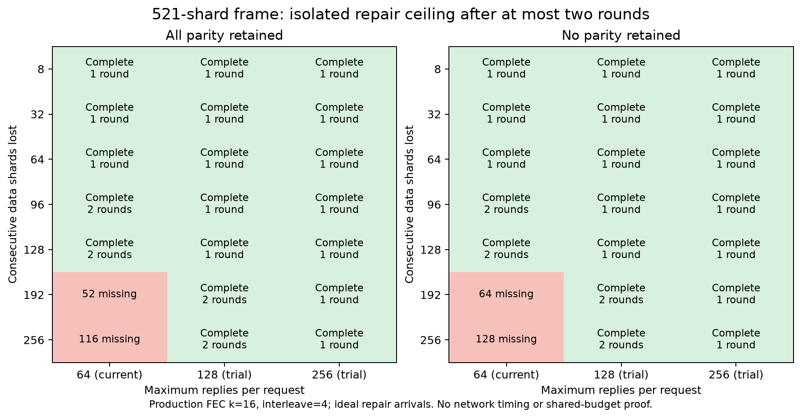

# Retention is not the same as repair throughput

The new 2 MiB history preserves high-rate shards, but existing recovery still answers at most **64 shards per NACK** and sends at most **two NACK rounds per frame**. A request can name a 256-index window. Stored data alone cannot overcome those separate ceilings.

## What the actual classes show

This scratch replay drives production `shard_set`, FEC group construction/reconstruction, history insertion/collection and blob decoding. It uses the retained `tests/nack_test.cpp` fixture helpers and checks every received/repaired payload byte. The bitmap and two-round loop mirror the receiver policy; the socket, accumulator clock, background rate limiter and render loop are excluded.

| 521-shard frame, k16/depth4, all parity received | Current 64/request | Trial 128/request | Trial 256/request |
| --- | --- | --- | --- |
| 96 consecutive data shards lost | Complete in 2 rounds | Complete in 1 | Complete in 1 |
| 128 lost | Complete in 2 | Complete in 1 | Complete in 1 |
| 192 lost | 52 still missing | Complete in 2 | Complete in 1 |
| 256 lost | 116 still missing | Complete in 2 | Complete in 1 |

These are deterministic cases, not loss probabilities or measured elapsed times. Higher reply caps can reduce required rounds in this replay, but create larger unpaced repair bursts. They do not reduce missing data volume. The existing **2000-shards/s per-encoder limiter** would still apply to any production change; this isolated replay assumes an available budget and successful immediate repair delivery. It therefore gives an optimistic ceiling. No timer, Wi-Fi, Pico or photon-latency claim follows.

## Coverage and decision

252 cases cover 261/521-shard frames, group sizes16/8/4 with interleave4, all/no parity retained, contiguous interior data losses8/32/64/96/128/192/256, and hypothetical reply caps64/128/256. Interior losses begin at index4, preserving final timing and first view metadata. The fixture payload budget is `fec::shard_payload_budget(true,k)-200`, so shard counts are illustrative and are **not exact 500/1000 Mbit/s frame payloads**. All parity retained and all parity absent are bounds, not a simulation of correlated parity loss. Normal and halt-on-error ASan/UBSan runs passed all252 cases and produced identical CSV rows.

**Current source remains at64/request.** The next candidate is an explicit bounded repair-budget trial, alongside measurement of the already-collected reply send path. Do not silently raise the live limit: larger bursts on a congested link can worsen the problem this tries to solve. Increasing history capacity did not establish successful two-frame recovery.

## Reproduce

Compile `replay.cpp` with C++23/O2 and include the matching source `common`, `client/decoder`, `server/encoder`, `external`, configured-build `common`, and configured Boost PFR paths. Link source `common/smp.cpp` and libcrypto. The included `nack_test.cpp` snapshot provides fixtures under a renamed original entry point. Run the binary; it emits252 rows plus a CSV header, and exits on payload/count/completeness errors. For sanitizers use `-O1 -g -fsanitize=address,undefined -fno-omit-frame-pointer` and halt-on-error ASan/UBSan. `manifest.json` records source hashes and modeled limits; `plot.py` renders the figure from the retained CSV.
