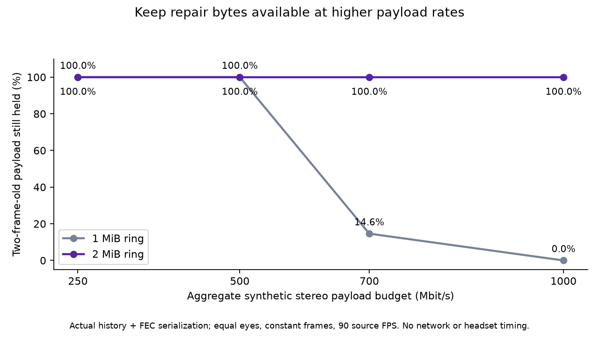

# High-rate repair history: hold bytes long enough to answer

**Accepted source change:** enabled server history is **2 MiB** per encoder instead of **1 MiB**; 4096 entries remain the hard metadata cap. Two independent eyes add 2 MiB of PC memory in total. Per-shard copying, NACK timing/retries, frame retirement, FEC adaptation and wire format stay unchanged. Disabling now releases vector capacity rather than merely clearing its size; the diagnostic reports capacity so the existing disable check proves that release. No APK was installed and no server/session restarted.

The actual production `shard_history`, shard payload budget and FEC blob serializer were driven with 12 synthetic frames per case. Payload rates 250/500/700/1000 Mbit/s are aggregate across two equally allocated eyes at 90 source frames/s. First shards carry default view metadata; final shards carry timing. Both FEC-enabled and disabled shard sizes are tested. The table asks what remains of an entire frame after two newer frames finish writing. Every returned recovery blob is parsed and its synthetic payload checked byte-for-byte.

| Aggregate payload budget | Per-eye frame bytes | FEC shard count | Old1MiB: two frames back | New2MiB |
| ---: | ---: | ---: | ---: | ---: |
|250Mbit/s |173611 |131 |131 |131 |
|500Mbit/s |347222 |261 |261 |261 |
|700Mbit/s |486111 |365 |54 |365 |
|1000Mbit/s |694444 |521 |0 |521 |

At 1000 Mbit/s, the old ring also retains only 262/521 shards of the immediately preceding frame. The new ring keeps all 521 at ages 1 and 2 in this synthetic sequence. This repairs a storage limit; it does **not** prove packets arrive before a display deadline. Equal-eye allocation, constant frame sizes and synthetic metadata are assumptions. Payload rates exclude parity/framing; production deducts FEC share from its configured link budget, so the test is a conservative data-volume stress case. Variable bursts, unequal eye allocation, larger metadata or different source cadence do not have a guaranteed two-frame retention time.

The new native-budget test passes with 816 NACK/history checks normally and with halt-on-error ASan/UBSan. Existing overwrite/disabled/spill/rate/bitmap cases remain. The broader FEC sanitizer suite passes 4296 checks; final server/OpenXR and Android native-library builds pass. Empty default foveation vectors exposed an existing zero-byte `memcpy` with a null vector pointer. The shared parser now checks bounds then skips that copy; positive-length parsing and cursor behavior remain. [Source rationale](SHARD_RECOVERY_WORK.md).

A separately tested client stale-NACK suppression was rejected before commit because cancelled requests also lower adaptive-FEC loss counts. The 3% incomplete-frame floor cannot substitute for heavier measured loss. [Saved rejected patch and decision](rejected-stale-nack/README.md).

## Reproduce

Configure the source checkout at `6d8970d2` first. Compile `probe.cpp` twice with C++23/O2, selecting `-I baseline` or `-I candidate` before the source include paths; also include source/common, source/external, configured-build/common and BoostPFR include directories. Link source/common/smp.cpp and libcrypto. Run each executable to CSV. Both use the same current serializer, including the zero-byte copy fix; only history capacity/disable diagnostics differ. `plot.py` rebuilds the figure. No private image, packet payload or binary is published.
