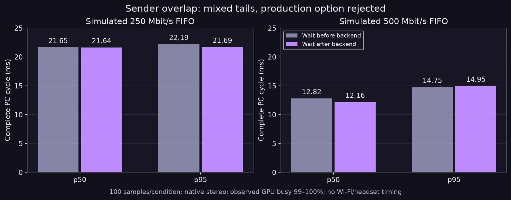

# ASTC sender-wait placement probe

This report evaluates whether moving a previous-frame per-eye sender wait until after GPU readback and CPU packet encoding overlaps useful work. The change was rejected for now: results are mixed, with effectively no p50 change at 250 Mbit/s and a small 500 Mbit/s median reduction offset by a slightly worse p95. It does not establish a robust end-to-end throughput gain.

## Method

The standalone C++ harness uses the current production primary ASTC compute shader copied into `shaders/` (the copy was byte-identical at capture), quality 6, fit 3, direct RGB, and ASTC 8x8. It loads two distinct native 2176x2176 RGBA test images by path; private fixture files are intentionally not included. The two eyes have independent Vulkan images, descriptors, output/readback buffers, command buffers, fences, and timestamp query pools, while sharing one `VkDevice`, compute queue, and pipeline. Uploads occur once before warmup and are excluded.

Every measured frame records and submits both eye dispatches before either sender wait. A simulated single FIFO sender owns immutable per-eye packet jobs. Its per-eye `wait_idle` waits for that eye's preceding send; the other eye may still be in flight. In legacy mode, each eye waits before its backend. In deferred mode, each eye performs backend readback/encoding first, validates that the prior immutable packet reference and metadata remain unchanged, then waits and queues the new packet. The unpaced mode has zero simulated send duration.

There are 20 warmups and 100 measured frames for each of five treatments. Paced modes use 250 or 500 Mbit/s aggregate FIFO rate. Treatment ordering uses alternating ABBA/BAAB 25-frame blocks; unpaced runs once per block. The sender queue is drained between blocks. The complete cycle includes command recording, both submit API calls, sender waits, fence waits/readback, compression, and packet assembly. Backend time excludes sender-wait intervals; fence and sender waits are separately reported. GPU timestamps cover dispatch and dispatch-through-readback command. Percentiles use sorted index `floor((n-1)*p)`.

The primary CSV does not isolate host staging-copy duration; host readback copy is included in each `backend_eye*_ms`. This was not separately timed in the canonical run.

## Results

Milliseconds, p50 / p95, 100 measured frames per condition:

| Condition | Complete cycle | Backend eye 0 | Backend eye 1 |
|---|---:|---:|---:|
| Legacy wait before backend, 250 Mbit/s | 21.648 / 22.187 | 2.435 / 3.812 | 1.980 / 7.179 |
| Deferred wait after backend, 250 Mbit/s | 21.640 / 21.690 | 10.630 / 13.923 | 10.624 / 13.850 |
| Legacy wait before backend, 500 Mbit/s | 12.816 / 14.748 | 3.254 / 9.104 | 7.350 / 11.382 |
| Deferred wait after backend, 500 Mbit/s | 12.163 / 14.951 | 12.045 / 14.871 | 11.695 / 14.679 |
| Unpaced | 11.602 / 14.845 | 11.189 / 14.680 | 11.354 / 14.498 |

At 250 Mbit/s, deferred-wait cycle p50 changed by -0.008 ms and p95 by -0.497 ms. At 500 Mbit/s, p50 changed by -0.653 ms while p95 increased by 0.203 ms. GPU dispatch was approximately 0.50 ms for eye 0 and 0.33 ms for eye 1 across treatments. The distributions do not support a dependable complete-cycle win from this scheduling change in this probe.

All CPU measurements were captured while the GPU was already heavily occupied before this run, when no other owned GPU test was active: four 0.5-second samples reported 99%, 99%, 100%, and 99% busy. At run start it was 99% busy with 9.34 GB of 25.75 GB VRAM in use; after the run it was 99% busy with 9.35 GB in use. The source of that activity was not identified. Treat queue delays and timings as observations under high/unknown background GPU load, not idle-GPU measurements.

Serial and deferred treatments produced byte-identical ASTC and packet outputs, and every packet passed the harness decompression check. CSV rows confirm old packet metadata remained unchanged during backend work. The earlier pre-submit-wait experiment was invalid because it waited before queue submission; it is excluded entirely. A later staging-instrumented run happened under changing GPU load and is also excluded. No network, headset, Pico, compositor live run, or FPS measurement was performed.



`python3 plot.py` regenerates the figure from the canonical CSV.

## Build and run

Requirements: CMake, C++20 compiler, Vulkan headers/loader, `glslc`, Zstd, and LZ4 development libraries. Configure/build from this directory, then run from the same directory so the harness finds `build/encode_primary.spv`:

```sh
cmake -S . -B build
cmake --build build -j4
./build/stereo-sender-wait /path/to/left-2176x2176-rgba /path/to/right-2176x2176-rgba build/sender-wait/
```

Inputs must be raw 2176x2176 RGBA8 byte arrays. The executable performs Vulkan work; this report packaging step only builds the harness and does not rerun the GPU experiment. The aggregate results are in [`results/sender-wait.csv`](results/sender-wait.csv).
