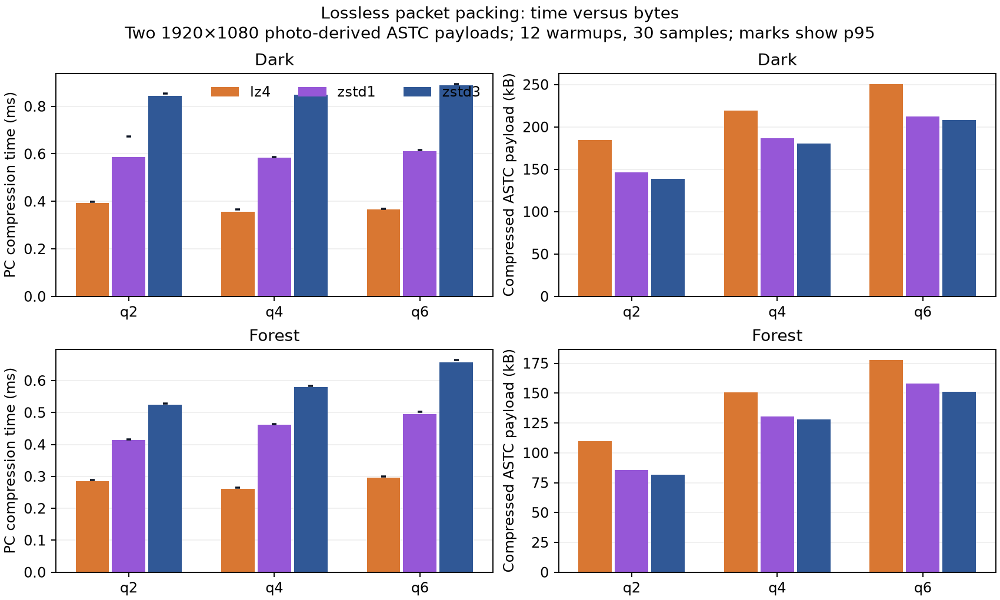

# Lossless packet CPU cost

The selected colour representation retains the existing LZ4/Zstandard packing policy. This bounded probe compared packing the same exact ASTC payload with LZ4, Zstandard level 1 and level 3. Every decompressed output matched the input bytes; visual quality is identical at a fixed ASTC quality setting.

At q6, level 1 reduced PC compression medians from 0.887 to 0.612 ms on dark and from 0.658 to 0.495 ms on forest. Its payload grew 1.96% and 4.60%, respectively. At q2 the growth was 5.56% and 4.60%. PC decompression did not improve: q6 dark was 0.246 versus 0.241 ms and forest 0.198 versus 0.188 ms. These are PC timings, not Pico timings.

Level 1 would exchange bandwidth for a modest PC saving. With connection recovery and native-image bandwidth still important, these two inputs do not justify replacing the current packer. The production path first measures LZ4, then uses Zstandard level 3 only when it saves at least 10% compared with that selected payload. Independent frames and bounded decode remain unchanged.

The newly added server stage counters separate fence/readback readiness, LZ4, Zstandard and packet construction. A short native stationary run measured approximately 0.6 ms LZ4 and 1.0 ms Zstandard per eye, with packet construction near 0.005 ms. That run also experienced session/focus churn and low viewer cadence; those stage averages are diagnostic observations, not a controlled codec performance comparison.

`results.json` retains all samples and q0/q2/q4/q6 sizes. `bench.py` uses installed native libraries through ctypes, reuses buffers and a compression context, excludes the 16-byte ASTC file header, and checks every decompression. `manifest.json` pins the payload hashes and library versions. Both input photos are encoded by the validated production RGB-input adaptation; this is not a capture of live NV12 compositor pixels. No full photographs or payloads are published here.
