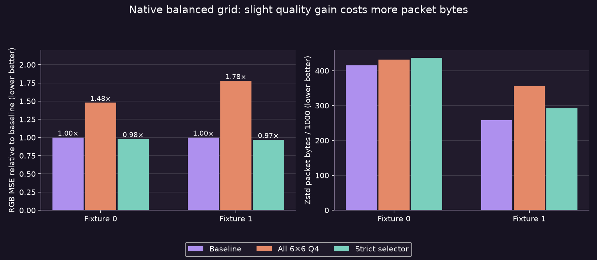

# Native 6×6 Q4 weights: rejected tradeoff

A balanced finer grid also fails this bounded gate: selective use raises the combined two-fixture packet size **8.40%** for only **2.24% less RGB SSE**. No production shader change is justified. Root independently compiled the public harness and reproduced both full native-image rows. The photographs are unrelated fixtures, not binocular captures or video.

| Fixture | Baseline / all-Q4 / selector RGB MSE | Selected share | Baseline → selector packet bytes |
|---|---:|---:|---:|
| 0 | 26.7308 / 39.5103 / 26.1828 | 10.57% | 414,921 → 436,864 |
| 1 | 4.79806 / 8.53226 / 4.63981 | 15.84% | 257,982 → 292,570 |

Every eye has73,984 valid16-byte candidate blocks at mode`0x108`:6×6 Q4 weights within the same native ASTC8×8 texture footprint, Q80 endpoints, one partition. The normal matrix from astcenc's actual decimation contributions is inverted once per run; the resulting36×64 pseudoinverse fits source projections onto the requantized baseline endpoint axis. Grid weights quantize to actual Q4 values. The standard packer selects CEM8 direct RGB or CEM9 RGB delta; raw rows retain the split. All candidate blocks parse and reference-decode.

The selector retains original bytes unless actual candidate RGB SSE is strictly smaller and at most80% of baseline. Aggregate error therefore improves, but headers/weight distributions change enough to increase whole-eye Zstd3 payloads. Applying Q4 everywhere increases both RGB error and packet bytes on these two fixtures.

## Reproduce and limits

`./run-local.sh eye0.rgba eye0.raw.astc eye1.rgba eye1.raw.astc` prints aggregate CSV; sources must be headerless2176²RGBA8 and exactly matched1,183,744-byte ASTC8×8 baselines. The generic harness checks input lengths and uses the recorded local astcenc AVX2/F16C/POPCNT build plus Zstd1.5.7. Override `ASTC_GATE_SOURCE`/`ASTC_GATE_LIBRARY` for matching installations. [Source](gate.cpp), [raw rows](raw.csv), [provenance](manifest.txt), [plot script](figures.py).

Pairing, input conversion, source shader and baseline payload hashes are the same as the [binary-weight gate](../astc-production-selector-gate/README.md). Zstd frame bytes plus ordinary24-byte headers match archived production packet totals at baseline. RGB error ignores alpha, matching the direct-RGB UNORM encoder source. Images, decoded pixels and candidate payloads remain private.

Candidate endpoints reuse the baseline pair; no candidate endpoint refit or dual-plane search is performed. This is a specific bounded representation experiment, not proof that every6×6 fitter is inferior. It is a CPU format/spatial-error gate, with no new GPU shader, runtime option, Pico app or user-session change. No encoder-speed, fresh FPS, live motion quality, HEVC parity, power or photon latency claim is supported. Further native finer-grid microprobes are held; priority returns to measured PC latency and independent recovery.
